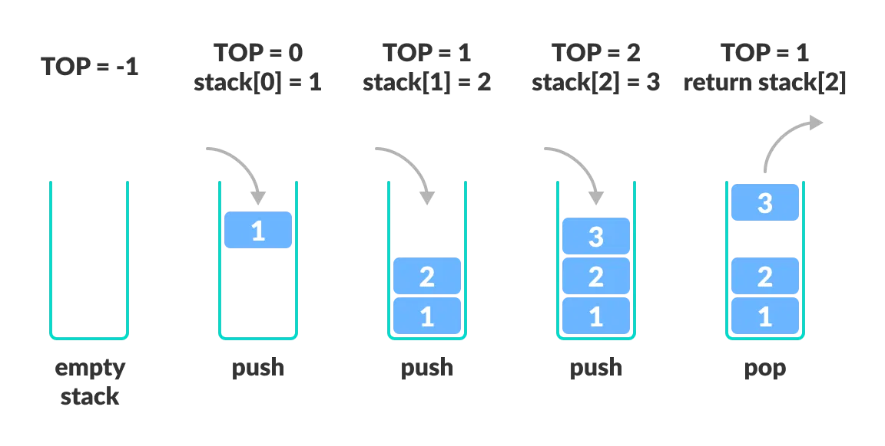

<div align="center">
<h1> Classes
</div>
<div align="center">
    <em>Algorithms and Parallel Computing</em><br>
    <em>Juan Pablo Vallejo Montañez</em><br>
    <em>Notes from Politecnico di Milano 2025/2026 Y.</em><br>
</div>


# 1. Introduction and Definitions.

A <strong>Class</strong> is a <i>user-defined type</i> that specifies how objects of its type can be
created and used. A class work as <strong>template</strong>. It deinfes  the data memebers and the methods the objects can support. Is the basic unit of encapsulation and it can be considered as  the collection of similar types of objects.

<strong style="color:#FF0000;">EXAMPLE OF THE DOGS</strong>

A class directly <i>represents a concept</i> in a program. If we can think of <i>it</i> as a separate <i>entity</i>, it is plausible that it could be a <strong>class</strong> or an <strong>object</strong> of a
class.

<i>Examples:</i>  vector, matrix, input stream, string, FFT, valve controller, robot arm, picture on screen,
dialog box, graph, window, temperature reading, clock

- In C++ (as in most modern languages), a class is the key building block for large
programs
- And very useful for small ones also
- Classes implement a very important concept: Abstract Data Types

The process by which the compiler creates a specific class or function from a template is called <strong>instantiation</strong>.


An <strong>Object</strong> is an instance of a class. Each objet has a class which defines its data and behaviour. Objects have states anc can be thought of as a realizations of a class.

<i style="color:#2E86C1;">Example - Stack: Array-base implementation.</i>

- Type: Stack
- Domain: Stack of integers (int)
- Policy: LIFO – Last In, First Out

<i>(Note: Queues follow the opposite rule — FIFO, First In, First Out.)</i>



<div style="text-indent: 30px;">
<i>Stack.h</i>
</div>

````cpp
//DECLARATIONS

 const int max_size = 10; // Maximum size of Stack
 class Stack {
 public:
 Stack() { top_index = -1; }
 // constructor: initializes the Stack data structure
 void push(int x);
 int pop();
 int top() const;
 ~Stack() { std::cout << "Stack deallocated"; }
 // destructor: runs when Stack data goes out of scope
 private:
 bool isEmpty() const;
 bool isFull() const;
 int top_index;
 int a[max_size];
 };
 ````
<div style="text-indent: 30px;">
<i>Explanation</i>
</div>

- <strong>Construction:</strong> Creates an instance and initializes it as an empty stack. In the case of the `Stack`, the constructor does not contain any parameters.
- <strong>void push(int x):</strong> Adds element x to the top of the stack.
- <strong>int pop():</strong>	Returns the element at the top of the stack and removes it.
- <strong>int top():</strong> 	Returns the element at the top of the stack without modifying it.
- When the <code>main()</code> function finishes, the <code>Stack</code> object goes out of scope.
At that moment, its destructor is automatically called to deallocate the stack and finalize the instance.

<div style="text-indent: 30px;">
<i>Implementation</i>
</div>

<br>
<div style="text-indent: 30px;">
<i>Stack.cpp</i>
</div>

````cpp
// Stach.CPP
#include "Stack.h"

// IMPLMENETATIONS
// The function returns true if top_index is less than 0
bool Stack::isEmpty() const{
    return top_index < 0;
}

//The function returns true if top_index is greater or equal to the last position.
// Remember that positions in the array go from 0 to max_size-1.
bool Stack::isFull() const{
    return top_index >= (max_size- 1);
}

//++top_index :increases the top_index by 1 before using it (pre-increment).
//a[++top_index] = x; stores the new element x in the next free position at the top of the stack.
void Stack::push(int x){
    if (isFull()) {
        cout << "Stack Overflow";
    } else {
        a[++top_index] = x;  
        cout << x << " pushed onto stack\n";
    }
}


int Stack::pop(){
    if (isEmpty()) {
        cout << "Stack Underflow";
        return 0;
    }
    else {
    int x = a[top_index--];
    return x;
    }
}

int Stack::top() const{

    if (isEmpty()) {
        cout << "Stack is Empty";
        return 0;
    }
    else {
        int x = a[top_index];
        return x;
    }
}
````

<div style="text-indent: 30px;">
<i>Claim</i>
</div>

There are difference between `a[top_index--]` and `a[--top_index]`.

| Expression | What happens first| What happens after| 
| ---------------- | ----------------------------------------- | --------------------------- | 
| `a[top_index--]` | Uses the **current value** of `top_index` | Then **decreases** it by 1  |
| `a[--top_index]` | **Decreases** `top_index` first           | Then uses the **new value** |

<i style="color:#FF0000;">SEE SLIDES PAGE 173 TO LOOK HOW WORKS THE CONECTION BETWEEN THE SOURCE FILES</i>


## 1.2 UML

A <strong>UML (Unified Modeling Language)</strong> class diagram is a graphical representation of a class that shows:
- Its name (the type or concept being modeled)
- Its attributes (the data it contains)
- Its operations or methods (the actions it can perform)
- The visibility of each element (+ for public, - for private)

public (+), private(-)

<i style="color:#FF0000;">SEE SLIDES PAGE 174-173 tO LOOK UML EXAMPLES</i>
atributtes can be of different types or can be other class

## 1.3 Constructor.

A <strong>constructor</strong> is a special method that creates an instance of a class and initializes it (for example, an empty stack, a default value, etc.).

 - In C++, the constructor is a method that has the same name as the class.
 - The constructor is automatically invoked by the language’s run-time system every time an object is created.
 - A class can have multiple constructors with different parameters (overloaded constructors).
 - Constructors can have parameters (for example, to initialize data members with specific values).
 - If no constructor is defined by the programmer, C++ automatically provides a default constructor — one that takes no parameters and does nothing special.
 - When you use `const` at the end of a member function, it means that the method will not modify the object it belongs to.

## 1.4 Destructor.

A <strong>destructor</strong> works inversely to a constructor — it is automatically invoked every time an object goes out of scope or is explicitly destroyed.

 - The destructor is a method with the same name as the class, but prefixed with a tilde (~).
 - It is associated with the finalization (or cleanup) of an instance — it runs when the object’s lifetime ends.
 - It has no return value and takes no parameters.
 - There is always only one destructor for a given class (It is unique).
 - The destructor performs cleanup tasks, such as freeing resources or memory used by the object - Its main purpose is to release resources, such as memory or file handles, before the object is destroyed.
 - Destructors are extremely important when using raw (C-style) pointers to avoid memory leaks.
 - If no destructor is defined, C++ provides a default destructor automatically.

# 2. Abstract Data Type (ADT)


<div align="justify">
An <strong>Abstract Data Type (ADT)</strong> is a logical description of a type, defined by:

1. Its domain (the set of possible values it can hold).
2. Its operations (the actions that can be performed on those values).

In other words, an ADT defines <strong>what operations can be done,but not how they are implemented.</strong>

ADTs separate the specification (what it does) from the implementation (how it does it).

 - Specification (what):	Describes available operations and their behavior.
 - Implementation (how): 	Defines the internal data representation and algorithms used.

````cpp
// Specification (what)
class Stack {
public:
    void push(int value);
    void pop();
    int top() const;
    bool isEmpty() const;
private:
    // Implementation (how)
    std::vector<int> elements;
};
````
In C++, an ADT is implemented as a class. A class (or module) separates <i>What the software does	</i> (The public interface (set of services)) and 
<i>How it does it</i>	(The private internals (implementation details))

The module that defines a new ADT and all the operations that allow us to manipulate its instance, can:

 - <i>Exports (or make available for other parts of the program)</i> the type name and the operations to manipulate it.
 - <i>Hides</i> The structure and the implementation details.  

The user can create objects (data) of the type specified by the module and manipulate these
objects through the operations defined within the module,
</div>

_______________________________________________________


 I really dont undesratbt what is a ADT ???
 What is the difference between implementation and definiton and operation?
 What really means implementation?
 what is an interface?


sEE THE IMAGE IN THE SLIDES page 150 slide 1 

Implementation of ADT
How information is storedin implementation is hidden from users of ADT
how information is stored = Data Structure.


See explamples on the sludes

FINISH THIS PARTS OF ADT

# 3. Structs.

A struct is a class where members are public by default.
````cpp
struct X {
    int m;
       // .....................
    };
    
//is equivalent to

class X {
    public:
    int m;
    //. ....................
};
 ````

## 3.1 Why bother with the public/private distinction?

1. Not everything should be public: Making everything public exposes internal details. Public members are accessible from anywhere, which can lead to unintended misuse.

2. Provides a clean interface: Public members define the interface that other code interacts with. Private members can hide “messy” or complex details that users don’t need to see.

3. Allows flexible implementation: If internal representation is private, you can change it freely without breaking code that uses the class.Only the public functions (interface) need to remain consistent.

4. Simplifies maintenance and debugging: When internals are hidden, it’s easier to locate and fix issues (“round up the usual suspects” technique). Private members help enforce invariants (rules about how data should behave).

5. Supports code evolution: Users of your class only rely on the public interface. You can change internal data structures or algorithms without affecting external code.


<i style="color:#2E86C1;">Benefits of information hiding (private members)</i>

- Easier support for code evolution.
- Internal changes don’t require changes in external code.
- Reduces the chance of unintended interference.
- Simplifies debugging and maintenance.
- Maintains invariants automatically.

## 3.2 Invariants.

An invariant is a condition or rule that must always be true for a piece of data or an object, no matter what operations are performed on it. In other words  <i>A rule for what constitutes a valid value is called an <strong>invariant</strong></i>

We try to design our types so that values are guaranteed to be valid  (or we have to check for validity all the time).


__________________________________________________
Advanced Classes

classess members are private by default

Struct is a particular kind of class
by default all the members is public  

What is heterogenius types?

Public private beneficies


Members are accessed using . (dot) for objects and −> (arrow) for pointers
• Operators, such as +, !, and [], can be defined
• The public members provide the class interface and the private members provide
implementation details


 Class members are private by default:
 class X {
 int mf();
 // …
 };
 is equivalent to
 class X {
 private:
 int mf();
 // …
 };
• So
 X x; // variable x of type X
X *px = &x; // pointer to type X
int y = x.mf(); // error: mf is private (i.e., inaccessible)
int w = (*px).mf(); // error: mf is private (i.e., inaccessible)
int z = px->mf(); // error: mf is private (i.e., inaccessible
____________________________________________________

CONSTRUCTUS

Similar to the funcition overlading we can have multilconstructors

Unlike other memeber functions, constructors may not be const.
a const mehtond oesnot modify object and the constructur build the object (modify the object). Its obivusly 

constructor can write to const objects dirung the constructio


Default Constructor
 •Classes control default initialization by defining a special constructor, known as the 
default constructor
 •The default constructor takes no arguments
 •Example
           Class Sales_data {
               public:
                   Sales_data(){ … } 
                   // rest of the class
           };
 •The default constructor is used when no explicit initialization is indicated, e.g.:
          Sales_data sd;


          The Role of the Default Constructor
 8
 • The default constructor is used automatically whenever an object is default- or value- 
initialized
 • Default initialization happens when: 
• we define non-static variables or arrays at block scope without initializers 
• a class that itself has members of class type uses the synthesized default constructor 
• members of class type are not explicitly initialized in a constructor initializer list 
• Value initialization happens:
 • during array initialization when we provide fewer initializers than the size of the array
 • when we define a local static object without an initializer
 • when we explicitly request value initialization by writing an expressions of the form T() where T is the 
name of a type (e.g., vector)
 Classes must have a default constructor in order to be used in these contexts
Constructors 
Synthesized Default Constructor
 • It is necessary that there is at least one way to construct an object
 • That is, each class must have at least one constructor
 9
 • If our class does not explicitly define any constructors, a default constructor will be 
implicitly defined by the compiler 
• The compiler-generated constructor is known as the synthesized default constructor. For 
most classes, this synthesized constructor initializes each data member of the class as 
follows: 
• If there is an in-class initializer, use it to initialize the member 
• Otherwise, default-initialize the member
 Because Sales_data provides initializers for units_sold and revenue, 
the synthesized default constructor uses those values to initialize those 
members. It default-initializes bookNo to the empty string. 
Constructors 
10
 We cannot always rely on the Synthesized Default Constructor 
• Only fairly simple classes can rely on the synthesized default constructor
 • The compiler generates the default constructor for us only if we do not 
define any other constructors
 • If we define at least one constructor, the class will not have a default constructor unless we 
define that constructor ourselves explicitly
 • Rationale: if a class requires control to initialize an object in one case, then the class is 
likely to require control in all cases
Constructors 
11
 We cannot always rely on the Synthesized Default Constructor 
• For some classes, the synthesized default constructor does the wrong thing:
 • E.g., objects of built-in or compound type (such as arrays and pointers) have undefined 
value when they are default-initialized
 • We should initialize those members inside the class or define our own version of the 
default constructor
 • Otherwise, we could create objects with members that have undefined value
 • Sometimes the compiler is unable to synthesize one
 • E.g., if a class has a member that has a class type, and that class doesn’t have a default 
constructor, then the compiler can’t initialize that member
Constructors 
12
 Example where default constructor cannot be synthesized
 class NoDefault { 
public: 
NoDefault(const std::string&); 
// additional members follow, but no other constructors
 }; 
struct A {   
NoDefault my_mem;         
}; 
A a;           
// my_mem is public by default;
 // error: cannot synthesize a constructor for A 
• In practice, it is almost always right to provide our own default constructor if 
other constructors are being defined
Constructors 
Defining the Sales_data Constructors
 • We’ll define three constructors with the following parameters: 
13
 • A const string& representing an ISBN, an unsigned representing the count of how many 
books were sold, and a double representing the price at which the books sold
 • A const string& representing an ISBN. This constructor will use default values for the 
other members
 • An empty parameter list (i.e., the default constructor), which we must define because we 
have defined other constructors
Constructors 
Defining the Sales_data Constructors
 Class Sales_data {
 public:
 Sales_data() = default; 
14
 Sales_data(const std::string &s): bookNo(s) { } 
Sales_data(const std::string &s, unsigned n, double p): 
bookNo(s), units_sold(n), revenue(p*n) { } 
// other members as before
 std::string get_bookNo() const { return bookNo; } 
Sales_data& operator+=(const Sales_data&); 
double avg_price() const;
 private:
 std::string bookNo;
 unsigned units_sold = 0; 
double revenue = 0.0; 
};
Constructors 
Defining the Sales_data Constructors
 Class Sales_data {
 public:
 15
 Constructor Initializer List 
Sales_data() = default; 
Sales_data(const std::string &s): bookNo(s) { } 
Sales_data(const std::string &s, unsigned n, double p): 
bookNo(s), units_sold(n), revenue(p*n) { } 
// other members as before
 std::string get_bookNo() const { return bookNo; } 
Sales_data& operator+=(const Sales_data&); 
double avg_price() const;
 private:
 std::string bookNo;
 unsigned units_sold = 0; 
double revenue = 0.0; 
};
Constructors 
Defining the Sales_data Constructors
 16
 Class Sales_data {
 public:
 Sales_data() = default; 
Sales_data(const std::string &s): bookNo(s) { } 
Sales_data(const std::string &s, unsigned n, double p): 
bookNo(s), units_sold(n), revenue(p*n) { } 
// other members as before
 std::string get_bookNo() const { return bookNo; } 
Sales_data& operator+=(const Sales_data&); 
double avg_price() const;
 private:
 std::string bookNo;
 unsigned units_sold = 0; 
double revenue = 0.0; 
};
 Sales_data(const std::string &s): 
bookNo(s), units_sold(0), revenue(0){ } 
Constructors 
Constructor Initializer List 
// legal but sloppier way to write the Sales_data 
// constructor: no constructor initializers 
17
 Sales_data::Sales_data(const string &s, unsigned cnt, double price) 
{
 bookNo = s; 
units_sold = cnt; 
revenue = cnt * price; 
} 
• How significant this distinction is depends on the type of the data member
Constructors 
Constructor Initializer List 
18
 • When we define variables, we typically initialize them immediately rather than 
defining them and then assigning to them: 
string foo = "Hello World!";    
string bar;                     
bar = "Hello World!";           
// define and initialize
 // default initialized to the empty string 
// assign a new value to bar 
• Exactly the same distinction between initialization and assignment applies to 
the data members of objects
 • if we do not explicitly initialize a member in the constructor initializer list, that member is 
default-initialized before the constructor body starts executing
Constructors 
Constructor Initializers are sometimes required 
19
 • We can often, but not always, ignore the distinction between whether a member is 
initialized or assigned: 
• Members that are const or references must be initialized
 • Members that are of a class type that does not define a default constructor also must be initialized 
class ConstRef { 
public: 
ConstRef(int ii); 
private: 
int i;
 const int ci;
 int &ri; 
};
Constructors 
Constructor Initializers are sometimes required 
20
 • The members ci and ri must be initialized. Omitting a constructor initializer for 
these members is an error: 
// error: ci and ri must be initialized 
ConstRef::ConstRef(int ii)
 {    
} 
// assignments: 
i  = ii;    // ok
 ci = ii;    
ri = i;     
// error: cannot assign to a const 
// error: ri was never initialized 
• The correct way to write this constructor is: 
// ok: explicitly initialize reference and const members 
ConstRef::ConstRef(int ii): i(ii), ci(ii), ri(i) { } 
Constructors 
Delegating Constructors 
21
 • A delegating constructor uses another constructor from its own class to perform its 
initialization
 class Sales_data { 
public: 
// non-delegating constructor initializes members from corresponding arguments 
Sales_data(const std::string& s, unsigned cnt, double price): 
bookNo(s), units_sold(cnt), revenue(cnt*price) { }
 // remaining constructors all delegate to another constructor 
Sales_data(): Sales_data("", 0, 0) {} 
Sales_data(const std::string& s): Sales_data(s, 0, 0){} 
// other members as before 
}; 
Constructors 
Constructors and initialization order
 22
 • Initializer lists are run first but members are initialized in order as they appear
 in the class declaration (in some situations this might create a mess, use 
the same order!)
 • Then, (non-static) data members are initialized in order of declaration in the 
class definition according to in-class initializers
 • Finally, the body of the constructor is executed
 • If a constructor relies on a delegating constructor, the delegated constructor
 is executed first, then the control returns to the delegating constructor and its
 body is executed
Constructors 
Copy, Assignment, and Destruction
 25
 • Classes also control what happens when we copy, assign, or destroy objects 
of the class type
 • Objects are copied in several contexts:
 • when we initialize a variable 
• when we pass or return an object by value 
• when we use the assignment operator
 • Objects are destroyed:
 • when they cease to exist, such as when a local object is destroyed on exit from the block 
in which it was created 
• objects stored in a vector (or an array) are destroyed when that vector (or array) is 
destroyed 
• If we do not define these operations, the compiler will synthesize them for us
 • Ordinarily, the versions that the compiler generates for us execute by copying, assigning, 
or destroying each member of the object
Constructors 
Copy, Assignment, and Destruction
 Sales_data total;  // variable to hold the running sum 
Sales_data trans;  // variable to hold data for the next transaction 
total = trans; 
// default assignment for Sales_data is equivalent to: 
total.bookNo = trans.bookNo; 
total.units_sold = trans.units_sold; 
total.revenue = trans.revenue; 
26
Constructors 
Copy, Assignment, and Destruction
 • Some classes cannot rely on the synthesized versions:
 27
 • the synthesized versions are unlikely to work correctly for classes that allocate resources 
that reside outside the class objects themselves (e.g., use dynamic memory)
 • for the moment, if you need to use dynamic memory, use vectors or strings to manage the 
necessary storage, we will get back to this issue


Type Member
________________________________________________

Type Aliases 
29
 • A type alias is a name that is a synonym for another type. We can define a type 
alias in one of two ways
 • Traditionally, we use a typedef
 typedef double wages;    
// wages is a synonym for double
 typedef wages base, *p;  // base is a synonym for double, p for double* 
• C++ 11 introduced a second way to define a type alias, via an alias declaration
 using SD = Sales_data;   // SD is a synonym for Sales_data 
Constructors 
Type Aliases 
30
 • A type alias is a type name and can appear wherever a type name can appear
 wages hourly, weekly;  // same as double hourly, weekly; 
SD item;               
// same as Sales_data item; 
Constructors 
Defining a Type Member
 class Screen { 
public: 
typedef std::string::size_type pos;
 Screen() = default;          
31
 // needed because Screen has another constructor 
// cursor initialized to 0 by its in-class initializer 
Screen(pos ht, pos wd, char c): height(ht), width(wd), contents(ht * wd, c) { } 
char get() const { return contents[cursor]; }    
char get(pos r, pos c) const; 
private: 
pos cursor = 0;
 pos height = 0, width = 0; 
std::string contents; 
// get the character at the cursor 
}; 
Constructors 
Defining a Type Member
 class Screen { 
public: 
typedef std::string::size_type pos;
 Screen() = default;          
32
 Members that define types must appear 
before they are used
 // needed because Screen has another constructor 
// cursor initialized to 0 by its in-class initializer 
Screen(pos ht, pos wd, char c): height(ht), width(wd), contents(ht * wd, c) { } 
char get() const { return contents[cursor]; }    
char get(pos r, pos c) const; 
private: 
pos cursor = 0;
 pos height = 0, width = 0; 
std::string contents; 
// get the character at the cursor 
};  


operator+ implementation (as plain helper function)
 class Sales_data {   // All code in Sales_data.h
 private:
 std::string bookNo; 
unsigned units_sold;
 double revenue; 
public:
 std::string get_bookNo() const;
 // other members and access specifiers as before (constructor, getters and setters)
 Sales_data& operator+=(const Sales_data&); 
};
 // declarations for nonmember parts of the Sales_data interface 
Sales_data operator+(const Sales_data&, const Sales_data&);
Matteo Rossi - Classes
 4
 operator+ implementation  (as plain helper function)
 in Sales_data.cpp
 Sales_data operator+(const Sales_data& lhs, const Sales_data& rhs)
 {
 Sales_data ret;
 ret.set_bookNo(lhs.get_bookNo());
 ret.set_units_sold(lhs.get_units_sold() + rhs.get_units_sold()); 
ret.set_revenue(lhs.get_revenue() + rhs.get_revenue()); 
return ret;
 }
Matteo Rossi - Classes
 friends
 5
 • Members defined after a public specifier are accessible to all parts of the 
program
 • public members define the interface to the class
 • Members defined after a private specifier are accessible to the member 
functions of the class but are not accessible to code that uses the class
 • private sections encapsulate (i.e., hide) the implementation
 • A class can allow another class or function to access its nonpublic members 
by making that class or function a friend 
Matteo Rossi - Classes
 friends
 class Sales_data {   // All code in Sales_data.h
 // other members and access specifiers as before 
private:
 std::string bookNo; 
unsigned units_sold;
 double revenue; 
public:
 6
 std::string get_bookNo() const;
 // other members and access specifiers as before (constructor, getters and setters)
 Sales_data& operator+=(const Sales_data&); 
};
 // declarations for nonmember parts of the Sales_data interface 
Sales_data operator+(const Sales_data&, const Sales_data&); 
*
Matteo Rossi - Classes
 friends
 class Sales_data {   // All code in Sales_data.h
 // friend declarations for nonmember Sales_data operations added 
friend Sales_data operator+(const Sales_data&, const Sales_data&);
 // other members and access specifiers as before 
private:
 std::string bookNo; 
unsigned units_sold;
 double revenue; 
public:
 7
 std::string get_bookNo() const;
 // other members and access specifiers as before (constructor, getters and setters)
 Sales_data& operator+=(const Sales_data&); 
};
 // declarations for nonmember parts of the Sales_data interface 
Sales_data operator+(const Sales_data&, const Sales_data&); 
*
Matteo Rossi - Classes
 friends
 8
 • A friend declaration only specifies access. It is not a general declaration of the 
function
 • If we want users of the class to be able to call a friend function, then we must also declare the 
function separately from the friend declaration
 • We usually declare each friend (outside the class) in the same header as the class itself
 • This is why our Sales_data header provides a separate declaration (aside from the friend 
declaration inside the class body) for operator+ 
*
Matteo Rossi - Classes
 operator+ implementation (declared as friend)
 in Sales_data.cpp
 Sales_data operator+(const Sales_data& lhs, const Sales_data& rhs)
 {
 Sales_data ret;
 ret.bookNo =  lhs.bookNo;
 ret.units_sold = lhs.units_sold + rhs.units_sold; 
ret.revenue = lhs.revenue  + rhs.revenue; 
return ret;
 }
 access to private members
 9
static Class Members
 Matteo Rossi - Classes 10
Matteo Rossi - Classes
 static Class Members
 11
 • Classes sometimes need members that are associated with the class, rather 
than with individual objects of the class type
 • For example, a bank account class might need a data member to represent 
the current prime interest rate
 • In this case, we’d want to associate the rate with the class, not with each 
individual object
 • If the rate changes, we’d want each object to use the new value
 • Also, from a memory efficiency standpoint, there’d be no reason for each object to store the 
rate
Matteo Rossi - Classes
 static Class Members
 12
 • We say a member is associated with the class by adding the keyword static 
to its declaration
 • Like any other member, static members can be public or private
 • The type of a static data member can be const, reference, array, class type, 
and so forth
 • We can also have static methods
Matteo Rossi - Classes
 static Class Members
 class Account {
 public: 
void calculate() { amount += amount * interest_rate; } 
static double rate() { return interest_rate; }
 static void rate(double); 
private:
 std::string owner;
 double amount;
 static double interest_rate; 
static double init_rate(); 
}; 
13
Matteo Rossi - Classes
 static Class Members
 class Account {
 public: 
void calculate() { amount += amount * interest_rate; } 
static double rate() { return interest_rate; }
 static void rate(double); 
private:
 std::string owner;
 double amount;
 static double interest_rate; 
static double init_rate(); 
}; 
Static member functions:
 14
 • Are not bound to any object
 • Do not have a this pointer
 A declaration like this:
 static double rate() const;
 doesn't make any sense!!!
Matteo Rossi - Classes
 static Class Members
 • We can access a static member directly through the scope operator:
 double r;
 r = Account::rate();  // access a static member using the
 // scope operator 
15
 • Even though static members are not part of the objects of its class, we can 
use an object, reference, or pointer of the class type to access a static 
member: 
Account ac1;
 Account *ac2 = &ac1;
 // equivalent ways to call the static member rate function
 // through an Account object or reference 
r = ac1.rate();    
r = ac2->rate();   
// through a pointer to an Account object 
Matteo Rossi - Classes
 static Class Members
 • Member functions can use static members directly, without the scope 
operator: 
class Account { 
public: 
void calculate() { amount += amount * interest_rate;  }
 // remaining methods as before 
private: 
static double interest_rate; 
// remaining members as before 
}; 
16
Matteo Rossi - Classes
 static Class Members
 17
 • As with any other member function, we can define a static member function 
inside or outside of the class body
 • When we define a static member outside the class, we do not repeat the 
static keyword. The keyword appears only with the declaration inside the 
class body: 
void Account::rate(double new_rate) 
{
 interest_rate = new_rate; 
} 
Matteo Rossi - Classes
 static Class Members
 19
 • Because static data members are not part of individual objects of the class 
type, they are not defined when we create objects of the class. As a result: 
• they are not initialized by the class constructors
 • we may not initialize a static member inside the class
 • we must define and initialize each static data member outside the class body
 • like any other object, a static data member may be defined only once
 • Like global objects, static data members are defined outside any function
 • once they are defined, they continue to exist until the program completes


 The computer's memory (again)
 • As a program sees it
 • Local variables “live on the stack”
 • Global variables and static members are “static data”
 • The executable code is in “the code section”
 • “Free store” is managed by new and delete
 20
Matteo Rossi - Classes
 static Class Members
 21
 • We define a static data member similarly to how we define class member 
functions outside the class:
 • name the object’s type, followed by the name of the class, the scope operator, and the 
member’s own name: 
// define and initialize a static class member
 double Account::interest_rate = init_rate(); 
• The best way to ensure that the static members are defined exactly once is to 
put the definition of static data members in the source (cpp) file


SEE SLIDES

_____________________________________________________
CLASS SCOPE

Scope
 • A scope is a region of program text
 • Global scope (outside any language construct, e.g., before main())
 • Local scope (between { … } braces)
 • Statement scope (e.g., in a for-statement)
 • Class scope (within a class)
 27
 • A name in a scope can be seen from within its scope and within scopes nested within that 
scope
 • Only after the declaration of the name (“can’t look ahead” rule)
 • Exception to this rule: class members can be used within the class before they are declared
 • A scope keeps “things” local
 • Prevents my variables, functions, etc., from interfering with yours
 • Remember: real programs have many thousands of entities
 • Locality is good!
 • Keep names as local as possible
Matteo Rossi - Classes
 Scope
 // get max and abs from algorithm and cstlib
 // no r, i, or v here
 class My_vector {
 public:
 int largest()                             
// largest is in class scope
 {
 }
 int r = 0;                            
for (int i = 0; i < v.size(); ++i)    
r = max(r,abs(v[i])); 
// no i here
 return r;
 // no r here
 private:
 vector<int> v;           
};
 // r is local
 // i is in statement scope
 // v is in class scope
 // no v here
 28
Matteo Rossi - Classes
 Scope
 // get max and abs from algorithm and cstdlib
 // no r, i, or v here
 class My_vector {
 public:
 int largest_buggy()                       
// largest_buggy is in class scope
 {
 }
 vector<int> v;                      
int r = 0                             
for (int i = 0; i < v.size(); ++i)    
r = max(r,abs(v[i])); 
// no i here
 return r;
 // no r here
 private:
 vector<int> v;                  
};
 // r is local
 // i is in statement scope
 // v is in class scope
 // no v here
 29
Matteo Rossi - Classes
 Scope
 // get max and abs from algorithm and cstlib
 // no r, i, or v here
 class My_vector {
 public:
 int largest_buggy()                       
// largest_buggy is in class scope
 {
 }
 vector<int> v;                      
int r = 0                             
for (int i = 0; i < v.size(); ++i)    
r = max(r,abs(v[i])); 
// no i here
 return r;
 // r is local
 // i is in statement scope
 30
 What is the value returned by largest_buggy()?
 // no r here
 private:
 vector<int> v;                  
};
 // no v here
 // v is in class scope
Matteo Rossi - Classes
 Scope
 // get max and abs from algorithm and cstlib
 // no r, i, or v here
 class My_vector {
 public:
 int largest_buggy()                       
// largest_buggy is in class scope
 {
 }
 vector<int> v;                        
int r = 0                             
for (int i = 0; i < v.size(); ++i)    
r = max(r,abs(v[i])); 
// no i here
 return r;
 // no r here
 private:
 // redeclare v, content is lost
 // r is local
 // i is in statement scope
 31
 0
 (v is redeclared, its values are initialized to 0) 
vector<int> v;                  
};
 // no v here


 Inhirence.

  SEE SLIDES 10


  _________________________________________________________
  COPY CONTRUCTURES Copy Constructors and Destructors
 Matteo Rossi
 Politecnico di Milano
 matteo.rossi@polimi.it
Copy Constructors and Destructors
 Content
 • Copy and Assignment Constructors
 • Destructor 
• Default, Delete
 • Copy control and resource management
 • Implicit Class-Type conversions 
2
Copy Constructors and Destructors
 Copy Control
 3
 • Each class defines a new type and defines the operations that objects of that 
type can perform
 • Classes can control what happens when objects of the class type are 
copied, assigned, or destroyed
 • Classes control these actions through special member functions
 • Copy constructor
 • Assignment operator 
• Destructor
 • Collectively, we’ll refer to these operations as copy control
 • Move semantics (since C++11, in APSC course)
Copy Constructors and Destructors
 Copy Control
 • If a class does not define all the copy-control members, the compiler 
automatically defines the missing operations
 • As a result, many classes can ignore copy control 
• For some classes, relying on the default definitions leads to disaster
 4
 Frequently, the hardest part of implementing copy-control operations is 
recognizing when we need to define them in the first place
Copy Constructors and Destructors
 Class example: Sales_data
 class Sales_data {
 public:
 /* Getters and Setters */
 Sales_data() : bookNo(""), units_sold(0), revenue(0.0){}
 private:
 std::string bookNo; 
unsigned units_sold; 
double revenue; 
};
 5
Copy Constructors and Destructors
 The Copy-Assignment Operator
 6
 • Just as a class controls how objects of that class are initialized, it also controls 
how objects of its class are assigned
 Sales_data trans, accum;
 trans = accum;     
// uses the Sales_data copy-assignment operator 
Sales_data::operator=
Copy Constructors and Destructors
 The Synthesized Copy-Assignment Operator
 7
 • Just as it does for the copy constructor, the compiler generates a 
synthesized copy-assignment operator for a class if the class does not 
define its own
 • If all the members can be copy-assigned…
 • …each non-static member of the right-hand object is assigned to the corresponding 
member of the left-hand object using the copy-assignment operator for the type of that 
member
 • If some members cannot be copy-assigned…
 • …the synthesized copy-assignment is unavailable (implicitly deleted)
 • Array members are assigned by assigning each element of the array
 • The synthesized copy-assignment operator returns a reference to its left
hand object 
Copy Constructors and Destructors
 The Synthesized Copy-Assignment Operator
 // equivalent to
 Sales_data& Sales_data::operator=(const Sales_data &rhs) {
 bookNo = rhs.bookNo;            
units_sold = rhs.units_sold;    
revenue = rhs.revenue;          
return *this;                   
// calls string::operator= 
// uses the built-in int assignment 
// uses the built-in double assignment
 // returns a reference to this object 
} 
8
 Crucial to guarantee the expected behavior when we have chains of assignments:
 Sales_data s1;
 Sales_data s2;
 Sales_data s3;
 (s1 = s2) = s3;
Copy Constructors and Destructors
 We can define our own version!
 9
 • Example: when we copy a Sales_data object, we may want to copy the 
number of units sold and the revenue, but to keep the book number 
unchanged
 Sales_data& Sales_data::operator=(const Sales_data &rhs)
 {
 bookNo
 = rhs.bookNo;
 units_sold = rhs.units_sold; 
revenue = rhs.revenue;        
return *this; This should always be the same!
 } 
Copy Constructors and Destructors
 Copy Initialization
 string dots(10, '.');                    
string s(dots);                          
string s2 = dots;                        
string null_book = "9-999-99999-9";      
string nines = string(100, '9');         
// direct initialization 
// direct initialization 
// copy initialization 
// copy initialization 
// copy initialization 
10
 • When we use direct initialization, we are asking the compiler to use ordinary 
function matching to select the constructor that best matches the arguments 
we provide
 • When we use copy initialization, we are asking the compiler to copy the 
right-hand operand into the object being created, converting that operand if 
necessary 
Copy Constructors and Destructors
 Copy Initialization
 • Copy initialization ordinarily uses the copy constructor
 11
 • Copy initialization happens not only when we define variables using an =, but 
also when we:
 • Pass an object as an argument to a parameter of non-reference type 
• Return an object from a function that has a non-reference return type 
• Brace initialize the elements in an array or the members of an aggregate class 
• Some class types also use copy initialization for the objects they allocate
 • The library containers copy-initialize their elements when we initialize the container, or when we call 
an insert or push member
Copy Constructors and Destructors
 The Copy Constructor
 12
 • A constructor is the copy constructor if its first parameter is a reference to 
the class type and any additional parameters have default values
 class Foo { 
public: 
Foo();              
Foo(const Foo&);    
// ... 
}; 
// default constructor 
// copy constructor 
• The first parameter must be a reference type: almost always a reference to 
const, although we can define the copy constructor to take a reference to 
non-const
Copy Constructors and Destructors
 The Synthesized Copy Constructor 
13
 • When we do not define a copy constructor for a class, the compiler tries to 
synthesize one for us
 • Unlike the synthesized default constructor, a copy constructor is synthesized even if we 
define other constructors
 • If all the members can be copied…
 • …the synthesized copy constructor member-wise copies the members of its argument 
into the object being created
 • If some members cannot be copied…
 • …the synthesized copy constructor is unavailable (implicitly deleted)
Copy Constructors and Destructors
 The Synthesized Copy Constructor 
• The type of each member determines how that member is copied
 • Members of class type are copied by the copy constructor for that class
 • Members of built-in type are copied directly
 • Array members are copied by copying elements one by one
 14
Copy Constructors and Destructors
 Example 
• Equivalent copy constructor signature:
 Sales_data(const Sales_data&); 
• Equivalent copy constructor implementation:
 Sales_data::Sales_data(const Sales_data &orig): 
bookNo(orig.bookNo),              
units_sold(orig.units_sold),      
revenue(orig.revenue)             
{ }                               
// uses the string copy constructor
 // copies orig.units_sold
 // copies orig.revenue
 // empty body
 15
Copy Constructors and Destructors
 We can define our own version!
 16
 • Example: when we create a new Sales_data object by copy, we may want to 
copy the number of units sold and the revenue, but to generate a new 
book number
 Sales_data (const Sales_data& orig): 
bookNo("9-999-99999-9"),
 units_sold(orig.units_sold),
 revenue(orig.revenue)
 {}
 Of course, a class copy constructor 
and the assignment operator should 
be coherent!
Copy Constructors and Destructors
 Copy Constructors and Destructors
 REMARK: Container elements are copies
 17
 • When we use an object to initialize a container, or insert an object into a 
container, a copy of that object value is placed in the container, not the object 
itself
 • Just as when we pass an object to a non-reference parameter, there is no 
relationship between the element in the container and the object from which 
that value originated
 Subsequent changes to the element in the container 
have no effect on the original object, and vice versa
Copy Constructors and Destructors
 Destructor
 20
Copy Constructors and Destructors
 What a Destructor does
 21
 • The destructor does whatever operations the class designer wishes to have 
executed after the last use of an object
 • Typically, the destructor frees resources an object allocated during its lifetime
 • The destructor operates inversely to the constructors
 • Just as a constructor has an initialization part and a function body, a 
destructor has a function body and a destruction part
 • In a destructor, there is nothing akin to the constructor initializer list to control 
how members are destroyed
 • the destruction part is implicit
Copy Constructors and Destructors
 Constructor vs. Destructor
 22
 • Constructors initialize the non-static data members of an object and may do 
other work
 • Members are initialized before the function body is executed
 • Members are initialized in the same order as they appear in the class
 • Destructors do whatever work is needed to free the resources used by an 
object and destroy the non-static data members of the object 
• The function body is executed first and then the members are destroyed
 • Members are destroyed in reverse order from the order in which they were initialized
Copy Constructors and Destructors
 What a Destructor does
 23
 • What happens when a member is destroyed depends on the type of the 
member: 
• Members of class type are destroyed by running the member’s own destructor
 • The built-in types do not have destructors, so nothing is done to destroy members of built-in type
Copy Constructors and Destructors
 The Destructor – Syntax 
24
 • The destructor is a member function with the name of the class prefixed by a 
tilde (~)
 • It has no return value and takes no parameters
 • Because it takes no parameters, it cannot be overloaded
 • There is always only one destructor for a given class
 class Foo { 
public: 
~Foo();   
// ... 
// destructor 
}; 
Copy Constructors and Destructors
 When a Destructor is called
 • Called automatically whenever an object of its type is destroyed: 
• Variables are destroyed when they go out of scope
 25
 • Members of an object are destroyed when the object of which they are a part is destroyed
 • Elements in a container—whether a library container or an array—are destroyed when the 
container is destroyed
 • Dynamically-allocated objects are destroyed when the delete operator is applied to a 
pointer to the object
 • Temporary objects are destroyed at the end of the full expression in which the temporary 
object was created
 • Because destructors are run automatically, our programs can allocate 
resources and (usually) not worry about when those resources are released
 • Provided that delete is invoked when necessary
Copy Constructors and Destructors
 Example
 { // new scope
 // p and p2 are smart pointers pointing to dynamically-allocated objects
 shared_ptr<Sales_data> p = make_shared<Sales_data>(); 
auto p2 = p; 
Sales_data item(*p);       
vector<Sales_data> vec;    
vec.push_back(*p2);        
} // exit local scope; destructor called on p, p2, item, and vec
 // copy constructor copies *p into item
 // local object
 // copies the object to which p2 points 
Note:
 destroying vec destroys the elements in vec and then the vector itself…
 …and the same happens to shared pointers!
 26
Copy Constructors and Destructors
 The Synthesized Destructor
 27
 • The compiler defines a synthesized destructor for any class that does not 
define its own destructor
 • As with the copy constructor and the copy-assignment operator, for some 
classes, the default destructor cannot be synthesized
Copy Constructors and Destructors
 The Synthesized Destructor
 28
 • The members are automatically destroyed after the (empty) destructor body 
is run
 • Members are destroyed as part of the implicit destruction phase that follows 
the destructor body
 • A destructor body executes in addition to the member-wise destruction that takes place as part of 
destroying an object
 class Sales_data { 
public: 
// no work to do other than destroying the members, which happens automatically 
~Sales_data() { } 
// other members as before 
};
 Better to define it as virtual!
 virtual ~Sales_data () {}
Copy Constructors and Destructors
 Copy Control
 Default, Delete
 29
Copy Constructors and Destructors
 The Rule of Three 
• There are three basic operations to control copies of class objects:
 • copy constructor
 • copy-assignment operator
 • destructor
 • There is no requirement that we define all these operations:
 • We can define one or two of them without having to define all of them
 • Ordinarily these operations should be thought of as a unit:
 • In general, it is unusual to need to define one without needing to define them all
 30
Copy Constructors and Destructors
 31
 Classes that need Copy need Assignment, and vice
versa
 • Although many classes need to define all (or none of) the copy-control 
members, some classes have work that needs to be done to copy or assign 
objects but has no need for the destructor
 • Example:
 number
 consider a class that gives each object its own, unique, serial 
• Such a class would need a copy constructor to generate a new, distinct serial number for 
the object being created
 • That constructor would copy all the other data members from the given object
 • This class would also need its own copy-assignment operator to avoid assigning to the 
serial number of the left-hand object
 • This class would have no need for a destructor 
Copy Constructors and Destructors
 Classes that need Copy need Assignment,
 and vice-versa
 • This example gives rise to a second rule of thumb: 
32
 • If a class needs a copy constructor, it almost surely needs a copy-assignment operator
 • And vice-versa: if the class needs an assignment operator, it almost surely needs a copy 
constructor as well
 • Nevertheless, needing either the copy constructor or the copy-assignment 
operator does not (necessarily) indicate the need for a destructor 
file Box.h
 class Box {
 public:
    // constructor
    Box (double l, double b, double h);
    // copy constructor
    Box (const Box& b);
    // member functions
    double volume (void) const;
    static unsigned getcount (void) { return count; }
    unsigned getid (void) const { return id; }
    // assignment operator
    Box& operator= (const Box &);
 private:
    double length, breadth, height; 
    unsigned id;              // Identification Number
    static unsigned count;   // Number of boxes
 };
 Copy Constructors and Destructors 34
Copy Constructors and Destructors
 file Box.cpp
 // initialization of the static variable
 unsigned Box::count = 0;
 // constructor
 Box::Box (double l, double b, double h): length(l), breadth(b), height(h)
 {
 std::cout << "Constructing a box" << std::endl;
 count++;
 id = count;
 }
 // copy constructor
 Box::Box (const Box& b): length(b.length), breadth(b.breadth), height(b.height)
 {
 std::cout << "Using copy constructor" << std::endl;
 count++;
 id = count;
 35
 }
Copy Constructors and Destructors
 Classes that need Destructors need Copy and 
Assignment 
36
 • One rule of thumb to use when you decide whether a class needs to define its 
own versions of the copy-control members is to decide first whether the 
class needs a destructor
 • Often, the need for a destructor is more obvious than the need for the copy 
constructor or assignment operator
 • If the class needs a destructor, it almost surely needs a copy constructor and copy
assignment operator as well
Copy Constructors and Destructors
 vector
 class vector {
 unsigned sz;     
double* elem;    
public:
 // the size
 // pointer to elements
 vector(unsigned s): sz{s}, elem{new double[s]} { }
 ~vector() { delete[ ] elem; }
 /* Synthesized copy constructor
 vector(const & vector other) :
 sz{other.sz},
 elem{other.elem} { }
 */
 /* Other methods */
 …
 37
 };
Copy Constructors and Destructors
 38
 vector Synthesized Copy-Assignment Operator
 void f(int n)
 {
 vector v1(n);
 vector v2(4);
 v2 = v1; // assignment: 
// by default, a copy of a class copies its members so sz and elem are copied
 }
 v1:
 v2:
 3
 4  
2nd 
3 
f(3);
 1st 
Disaster when we leave f()! 
v1’s elements are deleted twice (by the destructor) and we have also a memory 
leakage
Copy Constructors and Destructors
 Overloading the Copy-Assignment Operator
 39
 • The copy-assignment operator takes an argument of the same type as the 
class: 
class Foo { 
public: 
Foo& operator=(const Foo&);    
// ... 
}; 
// assignment operator 
• To be consistent with assignment for the built-in types, assignment 
operators usually return a reference to their left-hand operand
Copy Constructors and Destructors
 The  = default  expression
 40
 • Using = default  explicitly requires the synthesis of the default special method
 • Force synthesis of empty constructor
 • Prevent custom implementation
 • Improve readability
 class Sales_data { 
public: 
// copy control; use defaults 
Sales_data() = default; 
Sales_data(const Sales_data&) = default; 
Sales_data& operator=(const Sales_data &); 
~Sales_data() = default;
 // other members as before 
};
 Sales_data& Sales_data::operator=(const Sales_data&) = default; 
Copy Constructors and Destructors
 Preventing Copies
 • For some classes, there really is no sensible reason to create a copy:
 • copies or assignments must be denied
 41
 • The iostream classes prevent copying to avoid letting multiple objects write to 
or read from the same IO buffer
 • It might seem that we could prevent copies by not defining the copy-control 
members. However, this strategy doesn’t work: 
• If our class doesn’t define these operations, the compiler will synthesize them
Copy Constructors and Destructors
 Defining a Function as deleted
 • In C++ 11, we can prevent copies by defining the copy constructor and copy
assignment operator as deleted functions
 • Syntax: its parameter list is followed by    = delete
 • Synthesized versions of deleted functions are not generated
 struct NoCopy {
 NoCopy() = default;                  
42
 // use the synthesized default constructor 
NoCopy(const NoCopy&) = delete;               
NoCopy &operator=(const NoCopy&) = delete;   
~NoCopy() = default;                          
// other members 
};
 // disallow copy
 // disallow assignment
 // use the synthesized destructor
Copy Constructors and Destructors
 Copy Control and 
Resource Management 
43
Copy Constructors and Destructors
 Copy Control and Resource Management 
44
 • Classes that manage resources that do not reside in the class must define the 
copy-control members
 • In order to define these members, we first have to decide what copying an 
object of our type will mean. In general, we have two choices: 
• like-a-value: the class behaves like a value
 • like-a-pointer: the class behaves like a pointer
Copy Constructors and Destructors
 Copy Control and Resource Management 
• Like-a-value classes have their own state
 45
 • When we copy a like-a-value object, the copy and the original are independent of each 
other
 • Changes made to the copy have no effect on the original, and vice versa 
• Like-a-pointer classes act like pointers and share part of the state
 • When we copy objects of such classes, the copy and the original use the same underlying 
data
 • Changes made to the copy also change the original, and vice versa
Copy Constructors and Destructors
 Copy + like-a-pointer / like-a-value semantic
 • Shallow copy ⟶ Like-a-pointer
 • Copy only a pointer so that the two pointers now refer to the same object
 • What pointers and references do
 • Deep copy ⟶ Like-a-value
 • Copy what the pointer points to so that the two pointers now each refer to a distinct object
 • What vector, string, etc. do
 • Requires copy constructors and copy assignments for container classes
 • Must copy “all the way down” if there are more levels in the object
 x:
 Copy of x:
 y:
 Shallow copy / like-a-pointer
 x:
 y:
 Copy of x:
 Copy of y:
 46
 Deep copy / like-a-value
Copy Constructors and Destructors
 Copy Control and Resource Management 
47
 • Ordinarily, classes copy members of built-in type (other than pointers) directly; 
such members are values and hence ordinarily ought to behave like values
 • What we do when we copy the pointer member determines whether the class 
has like-a-value or like-a-pointer behavior
Example: like-a-pointer
 class StrLPVector { 
public: 
    typedef std::vector<std::string>::size_type size_type; 
    StrLPVector();
    StrLPVector(std::initializer_list<std::string> il); 
    size_type size() const { return data->size(); } 
    bool empty() const { return data->empty(); } 
    // add and remove elements 
    void push_back(const std::string &t) { data->push_back(t); } 
    void pop_back() { data->pop_back(); };
    // element access 
    std::string& front() {return data->front();} 
    std::string& back() {return data->back();}  
private:
    std::shared_ptr<std::vector<std::string>> data; 
    // write msg if data[i] isn't valid
 }; 
Copy Constructors and Destructors 48
Example: like-a-value
 class StrLPVector { 
public: 
    typedef std::vector<std::string>::size_type size_type; 
    StrLPVector(); 
    StrLPVector(std::initializer_list<std::string> il); 
    size_type size() const { return data.size(); } 
    bool empty() const { return data.empty(); } 
    // add and remove elements 
    void push_back(const std::string &t) { data.push_back(t); } 
    void pop_back() { data.pop_back(); };
    // element access 
    std::string& front() {return data.front();} 
    std::string& back() {return data.back();} 
private: 
    std::vector<std::string> data; 
    // write msg if data[i] isn't valid
 }; 
Copy Constructors and Destructors 49
Copy Constructors and Destructors
 Implicit Class-Type Conversions 
50
Copy Constructors and Destructors
 Implicit Class-Type Conversions
 • C++ defines several automatic conversions among the built-in types
 • Classes can define implicit conversions as well
 51
 • Every constructor that can be called with a single argument defines an implicit conversion 
to a class type
 • Such constructors are sometimes referred to as converting constructors
 • Define an implicit conversion from the constructor’s parameter type to the class type
Copy Constructors and Destructors
 Example: MatlabVector
 class MatlabVector {
 vector<double> elem;
 public:
 MatlabVector(unsigned sz): elem(sz, 0.) {}
 MatlabVector() = default;
 double& operator[](unsigned n);
 size_t size() const;     // returns the number of elements
 MatlabVector operator+(const MatlabVector& other) const;
 MatlabVector operator*(double scalar) const;
 };
 52
Copy Constructors and Destructors
 Implicit Class-Type Conversions
 53
 • The MatlabVector constructor that takes an unsigned sz defines implicit 
conversions from that type to MatlabVector
 • We can use an unsigned where an object of type MatlabVector is expected
 MatlabVector v1 = 7;     
// v1 has 7 elements, each with the value 0
 void do_something(MatlabVector v)
 do_something(7);        
// call do_something() with a vector of 7 elements
 • This is very error-prone
 • Unless, of course, that’s what we wanted
Copy Constructors and Destructors
 Suppressing Implicit Conversions Defined by 
Constructors
 56
 • A solution: we can prevent the use of a constructor in a context that requires 
an implicit conversion by declaring the constructor as explicit
 class MatlabVector  {
 // …
 public:
 explicit MatlabVector(unsigned sz): elem(sz, 0.) {}
 // …
 };
 MatlabVector v1 = 7;       
// error: no implicit conversion from unsigned
 void do_something(MatlabVector v);
 do_something(7);          
// error: no implicit conversion from unsigned
Copy Constructors and Destructors
 57
 explicit Constructors Can Be Used Only for Direct 
Initialization
 • One context in which implicit conversions happen is when we use the copy 
form of initialization 
• We cannot use an explicit constructor with this form of initialization; we must 
use direct initialization
 MatlabVector v1(10);      
MatlabVector v2 = 10;     
// ok: direct initialization 
// error: cannot use the copy form of initialization
 // with an explicit constructor 
Copy Constructors and Destructors
 Explicitly Using Constructors for Conversions 
58
 • Although the compiler will not use an explicit constructor for an implicit 
conversion, we can use such constructors explicitly to force a conversion
 MatlabVector v1(10);
 for (size_t j=0; j<v1.size(); ++j)
 v1[j] = j;
 v1 += 10;       
// error: no explicit conversion from unsigned to MatlabVector
 v1 += MatlabVector(10);    
// ok: the argument is an explicitly constructed
 // MatlabVector object 
Copy Constructors and Destructors
 References
 • Lippman Chapter 13
 59
Copy Constructors and Destructors
 Readings
 60
Copy Constructors and Destructors
 Implicit Class-Type Conversions
 Consider class Sales_data, with its constructor
 Sales_data (const std::string&);
 Even if it is not explicit, only one implicit conversion is allowed:
 // error: requires two user-defined conversions: 
//        
(1) convert "9-999-99999-9" to string 
//        
(2) convert that (temporary) string to Sales_data 
item += "9-999-99999-9";
 // ok: explicit conversion to string, implicit conversion to Sales_data 
item += string("9-999-99999-9");
 // ok: implicit conversion to string, explicit conversion to Sales_data 
item += Sales_data("9-999-99999-9"); 
61