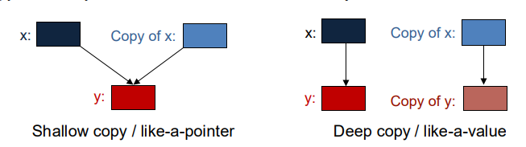

<div align="center">
<h1> Classes
</div>
<div align="center">
    <em>Algorithms and Parallel Computing</em><br>
    <em>Juan Pablo Vallejo Montañez</em><br>
    <em>Notes from Politecnico di Milano 2025/2026 Y.</em><br>
</div>


# 1. Introduction and Definitions.

A <strong>Class</strong> is a <i>user-defined type</i> that specifies how objects of its type can be
created and used. A class work as <strong>template</strong>. It deinfes  the data memebers and the methods the objects can support. Is the basic unit of encapsulation and it can be considered as  the collection of similar types of objects.

<strong style="color:#FF0000;">EXAMPLE OF THE DOGS</strong>

A class directly <i>represents a concept</i> in a program. If we can think of <i>it</i> as a separate <i>entity</i>, it is plausible that it could be a <strong>class</strong> or an <strong>object</strong> of a
class.

<i>Examples:</i>  vector, matrix, input stream, string, FFT, valve controller, robot arm, picture on screen,
dialog box, graph, window, temperature reading, clock

- In C++ (as in most modern languages), a class is the key building block for large
programs
- And very useful for small ones also
- Classes implement a very important concept: Abstract Data Types

The process by which the compiler creates a specific class or function from a template is called <strong>instantiation</strong>.


An <strong>Object</strong> is an instance of a class. Each objet has a class which defines its data and behaviour. Objects have states anc can be thought of as a realizations of a class.

<i style="color:#2E86C1;">Example - Stack: Array-base implementation.</i>

- Type: Stack
- Domain: Stack of integers (int)
- Policy: LIFO – Last In, First Out

<i>(Note: Queues follow the opposite rule — FIFO, First In, First Out.)</i>


<div style="text-indent: 30px;">
<i>Stack.h</i>
</div>

````cpp
//DECLARATIONS

 const int max_size = 10; // Maximum size of Stack
 class Stack {
 public:
 Stack() { top_index = -1; }
 // constructor: initializes the Stack data structure
 void push(int x);
 int pop();
 int top() const;
 ~Stack() { std::cout << "Stack deallocated"; }
 // destructor: runs when Stack data goes out of scope
 private:
 bool isEmpty() const;
 bool isFull() const;
 int top_index;
 int a[max_size];
 };
 ````
<div style="text-indent: 30px;">
<i>Explanation</i>
</div>

- <strong>Construction:</strong> Creates an instance and initializes it as an empty stack. In the case of the `Stack`, the constructor does not contain any parameters.
- <strong>void push(int x):</strong> Adds element x to the top of the stack.
- <strong>int pop():</strong>	Returns the element at the top of the stack and removes it.
- <strong>int top():</strong> 	Returns the element at the top of the stack without modifying it.
- When the <code>main()</code> function finishes, the <code>Stack</code> object goes out of scope.
At that moment, its destructor is automatically called to deallocate the stack and finalize the instance.

<div style="text-indent: 30px;">
<i>Implementation</i>
</div>

<br>
<div style="text-indent: 30px;">
<i>Stack.cpp</i>
</div>

````cpp
// Stach.CPP
#include "Stack.h"

// IMPLMENETATIONS
// The function returns true if top_index is less than 0
bool Stack::isEmpty() const{
    return top_index < 0;
}

//The function returns true if top_index is greater or equal to the last position.
// Remember that positions in the array go from 0 to max_size-1.
bool Stack::isFull() const{
    return top_index >= (max_size- 1);
}

//++top_index :increases the top_index by 1 before using it (pre-increment).
//a[++top_index] = x; stores the new element x in the next free position at the top of the stack.
void Stack::push(int x){
    if (isFull()) {
        cout << "Stack Overflow";
    } else {
        a[++top_index] = x;  
        cout << x << " pushed onto stack\n";
    }
}


int Stack::pop(){
    if (isEmpty()) {
        cout << "Stack Underflow";
        return 0;
    }
    else {
    int x = a[top_index--];
    return x;
    }
}

int Stack::top() const{

    if (isEmpty()) {
        cout << "Stack is Empty";
        return 0;
    }
    else {
        int x = a[top_index];
        return x;
    }
}
````

<div style="text-indent: 30px;">
<i>Claim</i>
</div>

There are difference between `a[top_index--]` and `a[--top_index]`.

| Expression | What happens first| What happens after| 
| ---------------- | ----------------------------------------- | --------------------------- | 
| `a[top_index--]` | Uses the **current value** of `top_index` | Then **decreases** it by 1  |
| `a[--top_index]` | **Decreases** `top_index` first           | Then uses the **new value** |

<i style="color:#FF0000;">SEE SLIDES PAGE 173 TO LOOK HOW WORKS THE CONECTION BETWEEN THE SOURCE FILES</i>


## 1.2 UML

A <strong>UML (Unified Modeling Language)</strong> class diagram is a graphical representation of a class that shows:
- Its name (the type or concept being modeled)
- Its attributes (the data it contains)
- Its operations or methods (the actions it can perform)
- The visibility of each element (+ for public, - for private)

public (+), private(-)

<i style="color:#FF0000;">SEE SLIDES PAGE 174-173 tO LOOK UML EXAMPLES</i>
atributtes can be of different types or can be other class

## 1.3 Constructor.

A <strong>constructor</strong> is a special method that creates an instance of a class and initializes it (for example, an empty stack, a default value, etc.).

 - In C++, the constructor is a method that has the same name as the class.
 - The constructor is automatically invoked by the language’s run-time system every time an object is created.
 - A class can have multiple constructors with different parameters (overloaded constructors).
 - Constructors can have parameters (for example, to initialize data members with specific values).
 - If no constructor is defined by the programmer, C++ automatically provides a default constructor — one that takes no parameters and does nothing special.

See [Complete Section](#6-constructors).

## 1.4 Destructor.

A <strong>destructor</strong> works inversely to a constructor — it is automatically invoked every time an object goes out of scope or is explicitly destroyed.

 - The destructor is a method with the same name as the class, but prefixed with a tilde (~).
 - It is associated with the finalization (or cleanup) of an instance — it runs when the object’s lifetime ends.
 - It has no return value and takes no parameters.
 - There is always only one destructor for a given class (It is unique).
 - The destructor performs cleanup tasks, such as freeing resources or memory used by the object - Its main purpose is to release resources, such as memory or file handles, before the object is destroyed.
 - Destructors are extremely important when using raw (C-style) pointers to avoid memory leaks.
 - If no destructor is defined, C++ provides a default destructor automatically.

## 1.5 Class Members.

In object-oriented programming (OOP), class members are the components that belong to a class. According to the general definition, the class members are :

 - Attributes (also known as fields or properties).
 - Methods.
 - Constructor (Special method used to initialize objects).
 - Class variables.
 - Instance variables.
 - Nested classes.

<strong>Note: The class members are pivate by default in C++.</strong> 

### 1.5.1 Static Members.

A static member in C++ is a member of a class (either a variable or a function) that belongs to the class itself, not to any specific object. A static member lives inside the class, not in the individual objects (instances).Therefore, does not belong to any particular object, so all objects of the class share the same copy and can be accessed using the class name, without creating an object.

````cpp
class Example {
public:
    static int counter; // static member
};

int Example::counter = 0;
int main() {
    Example::counter = 5; // Accessing without creating an object
}
````
Here, <code>counter</code> exists once in memory for the whole class, not separately for each object.

````cpp
class Example {
public:
    int nonStatic;      // belongs to each object
    static int staticVar; // belongs to the class itself
};

````
<i style="color:#2E86C1;">Memory Layout Visualization</i>

````
Class: Example
+---------------------------+
| staticVar (shared by all)|
+---------------------------+

Objects:
    Object1             Object2
  +----------+        +----------+
  | nonStatic|        | nonStatic|
  +----------+        +----------+

````

 - <strong>nonStatic:</strong> Each object has its own copy. Changing Object1.nonStatic does not affect Object2.nonStatic.

 - <strong>staticVar:</strong> Only one copy exists, shared by all objects. Changing it anywhere changes it for everyone.

 - Access:
   - Non-static → object.nonStatic.
   - Static → Example::staticVar (no object needed).

# 2. Abstract Data Type (ADT)


<div align="justify">
An <strong>Abstract Data Type (ADT)</strong> is a logical description of a type, defined by:

1. Its domain (the set of possible values it can hold).
2. Its operations (the actions that can be performed on those values).

In other words, an ADT defines <strong>what operations can be done,but not how they are implemented.</strong>

ADTs separate the specification (what it does) from the implementation (how it does it).

 - Specification (what):	Describes available operations and their behavior.
 - Implementation (how): 	Defines the internal data representation and algorithms used.

````cpp
// Specification (what)
class Stack {
public:
    void push(int value);
    void pop();
    int top() const;
    bool isEmpty() const;
private:
    // Implementation (how)
    std::vector<int> elements;
};
````
In C++, an ADT is implemented as a class. A class (or module) separates <i>What the software does	</i> (The public interface (set of services)) and 
<i>How it does it</i>	(The private internals (implementation details))

The module that defines a new ADT and all the operations that allow us to manipulate its instance, can:

 - <i>Exports (or make available for other parts of the program)</i> the type name and the operations to manipulate it.
 - <i>Hides</i> The structure and the implementation details.  

The user can create objects (data) of the type specified by the module and manipulate these
objects through the operations defined within the module,
</div>

_______________________________________________________


 I really dont undesratbt what is a ADT ???
 What is the difference between implementation and definiton and operation?
 What really means implementation?
 what is an interface?


sEE THE IMAGE IN THE SLIDES page 150 slide 1 

Implementation of ADT
How information is storedin implementation is hidden from users of ADT
how information is stored = Data Structure.


See explamples on the sludes

FINISH THIS PARTS OF ADT

# 3. Structs.

A struct is a class where members are public by default.
````cpp
struct X {
    int m;
       // .....................
    };
    
//is equivalent to

class X {
    public:
    int m;
    //. ....................
};
 ````

## 3.1 Why bother with the public/private distinction?

1. Not everything should be public: Making everything public exposes internal details. Public members are accessible from anywhere, which can lead to unintended misuse.

2. Provides a clean interface: Public members define the interface that other code interacts with. Private members can hide “messy” or complex details that users don’t need to see.

3. Allows flexible implementation: If internal representation is private, you can change it freely without breaking code that uses the class.Only the public functions (interface) need to remain consistent.

4. Simplifies maintenance and debugging: When internals are hidden, it’s easier to locate and fix issues (“round up the usual suspects” technique). Private members help enforce invariants (rules about how data should behave).

5. Supports code evolution: Users of your class only rely on the public interface. You can change internal data structures or algorithms without affecting external code.


<i style="color:#2E86C1;">Benefits of information hiding (private members)</i>

- Easier support for code evolution.
- Internal changes don’t require changes in external code.
- Reduces the chance of unintended interference.
- Simplifies debugging and maintenance.
- Maintains invariants automatically.

## 3.2 Invariants.

An invariant is a condition or rule that must always be true for a piece of data or an object, no matter what operations are performed on it. In other words  <i>A rule for what constitutes a valid value is called an <strong>invariant</strong></i>

We try to design our types so that values are guaranteed to be valid  (or we have to check for validity all the time).

<i>Advice: Try hard to think of good invariants and use classes, rather than structs. That saves you from poor buggy code</i>


# 4. Operators.

## 4.1 Operator dot <code>.</code>

The dot operator is a symbol (.) that lets us reach inside an object to use its attributes and methods.

<i style="color:#2E86C1;">Example</i>

````cpp
#include <iostream>
using namespace std;

class Person {
public:
    string name;
    int age;
    void greet() {
        std::cout << "Name: " << name << " , age:  " << age <<std::endl;
    }
};

int main() {
    Person person;        // Create an object of type Person
    person.name = "Anna"; // Accessing an attribute using the dot operator
    person.age = 25;
    person.greet();       // Calling a method using the dot operator
    return 0;
}
````

````cpp
my_birthday.m
````

Here, the dot operator is used to call the month() function on the object named my_birthday.

Except for static members, every time we call a member function, we do so on behalf of a specific object.The object before the dot determines which instance the function operates on.

BEHALFF MEANS EN NOMBRE DE O DE PARTR DE O POR CUENTA DE 

Inside a member function like month(), any reference to members of the class (for example, an attribute m) is actually a reference to the members of the object that invoked the function.
This happens implicitly—C++ automatically knows which object you mean.

Therefore, if month() returns the value of m, what it is really returning is:

````cpp
my_birthday.m
````

because my_birthday is the object that called the function. Wew don’t need to specify the object name inside the function — C++ already knows.

## 4.2 Operator <code>this</code>.

<code>this</code> is a special pointer available inside all non-static member functions of a class.<strong>It points to the object that is currently calling the function.</strong>

Member functions automatically have access to the object that calls them through an implicit parameter called <code>this</code>. When we call a member function, this is initialized with the address of the object that invoked the function.

````cpp
my_birthday.month();
````


Here, the compiler automatically passes the address of <strong>my_birthday</strong> to <code>this</code>.

Conceptually, the call is translated by the compiler as:

````cpp
// Illustration of what happens behind the scenes
int Date::month(Date* this)
Date::month(&my_birthday); // &my_birthday is passed to the function
````
Inside the function, any access to the object’s members (like m) is interpreted as <code>this->m</code>, meaning the member of the object that called the function.


<i style="color:#2E86C1;">object->attribute vs object.attribute</i>

1. Use <code>.</code> when you have an actual object:

````cpp
Date my_birthday;
my_birthday.m = 5; // dot operator because my_birthday is an object
````

2. Use <code>-></code> when you have a pointer to an object:

````cpp
Date* ptr = &my_birthday;
ptr->m = 5; // arrow operator because ptr is a pointer  
````

The this parameter is automatically defined by the compiler for all non-static member functions.It is illegal for us to define a variable or parameter named this.

Inside the body of a member function, we can freely use this to refer to the object that called the function.

````cpp
int month() {
    return this->m; // legal but not strictly necessary
}
````

Using <code>this->m</code> is allowed because this always refers to the current object.

<strong>this is a const pointer</strong>: we cannot change the address it holds, i.e., <strong>it always points to the object that invoked the member function</strong>.


## 4.3 <code>const</code> member function.

A const member function is a member function of a class that guarantees not to modify the object on which it is called. Is declared by placing const after the parameter list:

````cpp
int getValue() const;
````


- Inside the function, the <code>this</code> pointer is treated as <code>const ClassName* const this</code>.
- Can be called on both const and non-const objects.
- Cannot modify any non-mutable members or call non-const member functions.
- Commonly used for getters, inspectors, or any operation that should not change the object’s state

````cpp
class Date {
public:
    // …
    int day() const; // get (a copy of) the day
    // …
    void add_day(int n); // move the date n days forward
    // …
};

//...

const Date dx {2008, 11, 4};
int d = dx.day();                   // Fine
dx.add_day(4);                      // ❌ ERROR This line is trying to modify a constant date (cons date)
````

````cpp
// FOR THE SAME CLASS 

Date d (2004, 1, 7);                  // a variable - Date object
const Date d2 (2004, 2, 28);          // a constant Date object
d2 = d;                               // ❌ ERROR d2 is const
d2.add(1);                            // ❌ ERROR d2 is const
d = d2;                               // fine d is not a const object
d.add(1);                             // fine d is not a const object
````

## 4.4 Operator Overloading.

In C++, it is possible to redefine the behavior of existing operators for user-defined types, a feature known as operator overloading. This allows operators such as +, -, *, and others to work naturally with classes, providing intuitive syntax for operations on objects.

Key Rules:

- Only existing operators can be overloaded. We cannot create new operators; we can only redefine the behavior of those already defined in the language.

Examples of overloadable operators include:
````
+  -  =  +=  *  /  %  []  ()  ^  !  &  <  <=  >  >=
````

- Operands must respect conventional arity: Operators cannot be redefined with a different number of operands than usual.For instance, there is no unary version of <code><=</code> and no binary version of <code>!</code>.

- At least one operand must be a user-defined type : We cannot overload operators to work only with built-in types.

````cpp
//Example of illegal overloading:
int operator+(int, int); // ❌ invalid: both operands are built-in types

//Example of legal overloading with a user-defined type:
Vector operator+(const Vector& a, const Vector& b); // ✅ valid
````

To summarize, operator overloading provides a mechanism to make user-defined types behave like built-in types in expressions, improving code readability and usability. However, overloading must follow strict rules to preserve the language’s semantics and avoid ambiguity.

<i style="color:#2E86C1;">Suggestions</i>

- Overload operators only with their conventional meaning + should be addition, * be multiplication, [] be access, () be call, etc.
- Don’t overload unless we really have to.
- Don’t overload , * && || ! . Operand-evaluation are not preserved and short circuit does not work anymore.

SEE THE LAST PAGES OT THE SLIDES 6


## 5. INTERFACE ?????? and HELPER FUNCTIONS. See 6  slide 38


__________________________________________________

Advanced Classes

classess members are private by default

Struct is a particular kind of class
by default all the members is public  

What is heterogenius types?

Public private beneficies


Members are accessed using . (dot) for objects and −> (arrow) for pointers
• Operators, such as +, !, and [], can be defined
• The public members provide the class interface and the private members provide
implementation details


 Class members are private by default:
 class X {
 int mf();
 // …
 };
 is equivalent to
 class X {
 private:
 int mf();
 // …
 };
• So
 X x; // variable x of type X
X *px = &x; // pointer to type X
int y = x.mf(); // error: mf is private (i.e., inaccessible)
int w = (*px).mf(); // error: mf is private (i.e., inaccessible)
int z = px->mf(); // error: mf is private (i.e., inaccessible
____________________________________________________

## 6. Constructors.

<strong>The constructor have the same name as the class and unlike other functions, constructors have no return type
.</strong>

Like other functions, constructors have:
 - a (possibly empty) parameter list.
 - a (possibly empty) function body.

In the [first part](#13-constructor) we said a class can have multiple constructors with different parameters (overloaded constructors). This constructors may not be declared as <code>const</code>.

The reason is <code>const</code> member functions promise not to modify the object, but the constructor’s job is to initialize the object, which inherently modifies it.

When we create a const object of a class type:

````cpp
const MyClass obj;
````

The object does not assume its constness until after the constructor finishes.This allows the constructor to write to and initialize the object’s members even if the final object is const.

<i>Note: Constructors can modify all members, including those that will later be const, because the object is not yet fully constructed.</i>

## 6.1 In-class initializer

An in-class initializer is a way to provide a default value for a class member directly where it is declared inside the class.Instead of initializing members in every constructor, we can set a default value once in the class definition.

If a constructor does not explicitly initialize a member, the in-class initializer is used. If a constructor does initialize the member, that value overrides the in-class initializer.

````cpp
class Sales_data {
    public:
        std::string get_bookNo() const {return bookNo;} 
        Sales_data& operator+=(const Sales_data&);
    private:
        std::string bookNo;
        unsigned units_sold = 0;
        double revenue = 0.0;
    }
````

<i>Note: We don’t have to write a constructor if you use in-class initializers.</i> I'M NOT SURE ABOUT THIS

## 6.2 Default constructor.
Classes control default initialization by defining a special constructor, known as the 
default constructor. The default constructor takes no arguments.

````cpp
Class Sales_data {
    public:
        Sales_data(){ … } 
        // rest of the class
};
````

<i>Note: Default constructor is used when no explicit initialization is indicated, e.g.:
<code>Sales_data sd;</code></i>

The default constructor is used automatically whenever an object is default- or value-initialized.
- Default initialization happens when: 
  - We define non-static variables or arrays at block scope without initializers.
  - A class that itself has members of class type uses the synthesized default constructor. 
  - Members of class type are not explicitly initialized in a constructor initializer list.

STUDY THIS

- Value initialization happens:
  - During array initialization when we provide fewer initializers than the size of the array.
  - When we define a local static object without an initializer.
  - When we explicitly request value initialization by writing an expressions of the form T() where T is the name of a type (e.g., vector).

<strong>Note: Classes must have a default constructor in order to be used in these contexts.</strong>

It is necessary that there is at least one way to construct an object. That is, each class must have at least one constructor. If our class does not explicitly define any constructors, a default constructor will be implicitly defined by the compiler.

The compiler-generated constructor is known as the <strong>synthesized default constructor</strong>. For 
most classes, this synthesized constructor initializes each data member of the class as 
follows: 
 - If there is an in-class initializer, use it to initialize the member. 
 - Otherwise, default-initialize the member.

````cpp
class Sales_data {
    public:
        std::string get_bookNo() const {return bookNo;} 
        Sales_data& operator+=(const Sales_data&);
    private:
        std::string bookNo;
        unsigned units_sold = 0;
        double revenue = 0.0;
    }
````

In this example Sales_data provides initializers for units_sold and revenue, the synthesized default constructor uses those values to initialize those members. It default-initializes bookNo to the empty string. 


We cannot always rely on the Synthesized Default Constructor. Only fairly simple classes can rely on the synthesized default constructor

<strong style="color:#FF0000;">The compiler generates the default constructor for us only if we do not define any other constructors. If we define at least one constructor, the class will not have a default constructor unless we define that constructor ourselves explicitly ( a enos que lo definamos nosotros mismos)</strong>

If a class requires control to initialize an object in one case, then the class is likely to require control in all cases (If we need a constructor to do something special sometimes, we probably need constructors for every object, not just some.)

For some classes, the synthesized default constructor does the wrong thing:
  - E.g., objects of built-in or compound type (such as arrays and pointers) have undefined value when they are default-initialized.We should initialize those members inside the class or define our own version of the default constructor. Otherwise, we could create objects with members that have undefined value
  - Sometimes the compiler is unable to synthesize one
    - E.g., if a class has a member that has a class type, and that class doesn’t have a default 
constructor, then the compiler can’t initialize that member.
STUDY THIS

````cpp
class NoDefault { 
    public: 
        NoDefault(const std::string&); 
        // additional members follow, but no other constructors
}; 

struct A {   
    NoDefault my_mem;   // my_mem is public by default;
}; 

A a;                    // error: cannot synthesize a constructor for A 
 ````

<code>NoDefault</code> does not have a default constructor (NoDefault()). The only available constructor takes a <code>const std::string&.</code>. In struct A, the member my_mem is of type NoDefault, but A does not define any constructor.
Therefore, when we write:

````
A a;
````

the compiler tries to synthesize a default constructor for A, which would default-initialize all of its members.
But since my_mem requires a std::string argument, the compiler cannot default-initialize it, and the synthesis of A's default constructor fails.

In other words, A is trying to initialize a NoDefault object without providing the required constructor argument, which makes the code ill-formed.That means we cannot create a NoDefault object without providing a string.


## 6.3 Constructor Initializer List.

A constructor initializer list (also called an initialization list) is the part of a C++ constructor that allows you to directly initialize data members and base classes before the constructor body runs.

It appears after the constructor’s parameter list and before the constructor body, using a colon : followed by comma-separated initializers.

````cpp
class Foo {
public:
    int x;
    std::string name;

    Foo(int val, const std::string& str)
        : x(val), name(str)    // ← initializer list
    {
        // constructor body
    }
};

````
<i style="color:#2E86C1;">Example - Books</i>

````cpp
Class Sales_data {
    public:
        Sales_data() = default;
        Sales_data(const std::string &s): bookNo(s) { }
        Sales_data(const std::string &s, unsigned n, double p):bookNo(s),units_sold(n),revenue(p*n){ }

        // other members as before
        std::string get_bookNo() const { return bookNo; }
        Sales_data& operator+=(const Sales_data&);
        double avg_price() const;
    private:
        std::string bookNo;           // default intializer
        unsigned units_sold = 0;      // default intializer
        double revenue = 0.0;         // default intializer
};

````

 - <code>Sales_data()</code> is the default contructor.
 - If the constructor takes a string argument,the object is initialized directly from the parameter <code>s</code> via the intializer list. The attribute <code>bookNo</code> will be intialized with the parameter <code>s</code> as well.

 - If the constructor takes a string, an unsigned, and a double parameter, the object will be initialized using those values to initialize its attributes.

<i>“When the first constructor is used, only bookNo is initialized.
The members units_sold and revenue = 0.0 automatically initialize these data members to zero whenever a constructor does not explicitly initialize them. See the default intializer for each attribute.” </i>

````cpp
Sales_data(const std::string &s):bookNo(s), units_sold(0), revenue(0){ } 
````

El objeto original puede ser const o no const, no importa.
La referencia que recibes lo trata como const mientras esté dentro del constructor.
En otras palabras
You cannot modify the object through that reference,
but the original object itself is not made const. ACALARACION PARA ESTE PUNTO EN ESPAÑOL


<i style="color:#2E86C1;">Initialization vs Assignment in Constructors</i>

A constructor may initialize its data members either:

 - Using a constructor initializer list.
 - By assigning values inside the constructor body.

<i>Example of assignment inside the constructor body (legal but sloppier):</i>

````cpp
// Legal but not recommended: uses assignment, not initialization
Sales_data::Sales_data(const string &s, unsigned cnt, double price)
{
    bookNo = s;
    units_sold = cnt;
    revenue = cnt * price;
}
````

Using assignments inside the constructor body is generally discouraged when members could be initialized directly.


The same distinction that exists for local variables applies to data members:

````cpp
string foo = "Hello World!";  // initialization
string bar;                   // default-initialized to empty string
bar = "Hello World!";         // assignment
````

Data members behave identically. Members listed in the initializer list are initialized.Members not listed are default-initialized before the constructor body runs.

Assignments in the constructor body overwrite already-initialized members.

<strong>If a data member is not explicitly initialized in the initializer list, it is default-initialized before the constructor body begins execution.This can matter for performance and correctness, especially for complex objects.</strong>

There are situations in which members must be initialized in the initializer list.
Specifically:
 
 - <code>const</code> members
 - Reference members (&)
 - Members of a class type without a default constructor

<strong style="color:#FF0000;">These cannot be assigned inside the body, so they must appear in the initializer list.
</strong>

Example:

````cpp
class ConstRef {
public:
    ConstRef(int ii);
private:
    int i;
    const int ci;
    int &ri;
};
````

Attempting to assign to these members inside the constructor body is an error:

````cpp
// ❌ Error: ci and ri must be initialized
ConstRef::ConstRef(int ii)
{
    i = ii;     // ok
    ci = ii;    // error: cannot assign to a const
    ri = i;     // error: ri was never initialized
}
````
````cpp
// ✔ Correct: explicitly initializes const and reference members
ConstRef::ConstRef(int ii)
    : i(ii), ci(ii), ri(i) { }
````

<i>Key Points</i>

- Initialization happens before the constructor body runs.
- Assignment happens inside the constructor body, after initialization.
- Always prefer initialization when possible.
- Some members (const, reference, no-default-constructor types) must be initialized and cannot be assigned later.
- Using the initializer list is generally safer, more efficient, and sometimes required.

## 6.4 Delegating Constructors 

A delegating constructor uses another constructor from its own class to perform its initialization.
````cpp
class Sales_data { 
    public: 
        // non-delegating constructor initializes members from corresponding arguments 
        Sales_data(const std::string& s, unsigned cnt, double price): bookNo(s), units_sold(cnt), revenue(cnt*price) { }
        // remaining constructors all delegate to another constructor 
        Sales_data(): Sales_data("", 0, 0) {} 
        Sales_data(const std::string& s): Sales_data(s, 0, 0){} 
        // other members as before 
};
````
Initializer lists are run first but members are initialized in order as they appear in the class declaration (in some situations this might create a mess, use the same order!).

Then, (non-static) data members are initialized in order of declaration in the class definition according to in-class initializers. Finally, the body of the constructor is executed. If a constructor relies on a delegating constructor, the delegated constructor is executed first, then the control returns to the delegating constructor and its body is executed.

## 6.5 Copy, Assignment, and Destruction.

Classes also control what happens when objects of the class type are copied, assigned, or destroyed.
These operations occur frequently and automatically in C++.

### 6.5.1 When Objects Are Copied

An object of class type is copied in several situations:

- Variable initialization

````cpp
Foo x = y;  // copy initialization
````

- Passing an object by value

````cpp
void f(Foo obj); // obj is a copy of the argument
````

- Returning an object by value

````cpp
Foo g() { return localFoo; } // localFoo is copied to the caller
````

- Copy-initializing elements inside containers: 
e.g., pushing objects into a vector

### 6.5.2 When Objects Are Assigned

Using the assignment operator (operator=):

````cpp
x = y;   // assignment, not initialization
````
### 6.5.3 When Objects Are Destroyed

An object is destroyed when:

- It goes out of scope (e.g., local variables at the end of a block)
- A container (vector, array, etc.) destroys its elements
- Dynamically allocated objects are deleted (delete ptr)
- Temporary objects created during expression evaluation are discarded
- Destruction calls the class’s destructor.

If the programmer does not define a copy constructor, a copy-assignment operator or a destructor,then the compiler will generate them automatically. Ordinarily, the versions that the compiler generates for us execute by copying, assigning,
or destroying each member of the object.

````cpp
Sales_data total; // variable to hold the running sum
Sales_data trans; // variable to hold data for the next transaction
total = trans;


// default assignment for Sales_data is equivalent to:
total.bookNo = trans.bookNo;
total.units_sold = trans.units_sold;
total.revenue = trans.revenue
````

Some classes cannot rely on the synthesized versions. The synthesized versions are unlikely to work correctly for classes that allocate resources that reside outside the class objects themselves (e.g., use dynamic memory).
For the moment, if you need to use dynamic memory, use vectors or strings to manage the necessary storage, we will get back to this issue.


# 7 Type Member.

A type alias is simply an alternative name for an existing type.
It does not create a new type—it just gives another identifier that refers to the same type.

In C++, there are two main ways to define a type alias:

- Using using (modern and recommended)

````cpp
using SD = Sales_data;   // SD is a synonym for Sales_data 
````

- Using typedef (older syntax)

````cpp
typedef double wages;    // wages is a synonym for double
typedef wages base, *p;  // base is a synonym for double, p for double*
````

<i>Example</i>

````cpp
class Screen {
    public:
        typedef std::string::size_type pos;
        Screen() = default; // needed because Screen has another constructor

        // cursor initialized to 0 by its in-class initializer
        Screen(pos ht, pos wd, char c): height(ht), width(wd), contents(ht * wd, c) { }
        char get() const { return contents[cursor]; } // get the character at the cursor

        char get(pos r, pos c) const;
    private:
        pos cursor = 0;
        pos height = 0, width = 0;
        std::string contents;
};
````
<strong style="color:#FF0000;">Members that define types must appearbefore they are used
</strong>


This makes <code>pos</code> a type alias for std::string::size_type.

std::string::size_type is an unsigned integer type used for string positions.Writing it every time is annoying and long.So the class defines an alias:  pos means “a position type”.


# 8. Nonmember functions and operator +.

A nonmember function is simply a function that is NOT inside a class. It does not have access to:
- this
- private members of any class (unless made a friend)

It behaves like a normal C/C++ free function. A nonmember function lives outside the class.

<i style="color:#2E86C1;">operator +</i>

In C++, we can redefine how operators behave for our own classes.

````cpp
a + b

// is actually calling this function 

operator+(a, b);

````
So operator+ is simply a function that defines how + works for your type.

- As a member function. The function is defined inside the class

````cpp
class X {
    public:
        X operator+(const X &rhs) const;
};
````
Then a + b is interpreted as:`

````cpp
a.operator+(b); // it menas a+b
````

- As a nonmember function. Written outside the class:

````cpp
X operator+(const X &lhs, const X &rhs);
````

Then a + b becomes:

````cpp
operator+(a, b);
````

This does not require that the left operand is an X. Both operands are passed equally.

<i style="color:#2E86C1;">Why is operator+ usually written as a nonmember?</i>

Because addition is symmetric. If operator+ is a member function:

````cpp
//(a+b)
//(b+a)
a.operator+(b) // works
b.operator+(a) // works only if b is an X
````

If operator+ is a nonmember, both operands are treated the same. That's why C++ Primer (and most modern C++) recommends:

````cpp
X operator+(const X&, const X&);
````
<i style="color:#2E86C1;">Why does a nonmember need friend?</i> 

Because private members of the class cannot be accessed from outside.

````cpp
class X {
private:
    int value;
};

X operator+(const X &a, const X &b) {
    return X{a.value + b.value};    // ❌ ERROR: cannot access private
}
````


To allow the nonmember operator+ to read private members:
````cpp
class X {
    friend X operator+(const X&, const X&);
private:
    int value;
};
````

- Members defined after a <strong>public</strong> specifier are accessible to all parts of the
program. Public members define the interface to the class
- Members defined after a <strong>private</strong> specifier are accessible to the member functions of the class but are not accessible to code that uses the class. Private sections encapsulate (i.e., hide) the implementation
- A class can allow another class or function to access its nonpublic members <strong>by making that class or function a friend.</strong>

<i style="color:#2E86C1;">Example</i> 

````cpp
// All code in Sales_data.h
class Sales_data { 
    // friend declarations for nonmember Sales_data operations added
    friend Sales_data operator+(const Sales_data&, const Sales_data&);
    // other members and access specifiers as before
    private:
        std::string bookNo;
        unsigned units_sold;
        double revenue;
    public:
        std::string get_bookNo() const;
        // other members and access specifiers as before (constructor, getters and setters)
        Sales_data& operator+=(const Sales_data&);
};
// declarations for nonmember parts of the Sales_data interface
Sales_data operator+(const Sales_data&, const Sales_data&);
````
````cpp
// Implementation in in Sales_data.cpp
Sales_data operator+(const Sales_data& lhs, const Sales_data& rhs)
{
 Sales_data ret;
 ret.bookNo = lhs.bookNo;
 ret.units_sold = lhs.units_sold + rhs.units_sold;
 ret.revenue = lhs.revenue + rhs.revenue;
 return ret;
}
````

<i>Claims</i>
- The functions <code>operator+=</code> and <code>operator</code> are completely different functions.
- The friend declaration does not declare the function for use outside the class and neither does not define the function.
<strong>It only grants access permission. This allows the nonmember function to write lhs.bookNo, lhs.units_sold and 
lhs.revenue without error. Notice that these variables are private, meaning only members functions can access them. Nonmembers cannot access them unless they are declared as friends.</strong>
- A friend declaration only specifies access. It is not a general declaration of the function.
  - If we want users of the class to be able to call a friend function, then we must also declare the function separately from the friend declaration
  - We usually declare each friend (outside the class) in the same header as the class itself
  - This is why our Sales_data header provides a separat declaration (aside from the friend declaration inside the class body) for operator+

# 9. static Class Members.

[A static member in C++ is a member of a class (either a variable or a function) that belongs to the class itself, not to any specific object](#151-static-members). We say a member is associated with the class by adding the keyword <code>static</code>
to its declaration.
 - Like any other member, static members can be public or private
 - The type of a static data member can be const, reference, array, class type, and so forth.
 - We can also have static methods.

 <i style="color:#2E86C1;">Static Member Function</i>

 A static member function in a class is a function that belongs to the class itself, not to any specific object of that class. This function does not operate on individual objects — it operates on the class as a whole.

 <i>Claims</i>
  - They do not have a <code>this</code> pointer. Because they <strong>are not tied to any object</strong>. So inside a static function you cannot do this:
 
````cpp
value = 5;    // ❌ error if value is a non-static member
````
<strong>Only static data members can be accessed.</strong>

<strong style="color:#FF0000;">Warning - Why static and const cannot appear together in a member function
</strong>

Static member functions belong to the class, not to any object thet don´t have <code>this</code> pointer.

In the other hand, const member functions promise not to modify the object and apply to the implicit this pointer.

<i>Key contradiction:</i> A const member function has a signature like:
````cpp
double rate() const;
          ↑
       means “this is const”
````

But a static function has NO this pointer. So adding const to a static function is meaningless. It's like saying: "....This function belongs to no object… but it promises not to modify the object.”

This is logically impossible.So C++ forbids it.

We must choose:
 - Either const (requires an object) 
 ````cpp
double rate() const;   // OK (non-static) 
````
 - Or static (no object involved)
 ````cpp
static double rate();  // OK (static)
````
 - But NOT both
 ````cpp
static double rate() const;  // INVALID
````


If the function does not depend on an object, declare it static:
````cpp
static double rate();
````
If the function does depend on the object but does not modify it:
````
double rate() const;
````

<i>Summary</i>:
A static member function has no this pointer, so it cannot be const. Adding const to a static function has no meaning, and C++ forbids it.

````cpp
class Account {
    public:
        void calculate() { amount += amount * interest_rate; }
        // A declaration like this: static double rate() const; doesn't make any sense!!!
        static double rate() { return interest_rate; }
        static void rate(double);
    private:
    std::string owner;
        double amount;
        static double interest_rate;
        static double init_rate();
}; 
````
We can access a static member directly through the scope operator:
````cpp
double r;
r = Account::rate(); // access a static member using thescope operator
````
Even though static members are not part of the objects of its class, we can use an object, reference, or pointer of the class type to access a static member:
````cpp
 Account ac1;
 Account *ac2 = &ac1;`

 // equivalent ways to call the static member rate function
 r = ac1.rate(); // through an Account object or reference
 r = ac2->rate(); // through a pointer to an Account object 
````


<i>Note: Member functions can use static members directly, without the scope operator.</i>

````cpp
class Account {
    public:
        void calculate() { amount += amount * interest_rate; }
        // remaining methods as before
    private:
        static double interest_rate;
        // remaining members as before
}; 
````

<i>Note: As with any other member function, we can define a static member function inside or outside of the class body. When we define a static member outside the class, we do not repeat the
static keyword. The keyword appears only with the declaration inside the class body.</i>

````cpp
void Account::rate(double new_rate)
{
 interest_rate = new_rate;
}
````

Because static data members are not part of individual objects of the class type, they are not defined when we create objects of the class. As a result:
 - They are not initialized by the class constructors.
 - We may not initialize a static member inside the class.
 - We must define and initialize each static data member outside the class body.
 - Like any other object, a static data member may be defined only once.
 -  Like global objects, static data members are defined outside any function.
 - Once they are defined, they continue to exist until the program completes.

<strong style="color:green;">Note:Global variables and static members are “static data”.
</strong>

We define a static data member similarly to how we define class member functions outside the class:
 - Name the object’s type, followed by the name of the class, the scope operator, and the member’s own name:
 ````cpp
// define and initialize a static class member
double Account::interest_rate = init_rate();
````
- The best way to ensure that the static members are defined exactly once is to
put the definition of static data members in the <strong>source (cpp) file</strong>.

# 10. Class Scope
A scope is a region of program text
  - Global scope (outside any language construct, e.g., before main())
  - Local scope (between { … } braces)
  - Statement scope (e.g., in a for-statement)
  - <strong>Class scope (within a class)</strong>


 A name in a scope can be seen from within its scope and within scopes nested within that 
scope.Only after the declaration of the name (“can’t look ahead” rule).<strong> Exception to this rule: class members can be used within the class before they are declared</strong>

A scope keeps <i>things</i> local.
 - Prevents my variables, functions, etc., from interfering with yours
 - Remember: real programs have many thousands of entities
 - Locality is good!
 - Keep names as local as possible


````cpp
// get max and abs from algorithm and cstlib
// no r, i, or v here
class My_vector {
    public:
        int largest()  {    // largest is in class scope
            int r = 0;                              // r is local
            for (int i = 0; i < v.size(); ++i)      // i is in statement scope
                r = max(r,abs(v[i])); 
            // no i here
            return r;
        }
        // no r here
        private:
            vector<int> v;                         // v is in class scope
    };
    // no v here
````

 <i style="color:#2E86C1;">Example</i>


````cpp
// get max and abs from algorithm and cstdlib
// no r, i, or v here
class My_vector {
    public:
        int largest_buggy() {   // largest_buggy is in class scope
            vector<int> v;                      // ❌ redeclarate v, content of the attribute is lost. its values are initialized to 0.    
            int r = 0                           // r is local                 
            for (int i = 0; i < v.size(); ++i)  // i is in statement scope   
                r = max(r,abs(v[i])); 
            // no i here
            return r;
        }
        // no r here
    private:
    vector<int> v;     // v is in class scope             
};
// no v here
 ````

## Inhirence.

  SEE SLIDES 10

# 11. Copy Control.

Every class defines a new type along with the operations that objects of that type can perform. Part of this control includes specifying what should happen when objects are copied, assigned, or destroyed. Classes govern these behaviors through a set of special member functions: <strong>the copy constructor, the assignment operator, and the destructor</strong>. Together, these functions are known as copy control.

If a class does not explicitly define all of its copy-control operations, <i>the compiler automatically generates the missing ones</i>. This means many classes can safely ignore copy control altogether and rely on the defaults. However, for classes that manage resources such as dynamic memory, file handles, or shared state, using the default behavior can lead to serious errors—such as double deletion, memory leaks, or shallow copies.

<strong>In practice, the hardest part of working with copy control is not writing the functions, but recognizing when you actually need to define them.</strong>

````cpp
Sales_data trans, accum;
trans = accum; // uses the Sales_data copy-assignment operator 
````

## 11.1 The Synthesized Copy-Assignment Operator.

If a class does not explicitly define its own copy-assignment operator, the compiler automatically generates one. This synthesized operator works member-by-member: if all the class’s non-static members can be copy-assigned, then the compiler assigns each member of the right-hand object to the corresponding member of the left-hand object using the copy-assignment operator for that member’s type. However, if any member cannot be copy-assigned, the synthesized operator becomes implicitly deleted and cannot be used. Array members are handled element-by-element. Finally, the synthesized operator returns a reference to the left-hand object, just like a user-defined assignment operator would.

Key ideas
- The compiler automatically generates a copy-assignment operator if the class doesn’t define one.
- It performs member-wise assignment, using the copy-assignment operator of each member’s type.
- If any member type cannot be copy-assigned, the synthesized operator is deleted.
- Arrays are assigned element by element.
- The operator returns *this, i.e., a reference to the left-hand object.

````cpp
// equivalent to
Sales_data& Sales_data::operator=(const Sales_data &rhs) {
    bookNo = rhs.bookNo; // calls string::operator=
    units_sold = rhs.units_sold; // uses the built-in int assignment
    revenue = rhs.revenue; // uses the built-in double assignment
    return *this; // returns a reference to this object
}
````
<i>Example: When we copy a Sales_data object, we may want to copy the
number of units sold and the revenue, but to keep the book number
unchanged</i>

````cpp
Sales_data& Sales_data::operator=(const Sales_data &rhs)
{
    units_sold = rhs.units_sold;
    revenue = rhs.revenue;
    return *this;
}
````

The copy-assignment operator takes a parameter of the same class type:

````cpp
class Foo {
public:
    Foo& operator=(const Foo&);   // copy assignment
};
````

To match the behavior of built-in types, assignment operators return a reference to the left-hand object <code>(*this).</code>

## 11.2 Copy Initialization

When we use <strong>direct initialization</strong>, we ask the compiler to choose the constructor whose parameters best match the arguments we supply. The process works exactly like ordinary function overload resolution: the compiler selects the constructor that fits the given arguments.<i> Direct initialization (T obj(args...))
→ Constructor overload resolution chooses the best matching constructor.</i>

When we use <strong>copy initialization</strong>, we ask the compiler to create the object by copying the value on the right-hand side. In this case, the compiler may apply implicit conversions to convert the right-hand operand into something that can be used to construct the object. After this conversion, the copy (r move) constructor is used to create the object. <i>Copy initialization (T obj = rhs)
The compiler may perform implicit conversions on rhs, then constructs obj by copying (or moving) rhs.</i>

A constructor is considered a <strong>copy constructor</strong> if its first (and typically only) parameter is a reference to the <strong>same class type</strong>, and any additional parameters have default values. For example:

````cpp
class Foo {
public:
    Foo();              // default constructor
    Foo(const Foo&);    // copy constructor
    // ...
};
````

If a class does not define its own copy constructor, the compiler automatically attempts to synthesize one. <strong>Unlike the synthesized default constructor, the copy constructor is synthesized even if the class defines other constructors.</strong>

The synthesized copy constructor performs a member-wise copy of its argument: each non-static data member of the source object is copied into the corresponding member of the new object. This constructor is generated only if all members of the class can themselves be copied. If any member cannot be copied, the synthesized copy constructor becomes implicitly deleted and cannot be used.


The first parameter must be a reference, because passing by value would itself require copying—leading to infinite recursion. In practice, the parameter is almost always a reference to const, but the language does allow defining a copy constructor that takes a reference to non-const if needed.

The way each member is copied depends entirely on its own type:

How members are copied
- <strong>Class-type members</strong>: Copied using their copy constructor.
- <strong>Built-in type members</strong>: Copied directly (simple assignment).
- <strong>Array members</strong>: Copied element by element.

Thus, the synthesized copy constructor faithfully reproduces the structure of the object as long as all of its members support copying.

<i>Key ideas</i>

- The compiler synthesizes a copy constructor if none is provided.
- This happens even when other constructors exist.
- It performs member-wise copying.
- A member’s own type determines how it is copied.
- If any member is not copyable, the synthesized copy constructor is deleted.

 <i style="color:#2E86C1;">Example</i>

````cpp
//Equivalent copy constructor signature:
Sales_data(const Sales_data&);


//Equivalent copy constructor implementation:
Sales_data::Sales_data(const Sales_data &orig):
    bookNo(orig.bookNo), // uses the string copy constructor
    units_sold(orig.units_sold), // copies orig.units_sold
    revenue(orig.revenue) // copies orig.revenue
 { }
````

<i>REMARK — Container Elements Are Copies</i>

When we use an object to initialize a container or when we insert an object into a container (like vector, list, map, etc.), the container stores a copy of the object’s value, not the object itself. This is exactly like passing an object to a function by value: the container element is an entirely separate object, independent from the original.

There is no relationship between the container element and the object from which it was copied. Any later changes to the element inside the container do not affect the original object, and changes to the original object do not affect the element stored in the container.


## 11.2 Destructor

A destructor performs whatever actions the class designer wants to happen when an object is no longer needed. Most commonly, a destructor releases resources that the object acquired during its lifetime—such as dynamic memory, file handles, or network connections. Conceptually, the destructor does the inverse of what constructors do: while constructors initialize an object, the destructor cleans it up.

Like constructors, destructors have a function body, but unlike constructors, they do not have an initializer list. The destruction of member subobjects happens implicitly and automatically, in the <strong>reverse order of their construction.</strong>

<i>Key ideas</i>

- Construction
    - Members initialized before the constructor body.
    - Members initialized in the order of declaration in the class.

- Destruction
    - Destructor body runs first.
    - Members destroyed after, in the reverse order of initialization.

### 11.2.1 Syntax

A destructor is a special member function whose name is the class name prefixed with a tilde (~). It has no return type and takes no parameters, which means it cannot be overloaded. As a result, each class has exactly one destructor.

````cpp
class Foo {
    public:
        ~Foo();    // destructor
        // ...
};
````

The destructor is called automatically when an object goes out of scope or is deleted, allowing the class to clean up resources and perform finalization tasks.

A destructor is invoked automatically whenever an object of its type is destroyed. This happens in several situations:
- Local variables are destroyed when they go out of scope.
- Data members are destroyed when the object they belong to is destroyed.
- Elements of arrays or containers are destroyed when the container or array itself is destroyed.
- Dynamically allocated objects are destroyed when delete is applied to a pointer to the object.
- Temporary objects are destroyed at the end of the full expression in which they were created.

Because destructors run automatically, programs can allocate resources without manually tracking all lifetimes. The only requirement is that delete must be applied when destroying objects created with new

<i style="color:#2E86C1;">Example</i>

````cpp
{ //new scope
 // p and p2 are smart pointers pointing to dynamically-allocated objects
 shared_ptr<Sales_data> p = make_shared<Sales_data>();
 auto p2 = p;
 Sales_data item(*p);    // copy constructor copies *p into item
 vector<Sales_data> vec; // local object
 vec.push_back(*p2);     // copies the object to which p2 points
}
// exit local scope; destructor called on p, p2, item, and vec
````
<i>Note: destroying vec destroys the elements in vec and then the vector itself… and the same happens to shared pointers!
</i>

If a class does not define its own destructor, the compiler automatically generates a synthesized destructor for it. Just as with the synthesized copy constructor and copy-assignment operator, there are cases where the compiler cannot create a default destructor—typically when some members cannot be properly destroyed.

The synthesized destructor behaves in a predictable way: after the destructor body finishes (which is empty if no destructor is defined), all non-static data members are automatically destroyed. This destruction happens as part of an implicit cleanup phase that follows the destructor body. Class-type members are destroyed by their own destructors, and built-in types are destroyed directly.

For many classes, such as:

````cpp
class Sales_data {
public:
    ~Sales_data() { }   // no additional work—members destroy themselves
    // ...
};
````
the destructor needs no custom logic; the member-wise destruction is enough.

However, if a class is intended to be used as a base class, it is almost always better to define its destructor as virtual, to ensure proper cleanup through base-class pointers:

````cpp
virtual ~Sales_data() { }
````

<i>Key ideas</i>

- Compiler synthesizes a destructor if none is provided.
- Some classes cannot use the synthesized version (e.g., non-destructible members).
- Destructor body runs first; then members are destroyed implicitly.
- Member-wise destruction happens automatically.
- Base classes should generally have a virtual destructor to support polymorphism safely.

## 11.3 Copy Control Default and Delete

Classes have three fundamental operations that control how objects are copied and destroyed:

1. The copy constructor.
2. The copy-assignment operator.
3. The destructor.

Although C++ does not require a class to define all three, these operations are conceptually linked. In practice, if a class needs to define any one of them, it almost always needs to define all three. This is because classes that manage resources (dynamic memory, file handles, network connections, etc.) usually require consistent behavior for copying, assigning, and destroying objects. Treating these operations as a unit avoids inconsistency and bugs such as double deletion, shallow copies, or resource leaks.

A practical way to decide whether a class must define its own copy-control members is to start by asking whether the class needs a custom destructor. The need for a destructor is usually easier to recognize—for example, when the class manages dynamic memory, file handles, or other external resources.

<strong>If a class does require a destructor, then it almost certainly also needs its own copy constructor and copy-assignment operator. This ensures consistent behavior when objects are copied, assigned, and destroyed, preventing resource leaks, double deletion, or shallow copies.</strong>

````cpp
class vector {
        unsigned sz; // the size
        double* elem; // pointer to elements
    public:
        vector(unsigned s): sz{s}, elem{new double[s]} { }
        ~vector() { delete[ ] elem; }
        /* Synthesized copy constructor
        vector(const & vector other) :
        sz{other.sz},
        elem{other.elem} { }
        */
        /* Other methods */
        …
};


// ....  //

void f(int n)
{
    vector v1(n);
    vector v2(4);
    v2 = v1; // assignment:
    // by default, a copy of a class copies its members so sz and elem are copied
}

/*Disaster when we leave f()!
v1’s elements are deleted twice (by the destructor) and we have also a memory
leakage*/
````

### 11.3.1 Preventing Copies

Some classes should not be copied or assigned because doing so would be unsafe or meaningless. For example, the iostream classes disable copying so that multiple objects don’t write to the same buffer. Simply omitting the copy constructor and copy-assignment operator is not enough—the compiler will synthesize them unless told otherwise.

<strong>C++11 Solution: Deleted Functions</strong>

To forbid copying, C++11 lets us mark the copy constructor and copy-assignment operator as deleted using <code>=</code> delete. Deleted functions cannot be called, and the compiler will not generate defaults for them.

````cpp
struct NoCopy {
    NoCopy() = default;                 // allow default construction
    NoCopy(const NoCopy&) = delete;     // no copying
    NoCopy& operator=(const NoCopy&) = delete; // no assignment
    ~NoCopy() = default;                // allow destruction
};

````

### 11.4 Copy Control and Resource Management.

Classes that manage resources outside the object (e.g., dynamic memory, file handles, network sockets) must define their own copy-control members. Before writing these operations, we must decide what copying an object of that type should mean. In practice, there are two strategies:

1. Like-a-value semantics

- The object behaves like a value:
- Each object has its own independent state.
- Copying creates a separate copy of the resource.
- Changes to the copy do not affect the original, and vice versa.
- Examples: std::string, std::vector.

2. Like-a-pointer semantics 

- The object behaves like a pointer:
- Copies share the same underlying resource.
- The state is effectively shared among all copies.
- Changes to one object are visible to all others that share the resource. 
- Examples: shared_ptr, custom reference-counted resource handles.

<i>Key ideas</i>

- Resource-managing classes must define custom copy behavior.
- Two design choices: value semantics (deep copy) or pointer semantics (shared state).
- Like-a-value → independent copies.
- Like-a-pointer → shared resource; modifying one affects all.

In other terminology

1. <strong>Shallow copy ⟶ Like-a-pointer semantics</strong>

- Only the pointer is copied.
- Both objects now refer to the same underlying resource.
- Modifying one affects the other.
- This is what pointers and references naturally do.
- Equivalent to like-a-pointer (shared state).

2. <strong>Deep copy ⟶ Like-a-value semantics</strong>
- Copies the actual data, not just the pointer.
- The two objects own separate resources.
- Modifying one has no effect on the other.
- This is what vector, string, and most standard containers do.
- Equivalent to like-a-value (independent state).



 <i style="color:#2E86C1;">Example: Like-a-pointer</i>

````cpp
class StrLPVector {
    public:
        typedef std::vector<std::string>::size_type size_type;
        StrLPVector();
        StrLPVector(std::initializer_list<std::string> il);
        size_type size() const { return data->size(); }
        bool empty() const { return data->empty(); }
        // add and remove elements
        void push_back(const std::string &t) { data->push_back(t); }
        void pop_back() { data->pop_back(); };
        // element access
        std::string& front() {return data->front();}
        std::string& back() {return data->back();}
        private:
        std::shared_ptr<std::vector<std::string>> data;
        // write msg if data[i] isn't valid
};
````
<i style="color:#2E86C1;">Example: Like-a-value</i>

````cpp
class StrLPVector {
public:
    typedef std::vector<std::string>::size_type size_type;
    StrLPVector();
    StrLPVector(std::initializer_list<std::string> il);
    size_type size() const { return data.size(); }
    bool empty() const { return data.empty(); }
    // add and remove elements
    void push_back(const std::string &t) { data.push_back(t); }
    void pop_back() { data.pop_back(); };
    // element access
    std::string& front() {return data.front();}
    std::string& back() {return data.back();}
    private:
    std::vector<std::string> data;
    // write msg if data[i] isn't valid
}; 
````

## 11.5 Implicit Class-Type Conversions

C++ automatically performs many conversions among built-in types, and classes can participate in this mechanism as well. Any constructor that can be called with a single argument defines an implicit conversion from that argument’s type to the class type. Such constructors are known as converting constructors because they allow the compiler to convert values of one type into objects of the class without requiring an explicit call.

In other words, a single-parameter constructor lets the compiler treat:

````cpp
T x = value;   // implicit conversion using T(value)
````
as if you had explicitly constructed a T object from value.

<i>Key ideas</i>

- C++ performs implicit conversions for built-in types; classes can define their own.
- A constructor with one parameter automatically becomes a converting constructor.
- This constructor defines an implicit conversion from its argument type → to the class type.
- This happens even if we don’t intend it — unless marked explicit (covered later).

<i style="color:#2E86C1;">Example</i>

````cpp
class MatlabVector {
    vector<double> elem;
    public:
        MatlabVector(unsigned sz): elem(sz, 0.) {}
        MatlabVector() = default;
        double& operator[](unsigned n);
        size_t size() const; // returns the number of elements
        MatlabVector operator+(const MatlabVector& other) const;
        MatlabVector operator*(double scalar) const;
};
````

A constructor that takes a single argument implicitly defines a conversion from that argument’s type to the class type. In this example, the constructor of MatlabVector that takes an unsigned sz allows the compiler to convert an unsigned into a MatlabVector automatically.

This means the following is valid:

````cpp
MatlabVector v1 = 7;    // v1 becomes a vector of size 7, filled with 0s
````
And functions that expect a MatlabVector can also be called with an unsigned:

````cpp
void do_something(MatlabVector v);

do_something(7);        // implicit conversion: constructs a MatlabVector of size 7
````

While this may be intentional, it is also very error-prone: calling a function with a number might accidentally construct a temporary vector, leading to unexpected behavior, performance issues, or bugs.

Unless this is exactly the behavior we want, such implicit conversions should generally be avoided (by marking the constructor explicit—covered later).

<i>Key ideas</i>

- A single-parameter constructor creates an implicit conversion.
- <code>unsigned</code> → <code>MatlabVector</code> conversion happens automatically.
- You can pass an unsigned where a MatlabVector is expected.
- This may be convenient but is often dangerous and unintended.

To prevent this, we can mark such constructors with the keyword explicit. An explicit constructor cannot be used for implicit conversions; it can only be called directly.

````cpp
class MatlabVector {
public:
    explicit MatlabVector(unsigned sz) : elem(sz, 0.) {}
};
With this change:
````

````cpp
MatlabVector v1 = 7;     // ❌ error: implicit conversion is not allowed
do_something(7);         // ❌ error: cannot convert unsigned → MatlabVector
But the following still works:
````

````cpp
MatlabVector v1(7);      // ✔ direct initialization is allowed
do_something(MatlabVector(7));  // ✔ explicit construction
````

<i>Key ideas</i>

- <code>explicit</code> disables implicit conversions from the constructor’s parameter type.
- The constructor can still be used with direct initialization.
- Use <code>explicit</code> whenever implicit conversions would be surprising or unsafe.

<code>explicit</code> Constructors Can Be Used Only with Direct Initialization

Implicit conversions occur in contexts such as copy initialization (T obj = value;).
When a constructor is marked explicit, it cannot be used in those contexts.
Instead, it can only be used with direct initialization.

````cpp
MatlabVector v1(10);   // ✔ OK: direct initialization
MatlabVector v2 = 10;  // ❌ Error: copy initialization cannot use an explicit constructor
````

Using explicit Constructors Manually

Even though the compiler will not use an explicit constructor for implicit conversions, we can still call the constructor explicitly whenever we want to force a conversion.

````cpp
MatlabVector v1(10);
for (size_t j = 0; j < v1.size(); ++j)
    v1[j] = j;
````

Here, an expression like:

````cpp
v1 += 10;     // ❌ error: cannot implicitly convert unsigned → MatlabVector
````

fails because 10 cannot be implicitly turned into a MatlabVector.

However, we can explicitly construct a temporary object and pass it:

````cpp
v1 += MatlabVector(10);   // ✔ OK: explicit conversion using direct initialization
````

This works because we are calling the constructor ourselves, not asking the compiler to perform an implicit conversion.
  _________________________________________________________
  COPY CONTRUCTURES Copy Constructors and Destructors
 Matteo Rossi
 Politecnico di Milano
 matteo.rossi@polimi.it
Copy Constructors and Destructors
 Content
 • Copy and Assignment Constructors
 • Destructor 
• Default, Delete
 • Copy control and resource management
 • Implicit Class-Type conversions 
2
Copy Constructors and Destructors
 Copy Control
 3
 • Each class defines a new type and defines the operations that objects of that 
type can perform
 • Classes can control what happens when objects of the class type are 
copied, assigned, or destroyed
 • Classes control these actions through special member functions
 • Copy constructor
 • Assignment operator 
• Destructor
 • Collectively, we’ll refer to these operations as copy control
 • Move semantics (since C++11, in APSC course)
Copy Constructors and Destructors
 Copy Control
 • If a class does not define all the copy-control members, the compiler 
automatically defines the missing operations
 • As a result, many classes can ignore copy control 
• For some classes, relying on the default definitions leads to disaster
 4
 Frequently, the hardest part of implementing copy-control operations is 
recognizing when we need to define them in the first place
Copy Constructors and Destructors
 Class example: Sales_data
 class Sales_data {
 public:
 /* Getters and Setters */
 Sales_data() : bookNo(""), units_sold(0), revenue(0.0){}
 private:
 std::string bookNo; 
unsigned units_sold; 
double revenue; 
};
 5
Copy Constructors and Destructors
 The Copy-Assignment Operator
 6
 • Just as a class controls how objects of that class are initialized, it also controls 
how objects of its class are assigned
 Sales_data trans, accum;
 trans = accum;     
// uses the Sales_data copy-assignment operator 
Sales_data::operator=
Copy Constructors and Destructors
 The Synthesized Copy-Assignment Operator
 7
 • Just as it does for the copy constructor, the compiler generates a 
synthesized copy-assignment operator for a class if the class does not 
define its own
 • If all the members can be copy-assigned…
 • …each non-static member of the right-hand object is assigned to the corresponding 
member of the left-hand object using the copy-assignment operator for the type of that 
member
 • If some members cannot be copy-assigned…
 • …the synthesized copy-assignment is unavailable (implicitly deleted)
 • Array members are assigned by assigning each element of the array
 • The synthesized copy-assignment operator returns a reference to its left
hand object 
Copy Constructors and Destructors
 The Synthesized Copy-Assignment Operator
 // equivalent to
 Sales_data& Sales_data::operator=(const Sales_data &rhs) {
 bookNo = rhs.bookNo;            
units_sold = rhs.units_sold;    
revenue = rhs.revenue;          
return *this;                   
// calls string::operator= 
// uses the built-in int assignment 
// uses the built-in double assignment
 // returns a reference to this object 
} 
8
 Crucial to guarantee the expected behavior when we have chains of assignments:
 Sales_data s1;
 Sales_data s2;
 Sales_data s3;
 (s1 = s2) = s3;
Copy Constructors and Destructors
 We can define our own version!
 9
 • Example: when we copy a Sales_data object, we may want to copy the 
number of units sold and the revenue, but to keep the book number 
unchanged
 Sales_data& Sales_data::operator=(const Sales_data &rhs)
 {
 bookNo
 = rhs.bookNo;
 units_sold = rhs.units_sold; 
revenue = rhs.revenue;        
return *this; This should always be the same!
 } 
Copy Constructors and Destructors
 Copy Initialization
 string dots(10, '.');                    
string s(dots);                          
string s2 = dots;                        
string null_book = "9-999-99999-9";      
string nines = string(100, '9');         
// direct initialization 
// direct initialization 
// copy initialization 
// copy initialization 
// copy initialization 
10
 • When we use direct initialization, we are asking the compiler to use ordinary 
function matching to select the constructor that best matches the arguments 
we provide
 • When we use copy initialization, we are asking the compiler to copy the 
right-hand operand into the object being created, converting that operand if 
necessary 
Copy Constructors and Destructors
 Copy Initialization
 • Copy initialization ordinarily uses the copy constructor
 11
 • Copy initialization happens not only when we define variables using an =, but 
also when we:
 • Pass an object as an argument to a parameter of non-reference type 
• Return an object from a function that has a non-reference return type 
• Brace initialize the elements in an array or the members of an aggregate class 
• Some class types also use copy initialization for the objects they allocate
 • The library containers copy-initialize their elements when we initialize the container, or when we call 
an insert or push member
Copy Constructors and Destructors
 The Copy Constructor
 12
 • A constructor is the copy constructor if its first parameter is a reference to 
the class type and any additional parameters have default values
 class Foo { 
public: 
Foo();              
Foo(const Foo&);    
// ... 
}; 
// default constructor 
// copy constructor 
• The first parameter must be a reference type: almost always a reference to 
const, although we can define the copy constructor to take a reference to 
non-const
Copy Constructors and Destructors
 The Synthesized Copy Constructor 
13
 • When we do not define a copy constructor for a class, the compiler tries to 
synthesize one for us
 • Unlike the synthesized default constructor, a copy constructor is synthesized even if we 
define other constructors
 • If all the members can be copied…
 • …the synthesized copy constructor member-wise copies the members of its argument 
into the object being created
 • If some members cannot be copied…
 • …the synthesized copy constructor is unavailable (implicitly deleted)
Copy Constructors and Destructors
 The Synthesized Copy Constructor 
• The type of each member determines how that member is copied
 • Members of class type are copied by the copy constructor for that class
 • Members of built-in type are copied directly
 • Array members are copied by copying elements one by one
 14
Copy Constructors and Destructors
 Example 
• Equivalent copy constructor signature:
 Sales_data(const Sales_data&); 
• Equivalent copy constructor implementation:
 Sales_data::Sales_data(const Sales_data &orig): 
bookNo(orig.bookNo),              
units_sold(orig.units_sold),      
revenue(orig.revenue)             
{ }                               
// uses the string copy constructor
 // copies orig.units_sold
 // copies orig.revenue
 // empty body
 15
Copy Constructors and Destructors
 We can define our own version!
 16
 • Example: when we create a new Sales_data object by copy, we may want to 
copy the number of units sold and the revenue, but to generate a new 
book number
 Sales_data (const Sales_data& orig): 
bookNo("9-999-99999-9"),
 units_sold(orig.units_sold),
 revenue(orig.revenue)
 {}
 Of course, a class copy constructor 
and the assignment operator should 
be coherent!
Copy Constructors and Destructors
 Copy Constructors and Destructors
 REMARK: Container elements are copies
 17
 • When we use an object to initialize a container, or insert an object into a 
container, a copy of that object value is placed in the container, not the object 
itself
 • Just as when we pass an object to a non-reference parameter, there is no 
relationship between the element in the container and the object from which 
that value originated
 Subsequent changes to the element in the container 
have no effect on the original object, and vice versa
Copy Constructors and Destructors
 Destructor
 20
Copy Constructors and Destructors
 What a Destructor does
 21
 • The destructor does whatever operations the class designer wishes to have 
executed after the last use of an object
 • Typically, the destructor frees resources an object allocated during its lifetime
 • The destructor operates inversely to the constructors
 • Just as a constructor has an initialization part and a function body, a 
destructor has a function body and a destruction part
 • In a destructor, there is nothing akin to the constructor initializer list to control 
how members are destroyed
 • the destruction part is implicit
Copy Constructors and Destructors
 Constructor vs. Destructor
 22
 • Constructors initialize the non-static data members of an object and may do 
other work
 • Members are initialized before the function body is executed
 • Members are initialized in the same order as they appear in the class
 • Destructors do whatever work is needed to free the resources used by an 
object and destroy the non-static data members of the object 
• The function body is executed first and then the members are destroyed
 • Members are destroyed in reverse order from the order in which they were initialized
Copy Constructors and Destructors
 What a Destructor does
 23
 • What happens when a member is destroyed depends on the type of the 
member: 
• Members of class type are destroyed by running the member’s own destructor
 • The built-in types do not have destructors, so nothing is done to destroy members of built-in type
Copy Constructors and Destructors
 The Destructor – Syntax 
24
 • The destructor is a member function with the name of the class prefixed by a 
tilde (~)
 • It has no return value and takes no parameters
 • Because it takes no parameters, it cannot be overloaded
 • There is always only one destructor for a given class
 class Foo { 
public: 
~Foo();   
// ... 
// destructor 
}; 
Copy Constructors and Destructors
 When a Destructor is called
 • Called automatically whenever an object of its type is destroyed: 
• Variables are destroyed when they go out of scope
 25
 • Members of an object are destroyed when the object of which they are a part is destroyed
 • Elements in a container—whether a library container or an array—are destroyed when the 
container is destroyed
 • Dynamically-allocated objects are destroyed when the delete operator is applied to a 
pointer to the object
 • Temporary objects are destroyed at the end of the full expression in which the temporary 
object was created
 • Because destructors are run automatically, our programs can allocate 
resources and (usually) not worry about when those resources are released
 • Provided that delete is invoked when necessary
Copy Constructors and Destructors
 Example
 { // new scope
 // p and p2 are smart pointers pointing to dynamically-allocated objects
 shared_ptr<Sales_data> p = make_shared<Sales_data>(); 
auto p2 = p; 
Sales_data item(*p);       
vector<Sales_data> vec;    
vec.push_back(*p2);        
} // exit local scope; destructor called on p, p2, item, and vec
 // copy constructor copies *p into item
 // local object
 // copies the object to which p2 points 
Note:
 destroying vec destroys the elements in vec and then the vector itself…
 …and the same happens to shared pointers!
 26
Copy Constructors and Destructors
 The Synthesized Destructor
 27
 • The compiler defines a synthesized destructor for any class that does not 
define its own destructor
 • As with the copy constructor and the copy-assignment operator, for some 
classes, the default destructor cannot be synthesized
Copy Constructors and Destructors
 The Synthesized Destructor
 28
 • The members are automatically destroyed after the (empty) destructor body 
is run
 • Members are destroyed as part of the implicit destruction phase that follows 
the destructor body
 • A destructor body executes in addition to the member-wise destruction that takes place as part of 
destroying an object
 class Sales_data { 
public: 
// no work to do other than destroying the members, which happens automatically 
~Sales_data() { } 
// other members as before 
};
 Better to define it as virtual!
 virtual ~Sales_data () {}
Copy Constructors and Destructors
 Copy Control
 Default, Delete
 29
Copy Constructors and Destructors
 The Rule of Three 
• There are three basic operations to control copies of class objects:
 • copy constructor
 • copy-assignment operator
 • destructor
 • There is no requirement that we define all these operations:
 • We can define one or two of them without having to define all of them
 • Ordinarily these operations should be thought of as a unit:
 • In general, it is unusual to need to define one without needing to define them all
 30
Copy Constructors and Destructors
 31
 Classes that need Copy need Assignment, and vice
versa
 • Although many classes need to define all (or none of) the copy-control 
members, some classes have work that needs to be done to copy or assign 
objects but has no need for the destructor
 • Example:
 number
 consider a class that gives each object its own, unique, serial 
• Such a class would need a copy constructor to generate a new, distinct serial number for 
the object being created
 • That constructor would copy all the other data members from the given object
 • This class would also need its own copy-assignment operator to avoid assigning to the 
serial number of the left-hand object
 • This class would have no need for a destructor 
Copy Constructors and Destructors
 Classes that need Copy need Assignment,
 and vice-versa
 • This example gives rise to a second rule of thumb: 
32
 • If a class needs a copy constructor, it almost surely needs a copy-assignment operator
 • And vice-versa: if the class needs an assignment operator, it almost surely needs a copy 
constructor as well
 • Nevertheless, needing either the copy constructor or the copy-assignment 
operator does not (necessarily) indicate the need for a destructor 
file Box.h
 class Box {
 public:
    // constructor
    Box (double l, double b, double h);
    // copy constructor
    Box (const Box& b);
    // member functions
    double volume (void) const;
    static unsigned getcount (void) { return count; }
    unsigned getid (void) const { return id; }
    // assignment operator
    Box& operator= (const Box &);
 private:
    double length, breadth, height; 
    unsigned id;              // Identification Number
    static unsigned count;   // Number of boxes
 };
 Copy Constructors and Destructors 34
Copy Constructors and Destructors
 file Box.cpp
 // initialization of the static variable
 unsigned Box::count = 0;
 // constructor
 Box::Box (double l, double b, double h): length(l), breadth(b), height(h)
 {
 std::cout << "Constructing a box" << std::endl;
 count++;
 id = count;
 }
 // copy constructor
 Box::Box (const Box& b): length(b.length), breadth(b.breadth), height(b.height)
 {
 std::cout << "Using copy constructor" << std::endl;
 count++;
 id = count;
 35
 }
Copy Constructors and Destructors
 Classes that need Destructors need Copy and 
Assignment 
36
 • One rule of thumb to use when you decide whether a class needs to define its 
own versions of the copy-control members is to decide first whether the 
class needs a destructor
 • Often, the need for a destructor is more obvious than the need for the copy 
constructor or assignment operator
 • If the class needs a destructor, it almost surely needs a copy constructor and copy
assignment operator as well
Copy Constructors and Destructors
 vector
 class vector {
 unsigned sz;     
double* elem;    
public:
 // the size
 // pointer to elements
 vector(unsigned s): sz{s}, elem{new double[s]} { }
 ~vector() { delete[ ] elem; }
 /* Synthesized copy constructor
 vector(const & vector other) :
 sz{other.sz},
 elem{other.elem} { }
 */
 /* Other methods */
 …
 37
 };
Copy Constructors and Destructors
 38
 vector Synthesized Copy-Assignment Operator
 void f(int n)
 {
 vector v1(n);
 vector v2(4);
 v2 = v1; // assignment: 
// by default, a copy of a class copies its members so sz and elem are copied
 }
 v1:
 v2:
 3
 4  
2nd 
3 
f(3);
 1st 
Disaster when we leave f()! 
v1’s elements are deleted twice (by the destructor) and we have also a memory 
leakage
Copy Constructors and Destructors
 Overloading the Copy-Assignment Operator
 39
 • The copy-assignment operator takes an argument of the same type as the 
class: 
class Foo { 
public: 
Foo& operator=(const Foo&);    
// ... 
}; 
// assignment operator 
• To be consistent with assignment for the built-in types, assignment 
operators usually return a reference to their left-hand operand
Copy Constructors and Destructors
 The  = default  expression
 40
 • Using = default  explicitly requires the synthesis of the default special method
 • Force synthesis of empty constructor
 • Prevent custom implementation
 • Improve readability
 class Sales_data { 
public: 
// copy control; use defaults 
Sales_data() = default; 
Sales_data(const Sales_data&) = default; 
Sales_data& operator=(const Sales_data &); 
~Sales_data() = default;
 // other members as before 
};
 Sales_data& Sales_data::operator=(const Sales_data&) = default; 
Copy Constructors and Destructors
 Preventing Copies
 • For some classes, there really is no sensible reason to create a copy:
 • copies or assignments must be denied
 41
 • The iostream classes prevent copying to avoid letting multiple objects write to 
or read from the same IO buffer
 • It might seem that we could prevent copies by not defining the copy-control 
members. However, this strategy doesn’t work: 
• If our class doesn’t define these operations, the compiler will synthesize them
Copy Constructors and Destructors
 Defining a Function as deleted
 • In C++ 11, we can prevent copies by defining the copy constructor and copy
assignment operator as deleted functions
 • Syntax: its parameter list is followed by    = delete
 • Synthesized versions of deleted functions are not generated
 struct NoCopy {
 NoCopy() = default;                  
42
 // use the synthesized default constructor 
NoCopy(const NoCopy&) = delete;               
NoCopy &operator=(const NoCopy&) = delete;   
~NoCopy() = default;                          
// other members 
};
 // disallow copy
 // disallow assignment
 // use the synthesized destructor
Copy Constructors and Destructors
 Copy Control and 
Resource Management 
43
Copy Constructors and Destructors
 Copy Control and Resource Management 
44
 • Classes that manage resources that do not reside in the class must define the 
copy-control members
 • In order to define these members, we first have to decide what copying an 
object of our type will mean. In general, we have two choices: 
• like-a-value: the class behaves like a value
 • like-a-pointer: the class behaves like a pointer
Copy Constructors and Destructors
 Copy Control and Resource Management 
• Like-a-value classes have their own state
 45
 • When we copy a like-a-value object, the copy and the original are independent of each 
other
 • Changes made to the copy have no effect on the original, and vice versa 
• Like-a-pointer classes act like pointers and share part of the state
 • When we copy objects of such classes, the copy and the original use the same underlying 
data
 • Changes made to the copy also change the original, and vice versa
Copy Constructors and Destructors
 Copy + like-a-pointer / like-a-value semantic
 • Shallow copy ⟶ Like-a-pointer
 • Copy only a pointer so that the two pointers now refer to the same object
 • What pointers and references do
 • Deep copy ⟶ Like-a-value
 • Copy what the pointer points to so that the two pointers now each refer to a distinct object
 • What vector, string, etc. do
 • Requires copy constructors and copy assignments for container classes
 • Must copy “all the way down” if there are more levels in the object
 x:
 Copy of x:
 y:
 Shallow copy / like-a-pointer
 x:
 y:
 Copy of x:
 Copy of y:
 46
 Deep copy / like-a-value
Copy Constructors and Destructors
 Copy Control and Resource Management 
47
 • Ordinarily, classes copy members of built-in type (other than pointers) directly; 
such members are values and hence ordinarily ought to behave like values
 • What we do when we copy the pointer member determines whether the class 
has like-a-value or like-a-pointer behavior
Example: like-a-pointer
 class StrLPVector { 
public: 
    typedef std::vector<std::string>::size_type size_type; 
    StrLPVector();
    StrLPVector(std::initializer_list<std::string> il); 
    size_type size() const { return data->size(); } 
    bool empty() const { return data->empty(); } 
    // add and remove elements 
    void push_back(const std::string &t) { data->push_back(t); } 
    void pop_back() { data->pop_back(); };
    // element access 
    std::string& front() {return data->front();} 
    std::string& back() {return data->back();}  
private:
    std::shared_ptr<std::vector<std::string>> data; 
    // write msg if data[i] isn't valid
 }; 
Copy Constructors and Destructors 48
Example: like-a-value
 class StrLPVector { 
public: 
    typedef std::vector<std::string>::size_type size_type; 
    StrLPVector(); 
    StrLPVector(std::initializer_list<std::string> il); 
    size_type size() const { return data.size(); } 
    bool empty() const { return data.empty(); } 
    // add and remove elements 
    void push_back(const std::string &t) { data.push_back(t); } 
    void pop_back() { data.pop_back(); };
    // element access 
    std::string& front() {return data.front();} 
    std::string& back() {return data.back();} 
private: 
    std::vector<std::string> data; 
    // write msg if data[i] isn't valid
 }; 
Copy Constructors and Destructors 49
Copy Constructors and Destructors
 Implicit Class-Type Conversions 
50
Copy Constructors and Destructors
 Implicit Class-Type Conversions
 • C++ defines several automatic conversions among the built-in types
 • Classes can define implicit conversions as well
 51
 • Every constructor that can be called with a single argument defines an implicit conversion 
to a class type
 • Such constructors are sometimes referred to as converting constructors
 • Define an implicit conversion from the constructor’s parameter type to the class type
Copy Constructors and Destructors
 Example: MatlabVector
 class MatlabVector {
 vector<double> elem;
 public:
 MatlabVector(unsigned sz): elem(sz, 0.) {}
 MatlabVector() = default;
 double& operator[](unsigned n);
 size_t size() const;     // returns the number of elements
 MatlabVector operator+(const MatlabVector& other) const;
 MatlabVector operator*(double scalar) const;
 };
 52
Copy Constructors and Destructors
 Implicit Class-Type Conversions
 53
 • The MatlabVector constructor that takes an unsigned sz defines implicit 
conversions from that type to MatlabVector
 • We can use an unsigned where an object of type MatlabVector is expected
 MatlabVector v1 = 7;     
// v1 has 7 elements, each with the value 0
 void do_something(MatlabVector v)
 do_something(7);        
// call do_something() with a vector of 7 elements
 • This is very error-prone
 • Unless, of course, that’s what we wanted
Copy Constructors and Destructors
 Suppressing Implicit Conversions Defined by 
Constructors
 56
 • A solution: we can prevent the use of a constructor in a context that requires 
an implicit conversion by declaring the constructor as explicit
 class MatlabVector  {
 // …
 public:
 explicit MatlabVector(unsigned sz): elem(sz, 0.) {}
 // …
 };
 MatlabVector v1 = 7;       
// error: no implicit conversion from unsigned
 void do_something(MatlabVector v);
 do_something(7);          
// error: no implicit conversion from unsigned
Copy Constructors and Destructors
 57
 explicit Constructors Can Be Used Only for Direct 
Initialization
 • One context in which implicit conversions happen is when we use the copy 
form of initialization 
• We cannot use an explicit constructor with this form of initialization; we must 
use direct initialization
 MatlabVector v1(10);      
MatlabVector v2 = 10;     
// ok: direct initialization 
// error: cannot use the copy form of initialization
 // with an explicit constructor 
Copy Constructors and Destructors
 Explicitly Using Constructors for Conversions 
58
 • Although the compiler will not use an explicit constructor for an implicit 
conversion, we can use such constructors explicitly to force a conversion
 MatlabVector v1(10);
 for (size_t j=0; j<v1.size(); ++j)
 v1[j] = j;
 v1 += 10;       
// error: no explicit conversion from unsigned to MatlabVector
 v1 += MatlabVector(10);    
// ok: the argument is an explicitly constructed
 // MatlabVector object 
Copy Constructors and Destructors
 References
 • Lippman Chapter 13
 59
Copy Constructors and Destructors
 Readings
 60
Copy Constructors and Destructors
 Implicit Class-Type Conversions
 Consider class Sales_data, with its constructor
 Sales_data (const std::string&);
 Even if it is not explicit, only one implicit conversion is allowed:
 // error: requires two user-defined conversions: 
//        
(1) convert "9-999-99999-9" to string 
//        
(2) convert that (temporary) string to Sales_data 
item += "9-999-99999-9";
 // ok: explicit conversion to string, implicit conversion to Sales_data 
item += string("9-999-99999-9");
 // ok: implicit conversion to string, explicit conversion to Sales_data 
item += Sales_data("9-999-99999-9"); 
61