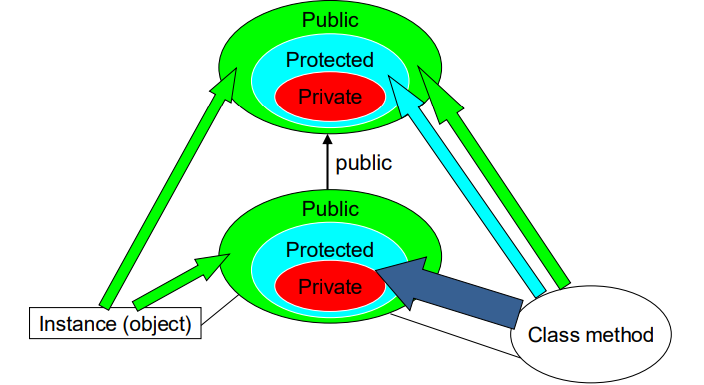

<div align="center">
<h1> OOP PIE Properties.
</div>
<div align="center">
    <em>Algorithms and Parallel Computing</em><br>
    <em>Juan Pablo Vallejo Montañez</em><br>
    <em>Notes from Politecnico di Milano 2025/2026 Y.</em><br>
</div>

<br>

# 1. Encapsulation.

Encapsulation is the mechanism that bundles data and the functions that operate on that data into a single unit, typically a class. Within a class, data members and methods can be declared as private, protected, or public controlling how they may be accessed or modified.

Why encapsulation matters
- Thinking of a system as a collection of independent objects helps maintain strong separation between components.
- Objects interact exclusively through well-defined methods, ensuring controlled access to internal data.
- This separation means that different development teams can work on distinct parts of the system, as long as they agree on the public interface.
- Encapsulation therefore supports the construction of large and complex systems with significantly reduced effort.

Key advantages      

- Extreme modularity: Each part of the system becomes replaceable, testable, and independently maintainable.
- Conceptual alignment: Modeling the system as interacting objects often matches how humans reason about real-world problems.
- Reduced duplication and increased reuse: Encapsulation supports writing components once and reusing them in multiple contexts without modification.


# 2. Inheritance.

Inheritance provides a mechanism for defining a new class <strong>(the derived class or child)</strong> based on an existing class <strong>(the base class or parent)</strong>. The derived class represents a specialized version of the base class, automatically acquiring its <strong>data members and methods.</strong>

Inheritance is motivated primarily by code reuse and by the evolution of software systems: new abstractions can be built from established ones without rewriting existing logic.

Advantages of Inheritance

When a class inherits from another, it gains three principal benefits:

- <strong>Reuse :</strong>The derived class can directly use the data members and methods defined in the base class.
- <strong>Extension :</strong>The derived class may introduce new data and new methods, enriching the behavior of the base abstraction.
- <strong>Modification (Customization) :</strong>The derived class can override or overload inherited methods to provide specialized implementations while preserving the original interface.

<i>Note: Inheritance establishes an "is a" relationship between classes (e.g) A dachshund is a dog;  A car is a vehicle</i>

<i style="text-indent: 30px;color:#FF0000;">Note: Exist multiple inheritance. Advanced Topic for APSC (course for the next semester) </i>

ALTOUGH ES AUNQUE

A derived class inherits:

- Every data member defined in the parent class (although such members may
not always be accessible in the derived class!)
- Every ordinary member function of the parent class (although such
members may not always be accessible in the derived class!)

A derived class does not inherit the following members from its base class:
- <strong>Constructors and destructor :</strong> These are specific to the base class and are not transferred to the derived class.
- <strong>Assignment operator (operator=) :</strong> This operator must be defined separately for each class because it depends on that class’s own data members.
- <strong>Friends of the base class : </strong> Friendship is not inherited; friends of the base class do not automatically become friends of the derived class.

These functions are <strong>class-specific</strong>, meaning they depend on the internal representation and initialization semantics of each class, and therefore cannot be automatically inherited.

What a derived class can add
- New data members
- New member functions (also overwrite existing ones)
- New constructors and destructor

What Does a Child (Derived) Object Have?

An object—that is, an instance—of a derived class contains:

- All members declared in the parent (base) class
(they exist inside the object even if some of them are not accessible)
- All members declared in the derived (child) class

In terms of what the derived object can actually use, it may access:
- All public members inherited from the parent class
- All public members defined in the child class

WHAT HAPPEN WITH THE PRIVATE MEMEBERS

(Protected members are also accessible inside the class definition, but not from outside; private members of the parent remain inaccessible.)


## 2.1 Defintion of a Class Hierarchy.

````cpp
class DerivedClassName : access-level BaseClassName
````
The <strong>access level</strong> determines the type of derivation between a base class and a derived class.

- If no access level is specified, inheritance is private by default (in C++, for classes).
- It may also be explicitly declared as <strong>public or protected</strong>.

<i>Note: In this course, we will use only public inheritance, since it preserves the interface of the base class and models the “is-a” relationship cleanly.</i>

### 2.1.1 Memebers of class.

- <strong>private: </strong> Accessible only within the class itself.
Neither derived classes nor external code can access private members directly.
- <strong>public : </strong> Accessible from anywhere: outside the class, through objects, and inside the class itself.
- <strong>protected :</strong> Accessible within the class and in its derived classes, but not from outside code.

#### 2.1.1.1 Protected Members 
Like private members, protected members are not accessible to users of the class (i.e., through objects from outside).

Like public members, protected members are accessible to the methods (and friends) of classes derived from the base class.

In addition, protected has an important restriction:

- A derived-class method may access the protected members of the base class only through the derived object itself.
- A derived class cannot access protected members through arbitrary base-class objects.

This ensures that inheritance does not violate encapsulation by allowing a derived class to manipulate the internals of unrelated base-class instances.

<i style="color:#2E86C1;">Example</i>

````cpp
class Base {
    protected:
        int prot_mem; // protected member
};

class Sneaky : public Base {
    void clobber1(Sneaky&);   // can access Sneaky::prot_mem
    void clobber2(Base&);     // can't access Base::prot_mem
    int j;                    // j is private by default
};


// ok: clobber1 can access the private and protected members in Sneaky objects
void Sneaky::clobber1(Sneaky &s) { s.j = s.prot_mem = 0; }

// error: clobber2 can't access the protected members in Base
void Sneaky::clobber2(Base &b) { b.prot_mem = 0; } 
````

<i style="color:lime">Note (clobber1) : Inside the derived class, we can access (private and) protected members of other objects only if they are instances of the derived class.</i>

<i style="color:lime">Note (clobber2) : We cannot access protected
members if the other object is an instance of the base class.</i>



<i style="color:#2E86C1;">Example</i>

````cpp
class Base {
    public:
        int pub_mem();   // public member
    protected:
        int prot_mem;    // protected member
    private:
        char priv_mem;   // private member
    };

class Pub_Derv : public Base {
    public:
        // ok: derived classes can access protected members
        int f() { return prot_mem; }
    private:
        // error: private members are inaccessible to derived classes
        char g() { return priv_mem; }
};

Pub_Derv d1;           // members inherited from Base are public
int i = d1.pub_mem();  // ok: pub_mem is public in the derived class
int ii = d1.f();       // ok
char c = d1.g();       // error g is private!
int iii = d1.prot_mem; // error protected member cannot be accessed by objects!
````

## 2.2 Creation and Destruction of a Derived-Class Object

When a derived-class object is created:

1. <strong>Memory allocation</strong> Space is allocated—either on the stack or on the free store—for the entire object.
This includes:
- The data members inherited from the base class
- The data members introduced in the derived class

2. <strong>Base-class construction</strong> The base class constructor is invoked first to initialize the inherited portion of the object.

3. <strong>Derived-class construction</strong> The derived class constructor is then called to initialize the members defined in the derived class.

4. <strong>Object becomes usable</strong> At this point, the fully constructed derived-class object is ready for use.

When a derived-class object is destroyed:

1. <strong>Derived-class destructor runs first</strong> The derived class destructor is called to release or clean up resources defined at the derived level.

2. <strong>Base-class destructor runs next </strong> The base class destructor is then called to clean up the inherited portion of the object.

3. <strong>Memory deallocation</strong> Finally, the space previously allocated for the full object is reclaimed.


<i style="text-indent: 30px;color:#FF0000;">EXAMPLE IN THE SLIDES PAGE 37-44</i>

## 2.3 Class Design Principle

### 2.3.1 Class Design Principle (Without Inheritance)

When no inheritance is involved, we can conceptually distinguish two types of developers interacting with a class:

1. <strong>Ordinary developers</strong>

They write code that uses objects of the class. They can access only the public interface of the class. They treat the class as a black box and rely solely on its documented behavior.

2. <strong>Implementors</strong>

They write the internal code of the class (its methods and friends). They can access:

- The public section
- The private implementation details

They hold full responsibility over how the class maintains its internal invariants.

### 2.3.2 Class Design Principle (With Inheritance)

When inheritance enters the picture, a third category of developer appears:

3. <strong>Derived-class programmers</strong>

These are developers who create new classes by extending an existing base class. The base class exposes certain implementation details to derived classes by declaring them protected.

<strong>Access rules under inheritance</strong>

- Protected members: accessible to derived classes, but not to ordinary users.
- Private members: remain hidden even from derived classes.
- Public members: form the interface available to everyone.

<i>General guideline: Be as strict as possible when deciding what to expose to derived classes. Expose only what is necessary, no more.</i>

### 2.3.3 Designing a Base Class Interface

Like any other class members intended as part of the public interface should be declared public. 

<strong>Implementation members should be declared protected only if they provide functionality or data that derived classes will need.Otherwise, implementation details should remain private.</strong>

This ensures:

- Maximum encapsulation.
- Minimal coupling between base and derived classes.
- Better maintainability and evolution of the codebase.

# 3. Polymorphism.

Polymorphism (from poly, “many”, and morphism, “forms”) is <i>the capability of objects to respond differently to the same message or function call</i>. It allows a single interface to be used with objects of different types, each providing its own specialized behavior. 

Because objects can have multiple “identities” depending on their position in an inheritance hierarchy, the same operation may produce different effects at run time. This flexibility enables more general and modular code, as functions can operate on base-class references while invoking behavior appropriate to the actual derived type. 

Polymorphism appears in two principal forms: <strong>compile-time polymorphism, achieved through function or operator overloading, and run-time polymorphism, implemented through virtual functions and dynamic dispatch.</strong>

<i>Key Ideas</i>

- Same function call → different behavior depending on the object.
- Based on inheritance and overridden methods.
- Allows writing generic code that adapts to actual object types.
- Two main types:
    - Compile-time: overloading.
    - Run-time: virtual functions and dynamic binding.

## 3.1 Overwriting Methods

A subclass can change the behavior of a method inherited from a base class, a process generally called overwriting. There are three mechanisms involved:

- Overloading, where methods share a name but differ in their parameter lists. 
- Redefinition, where a derived class provides a new implementation of a non-virtual base method. 
- Overriding, where a derived class replaces the implementation of a virtual method. 

Among the three, overriding is the one that enables polymorphism, since the version of the method executed depends on the run-time type of the object.

### 3.1.1 Redefining Base Class Functions

A derived class may redefine a function by providing a method with the same name and the same parameter list as one in its base class. Redefinition is used when the derived class wants behavior different from that of the base class. Unlike overloading, redefinition does not change the parameter list; it simply replaces the inherited version. <strong>As a result, objects of the base class call the base version, while objects of the derived class call the derived version.</strong>

In C++, the base class decides whether a function should be type-dependent by marking it as virtual. Virtual functions are meant to be redefined (overridden) by derived classes whenever appropriate, though overriding is optional. <strong>If a derived class does not provide its own implementation, it automatically inherits the base class version, just like any other member.</strong>

### 3.1.2 Virtual Functions.

<strong>A virtual member function is a function in a base class that is meant to be overridden by derived classes, and it is declared using the keyword virtual.</strong>

````cpp
virtual void y() {...}
````

Declaring a function virtual enables dynamic binding, meaning that the function call is resolved at run time based on the actual type of the object, not the static type of the pointer or reference. 

Without virtual, C++ uses static (compile-time) binding, and redefining a function in the derived class does not provide polymorphism—it is simply name hiding. Virtual functions are therefore essential for achieving run-time polymorphism, though not the only requirement (e.g., calls must also be made through pointers or references).


<i style="color:#2E86C1;">Example</i>

````cpp
// PARENT
class Quote {
    public:
        Quote() = default;
        Quote(const string &book, double sales_price): bookNo(book), price(sales_price) { }
        // returns the total sales price for the specified number of items
        string isbn() const { return bookNo; }

        // derived classes will override and apply different discount algorithms
        virtual double net_price(size_t cnt) const
            { return cnt * price; }

        // dynamic binding for the destructor
        virtual ~Quote() = default;
    private:
        string bookNo;      // ISBN number of this item
    protected:
        double price = 0.0; // normal, undiscounted price
    }; 

// CHILD 
class Bulk_quote : public Quote {   // Bulk_quote inherits from Quote
    public:
        Bulk_quote() = default;
        Bulk_quote( const string &book, double sales_price,
        size_t min_qty, double disc_rate );

        // overrides the base version in order to implement the bulkpurchase discount policy
        double net_price(size_t cnt) const override;
    private:
        size_t min_qty = 0;        // minimum purchase for the discount to apply
        double discount = 0.0;     // fractional discount to apply
};


// Implementation 
// if the specified number of items are purchased, use the discounted price
double Bulk_quote::net_price(size_t cnt) const
{
    if (cnt <= min_qty)
        return cnt * price;
    else
        return cnt * (1 - discount) * price;
}

````

## 3.2 Dynamic Binding 

Through dynamic binding, the same piece of code can operate on objects of different derived types—such as Quote and Bulk_quote—and invoke the correct behavior at run time. In the example below, the function print_total takes a reference to Quote, but depending on the actual object passed (Quote or Bulk_quote), the call to item.net_price(n) is dynamically dispatched to the appropriate implementation. This allows the function to remain completely generic while still respecting each class’s pricing strategy.

````cpp
double print_total(const Quote &item, size_t n)
{
    // At run time, calls Quote::net_price or Bulk_quote::net_price
    double ret = item.net_price(n);
    cout << "ISBN: " << item.isbn()       // always calls Quote::isbn
         << " # sold: " << n 
         << " total due: " << ret << endl;
    return ret;
}
````
<strong style="text-indent: 30px;color:#FF0000;">Polymorphic behavior is only possible when an object is referenced by a reference variable or a pointer, as demonstrated in the print_total function.</strong>

````cpp
// basic has type Quote; bulk has type Bulk_quote
print_total(basic, 20); // calls the Quote version of net_price
print_total(bulk, 20); // calls the Bulk_quote version of net_price
````

To enable run-time polymorphism, a base class marks a member function as virtual, requesting that calls to that function be dynamically bound. 

Any non-static member function (except constructors) may be virtual, and destructors should be virtual to ensure proper cleanup through base-class pointers. The virtual keyword is written only in the function’s declaration inside the class; it is omitted from out-of-class definitions. 

Once a function is declared virtual in the base class, it remains virtual throughout the entire inheritance hierarchy. Functions that are not virtual use static (compile-time) binding, and—for functions like <code>isbn()</code>—this is precisely the correct behavior, since every <code>Quote</code> object should share the same lookup logic regardless of the derived type.

<i>Key Points</i>

- Virtual in the base class ⇒ dynamic binding.
- Applies to any non-static member function (constructors cannot be virtual; destructors should be).
- Virtual appears only in the class declaration, not in the definition outside.
- Virtual-ness propagates to all derived classes automatically.
- Non-virtual members use compile-time binding (as desired for isbn()).

<i>Note:  In C++, redefined functions are statically bound and
overridden functions are dynamically bound. So, a virtual function is overridden, and a non-virtual function is redefined.</i>

<i style="color:lime;">Summary - Dynamic Binding </i>

- The member function is declared as <strong>virtual</strong> in the <strong>base class</strong>.
- The member function is declared with the <strong>override specifier in the child class.</strong>
- <strong>The member function is run trough a pointer or a reference to the base class object.</strong>

<i style="color:lime;">Summary - Overwriting methods </i> 

A subclass can overwrite - i.e., change - a base class method behaviour. There are three mechanisms:
- Overloading (same method name, different parameters)
- Redefinition (same method name, same parameters) <code>no virtual</code> in the base class or missing any of the three conditions for overriding
- Overriding (same method name, same parameters)
    - Base class method declared as virtual.
    - Method overridden in the sub-class.
    - Method invocation through a pointer or reference of a base class object.

Overriding result:
- Base or sub class methods used interchangeably through the same code
- This happens at runtime

# 4. Derivate-to-base Conversion

A derived-class object is composed of several sub-objects layered together. One sub-object contains all the (non-static) data members defined directly in the derived class. 

In addition, the object also contains one sub-object for each base class it inherits from. Because these base-class sub-objects are fully embedded inside the derived object, a derived-to-base conversion is always valid: every derived object is a complete base-class object as part of its structure. This layout is what allows base-class references or pointers to bind safely to derived objects.

A derived-class object contains all the data members it defines plus the complete sub-object representing each of its base classes. 

For example, a <code>Bulk_quote</code> object stores four data members: <strong>bookNo and price inherited from Quote, and min_qty and discount defined in Bulk_quote</strong>. 

Although the C++ standard does not fix the exact memory layout, we can conceptually view a derived object as a base-class sub-object extended with additional derived-class data. Because the base part is physically embedded inside the derived object, C++ allows a derived-to-base conversion: a derived object can be used wherever a base-class object is expected. In practice, this means that a base-class reference or pointer can bind directly to the base-class portion of a derived object.

<strong>In particular, we can bind a base-class reference or pointer to the baseclass part of a derived object.</strong>

````cpp
Quote item;            // object of base type
Bulk_quote bulk;       // object of derived type
Quote *p = &item;      // p points to a Quote object
p = &bulk;             // p points to the Quote part of bulk
Quote &r = bulk;       // r binds to the Quote part of bulk
````

Ordinarily, a reference or pointer can bind only to an object of exactly the same type. Inheritance introduces an important exception: <strong>a reference or pointer to a base class can bind to an object of any derived class.</strong> This means, for example, that a <code>Quote&</code> can refer to a <code>Bulk_quote</code> object, and a <code>Quote*</code> can store the address of a <code>Bulk_quote</code>. The reason is that every derived object contains a complete base-class sub-object, making the conversion from derived → base both valid and safe.

<i>Key ideas</i>

- Normally, types must match exactly when binding references or pointers.
- Inheritance allows derived → base binding.
- Base-class pointers/references can refer to derived objects because the base portion is embedded inside the derived object.

QUEDE EN LA SLIDE 70 SGIUE LA 71

___________________________________________________

PORQUE SE DEJAN VARIABLES PRIVADAS
¿Por qué se hace así?

Para garantizar encapsulación:

nadie puede romper el estado interno del objeto

se controla qué valores son válidos

se evita modificar atributos de forma accidental

la clase mantiene “invariantes” (reglas internas)

__________________________________________________
DUDA DE HERENCIA + ENCAPSULACION 
ok entonces tengo una duda, una clase heredada hereda estos atributos pero no puede hacer nada con ellos entocnes cual es el proposito de que los herede si no puede acceder a ellos
ChatGPT Plus

Excelente pregunta — esa duda es clave para entender de verdad la herencia y la encapsulación.
Y sí: una subclase hereda los atributos privados, pero no puede acceder a ellos.
Entonces… ¿para qué sirve heredarlos?

Aquí va la explicación clara y conceptual:

✅ 1. La subclase sí hereda los atributos privados, pero no el derecho a tocarlos

Esto significa:

el objeto físicamente contiene esos campos privados

pero la subclase no puede leerlos ni escribirlos directamente

Ejemplo:

class A {
private:
    int x;
};
class B : public A {
    void f() {
        x = 10;  // ❌ ERROR: x es privado en A
    }
};

✅ 2. ¿Para qué sirve entonces heredarlos?
✔️ A) Porque los métodos heredados sí pueden usar esos atributos privados

Incluso desde la subclase, tú puedes llamar métodos de la clase padre que sí acceden a los privados.

Ejemplo:

class A {
private:
    int x;
public:
    void setX(int v) { x = v; }
    int getX() const { return x; }
};

class B : public A {
public:
    void printX() {
        std::cout << getX();  // ✔️ Puedo llamar al método del padre
    }
};


Aquí:

B no puede tocar x

pero puede usar el comportamiento heredado para manipular x

Esto es clave en OOP.

✔️ B) Porque así se mantiene la encapsulación del padre

La subclase hereda la estructura del padre, pero no puede romper su estado interno.

Si los hijos pudieran acceder a los privados, podrían violar reglas importantes del padre.

Ejemplo real:

class BankAccount {
private:
    double balance;
public:
    void deposit(double amount);
    void withdraw(double amount);
};


Si una subclase pudiera modificar balance directamente, podría hacerlo negativo sin controles.
Eso violaría la lógica del padre.

✔️ C) Porque garantiza que la subclase es realmente “una versión especializada”

El contrato es:

El hijo es del mismo tipo que el padre,

pero no tiene permisos para manipular su “caja negra” interna.

Esto permite construir objetos más complejos encima de otros sin dañarlos.

🧠 Entonces la idea es:

La subclase hereda tanto la estructura como el comportamiento del padre,
pero la encapsulación se mantiene: los detalles internos permanecen escondidos.

La subclase usa los atributos privados a través de métodos públicos/protegidos del padre,
no manipulándolos directamente.

⭐ Resumen para tus notas

Un atributo privado es heredado, pero no accesible por la subclase.

La subclase sí puede usar los métodos del padre que trabajan con ese atributo privado.

Esto mantiene la encapsulación y evita que el hijo dañe el estado del padre.

El objetivo: la subclase añade funcionalidades sin romper la lógica interna heredada.

Si quieres, te muestro un ejemplo con private vs protected para ver cuándo la subclase sí puede acceder directamente.

Tú dijiste:
entonces que impide que por ejemplo yo tenga un atributo privado y una funcion publica en mi clase padre. Luego herede la clase y dentro del hijo yo modifique el metodo que modifica el atributo privado y cambie la forma de como asigno el atributo 
ChatGPT Plus

Excelente, esta es la pregunta profunda sobre encapsulación + herencia.
Vamos paso a paso porque aquí hay un matiz MUY importante.

✅ Idea clave: puedes sobrescribir el método público, pero NO puedes acceder al atributo privado

Si el atributo es privado:

class A {
private:
    int x;
public:
    void setX(int v) { x = v; }
};


Y tú haces una subclase:

class B : public A {
public:
    void setX(int v) { 
        // ¿puedo modificar x directamente? 
        x = v;   // ❌ ERROR: x es privado en A
    }
};


No puedes.
Aunque sobrescribas el método, no puedes tocar la variable privada, porque no existe en el scope de la subclase.

⭐ Pero aquí viene la parte importante:
✔️ Sobrescribir el método SÍ te permite cambiar el comportamiento observable

Aunque NO puedes tocar el atributo privado directamente, SÍ puedes:

cambiar la validación

cambiar la lógica

llamar opcionalmente al método del padre

bloquear o alterar el flujo

Ejemplo:

class B : public A {
public:
    void setX(int v) override {
        if (v < 0) v = 0;  // cambia la semántica del padre
        A::setX(v);        // llama al método original para modificar el privado
    }
};


Aquí:

NO accedes a x directamente (prohibido)

pero usas el método público del padre para modificarlo bajo tus reglas.

Esto sí está permitido.

❗ Ahora la pregunta: ¿qué impide que el hijo cambie la forma de asignar el atributo privado?
✔️ Lo que lo impide es:

La subclase no tiene acceso al atributo privado, solo al método público.
Por tanto, solo puede modificar el comportamiento, no el acceso directo.

Es decir:

No puede leer el valor interno.

No puede asignarlo directamente.

Solo puede llamar al método público del padre.

🎯 ¿Qué pasaría si el método privado del padre fuera protegido?

Si el atributo fuera protected, sí podrías romper todo:

class A {
protected:
    int x;
};
class B : public A {
public:
    void setX(int v) { x = v * 100; }  // ✔️ válido, pero peligroso
};


Este es EXACTAMENTE el motivo por el cual muchos diseñadores recomiendan:

Preferir private para atributos y protected solo para métodos que realmente deben extenderse.

🧠 Conclusión conceptual para tus notas

Atributos privados no son accesibles por la subclase.

Si sobrescribes un método que modifica el atributo privado, solo puedes usar el método público del padre para modificarlo.

La subclase puede cambiar el comportamiento, pero NO la representación interna.

Esto protege la invariantes internas de la clase padre (encapsulación fuerte).

Si quieres, te hago un diagrama conceptual de public vs protected vs private con herencia para tenerlo perfecto en tus apuntes.


__________________________________
Chat GPT for later

i mean a child class have a private memeber or the parent?
ChatGPT Plus

Great question — this is a very common point of confusion.
Here is the precise rule in C++:

✅ Does a child class have the parent’s private members?

Yes — the derived class has the private members of the parent.
They exist inside every object of the derived class because the derived object contains the full base-class subobject.

But the child class cannot access them.

So we distinguish two things:

1. What the derived object has

A derived-class object contains:

all data members of the parent class (including private ones)

all data members of the derived class

2. What the derived class can access

The derived class can access:

the public members of the parent

the protected members of the parent

NOT the private members of the parent (even though they are physically inside the object)

🔍 Analogy

Think of private members as “locked drawers” inside the parent-class portion of the object.
The child object has the drawer, but it does not have the key.

✅ Summary for your notes

A derived object contains all members of the base class, including private ones.

But private members of the base class are not accessible in the derived class.

If you want, I can rewrite this as a compact formula or short bullet list for your slides.

Tú dijiste:
access is modify?
ChatGPT Plus

Great distinction — and no, in C++ “access” does not mean “modify.”

Let me clarify it precisely:

✅ Access ≠ Modify

Access means:

you are allowed to read or refer to a member,

and you are allowed to write/modify it if you can access it.

So:

Access = permission to see and use the member

(including reading or writing it)

If you cannot “access” a member, you cannot:

read it

modify it

call it

use it in any way

🧠 So does “accessible” mean “modifiable”?

Not exactly.

If a member is accessible, you may modify it (as long as it's not const).

If a member is not accessible, you cannot even read it, let alone modify it.

Access is a gate; modification is an action you perform once you're inside the gate.

Example
class Base {
private:
    int x = 5;      // child object has x, but cannot access it
public:
    int y = 10;     // child object has y, and can access it
};


x exists in the derived object, but cannot be accessed or modified.

y exists and can be accessed → so it can also be modified.

🔥 Summary

Access = permission to read or write a member.

Modify = write to the member.

If you do not have access → modifying is impossible.

If you'd like, I can create a small diagram showing has, access, and modify relationships.

Tú dijiste:
what is the point to have a memeber that i cant read ?
ChatGPT Plus

This is an excellent question — and one that every student asks at some point.
Here is the real reason why private members exist, and why you “have” them but cannot “read” them in the child class.

✅ Why have a member you cannot read?

Because the derived class is not supposed to depend on the internal representation of the parent class.

This is the whole point of encapsulation.

Private members protect the internal structure of a class so that:

1. The base class can change its implementation without breaking derived classes

If the derived class could read private variables of the base class, then:

every change inside the base class

would force you to update all derived classes.

This destroys modularity.

Keeping data private allows the base class to evolve internally without affecting children.

2. The base class controls how its data is accessed

Even if the derived class cannot read the member directly, it can still interact with it through:

public getters/setters

protected methods

virtual functions

The base class defines a safe interface, guaranteeing data consistency.

Example:

class BankAccount {
private:
    double balance;  // you don't want child classes directly messing with this
public:
    double get_balance() const { return balance; }
protected:
    void change_balance(double x) { balance += x; }
};


A derived class should not be allowed to read or write balance arbitrarily, because that would break security/invariants.

3. The derived class has the private member because it must behave like a valid base-class object

Even though the child class cannot read the private member:

it contains that data,

so that it behaves exactly like a base-class object when used polymorphically.

Example:

Base* p = new Derived();
p->doSomething();   // expects the Base part of Derived to be complete


The derived object must contain the complete base-class subobject, including private data, so that external code can rely on it.

4. Private data forces correct abstraction

Private members enforce:

encapsulation

independence between classes

safer and more robust designs

clear interfaces

If child classes could freely read private members, everything would become tightly coupled and fragile.

🔥 Short answer for your notes

A derived class has the parent’s private members, but cannot access them, because:

Private members enforce encapsulation, allow the base class to preserve invariants, prevent tight coupling, and let the implementation evolve without breaking derived classes.

If you want, I can also rewrite this as a single clean paragraph or turn it into a graphical explanation (diagram).
______________________________________________


