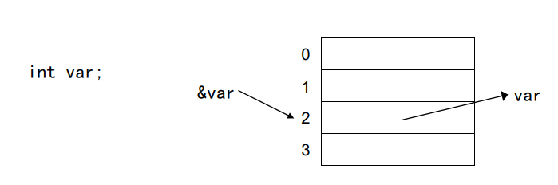
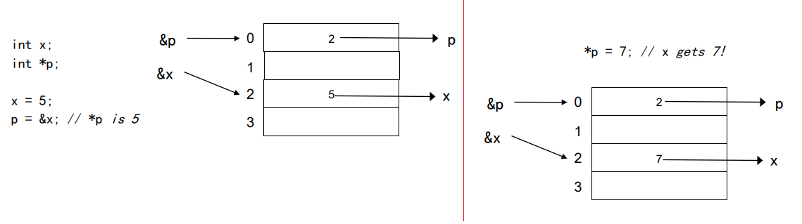
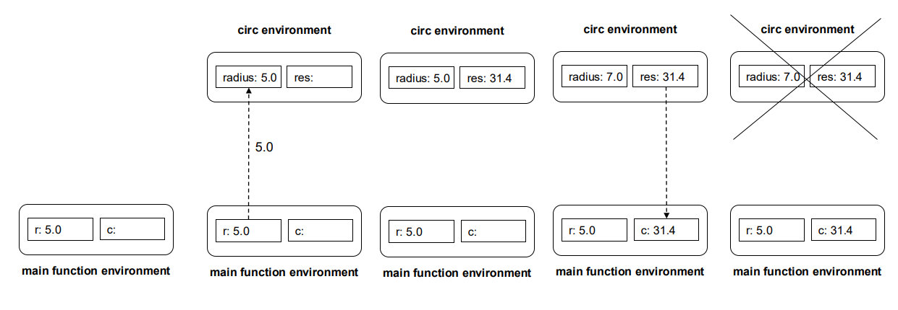
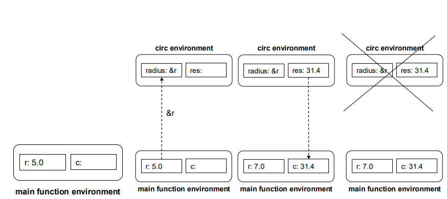
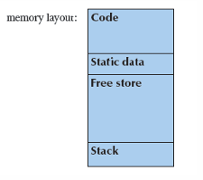
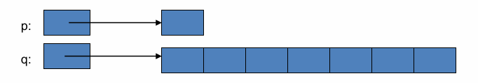
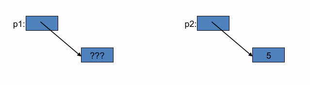
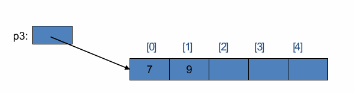
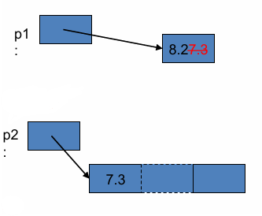
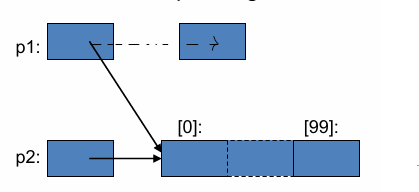

<div align="center">
<h1> Pointersm, References and Function Parameters
</div>
<div align="center">
    <em>Algorithms and Parallel Computing</em><br>
    <em>Juan Pablo Vallejo Montañez</em><br>
    <em>Notes from Politecnico di Milano 2025/2026 Y.</em><br>
</div>

# 1. Pointers

## 1.1 Definition.
<div align="justify">
A <strong>pointer</strong> is a variable whose value is the address of another variable (or object) in memory. Instead of holding a direct value (like <code>int x = 5;</code>), a pointer holds the location in memory where that value is stored.

<i style="color:#2E86C1;">Intuitive Idea</i>

Every variable or object in a C++ program is stored in a specific location in memory.
That location has a unique memory address.

- The variable name refers to the contents stored at that address.
- The address-of operator (&) allows us to obtain the memory address of a variable or object.




<div style="text-indent: 30px;"> 

  - <i><code>var</code> indicates the content of the memory location.</i>
  - <i><code>&var</code> indicates the memory address.</i>
</div>

A pointer is a special variable that can store such an address.
In this way, the pointer “points” to the memory location of another variable — <strong>it doesn’t hold a value directly, but rather the location of that value.</strong>

<i>This is a lower level feature bring form C </i>

<i style="color:#2E86C1;">Declaration</i>

To declare a pointer, you must also specify what type of object the pointer points to. This tells the compiler what kind of data is stored at the address the pointer refers to. 

A pointer’s type determines how the memory referred to by the pointer’s value is interpreted and used.

````cpp
double* p;   // p is a pointer to a double
````
<div style="text-indent: 30px;color:#FF0000;">
<i>Invalid pointer initialization.</i>
</div>

<br>

````cpp
int* p = 5;   //  Error
````

This is wrong because 5 is a number, not a memory address. Pointers store addresses, not normal values. We must assign a <strong>valid address (like &x) or use nullptr if it doesn’t point anywhere yet.</strong>


## 1.2 Dereference Operator (*)

The dereference operator (*) is used in C++ to access or modify the value stored at the memory address a pointer is pointing to. It allows you to <strong>retrieve or change</strong> the value of a variable indirectly through its pointer.

<i style="text-indent: 30px;color:#FF0000;">WARNING: The symbol * is used both in the declaration and in the dereferencing </i>

<strong>This is the correct way.</strong>

````cpp
int x = 5;
int* p = &x;   // p stores the address of x
*p = 7;        // change the variable x to 7 .    
p = 7;         // ERROR, p is a pointer. We´re assign it a integer not a direction.
cout << *p;    // prints 7 (value of x)
cout << p;     // prints address of x (e.g., 0x7ffee2b4a)
````

A pointer variable typically requires 2 or 4 bytes, depending on the system architecture (and sometimes 8 bytes on 64-bit systems). What’s stored in a pointer is a memory address, not a normal value.

## 1.3 Operators



<i>Stage 1</i>

- Two variables are defined: x (of type <code>int</code>) and p (of type <code>int*</code>). Both have an address and a value.
The value of p is the memory address of x — that is, the address of the variable it points to.
In this example, that memory address is 2.

<i>Stage 2</i>

- The expression <code>*p=7</code> changes the value of the variable that the pointer points to.
In this example, the value of x changes from 5 to 7.
</div>

## 1.4 Pointer to Pointers

A pointer is an object in memory, so like any object it has a value and an address. In this way, a pointer can be viewed as a variable that stores an address. Therefore, we can store the address of a pointer in another pointer.

````cpp
int ival = 1024;
int *pi = &ival;    // pi points to an int
int **ppi = &pi;    // ppi points to a pointer to an int
````

//////////////////////////////////////////////////////

 Pointers  --- think like an integer (can i do opoertations with pointers??)
  -Variable which store memory address

See exmplae page 7 
What is the difference between & and *

Be careful where the pinter is pointing :v

////////////////////////////////////////////////////


# 2. References.
## 2.1 Definition.
A reference in C++ can be seen as an <strong>automatically dereferenced pointer</strong> or as an alternative name for an existing object.

A reference is introduced using the & symbol in a variable declaration.and must be initialized when it is declared.

<strong style="text-indent: 30px;color:#FF0000;"> A reference is not a object. Hence, we cannot have pointer to a reference.</strong>

After initialization, a reference cannot be changed to refer to another object

````cpp
int x = 9;
int y = 8;
int& r = x;   // r refers to x
````
In this example, r becomes an alias for x. Any modification made through r will affect x directly.

<i style="color:#2E86C1;">Reference Binding and Behavior</i>

When we initialize a variable, the value of the initializer is copied into the new object. When we define a reference, <strong>instead of copying the value, we bind the reference to its initializer.</strong>

<strong>Once initialized, a reference remains permanently bound to the same object, then
there is no way to rebind it to a different one.</strong>

Because of this, references must always be initialized at declaration.

<i style="color:#2E86C1;">Accessing and Using References</i>

When we fetch the value of a reference, we are actually accessing the value of the object it is bound to. When we use a reference as an initializer, we are really using the object itself, not a copy.

<i style="color:#2E86C1;">When use references or pointers.</i>

Like other built-in types, pointers have undefined value if they are not 
initialized.  Be very careful !!


| **Property**           | **Pointer**                                              | **Reference**                                    |
| ---------------------- | -------------------------------------------------------- | ------------------------------------------------ |
| **Definition**         | A variable that stores the *address* of another variable | An alias (alternative name) for another variable |
| **Initialization**     | Optional; can be uninitialized (⚠️ dangerous)            | Must be initialized at declaration               |
| **Can change target?** | ✅ Yes — can point to different objects                   | ❌ No — fixed after initialization                |
| **Access syntax**      | `*p` (dereference)                                       | Automatically dereferenced                       |
| **Can be null?**       | ✅ Yes (`nullptr`)                                        | ❌ No                                             |
| **Memory storage**     | Is an object itself                                      | Is not a separate object                         |
| **Typical use**        | Dynamic memory, arrays, low-level manipulation           | Safer parameter passing and aliasing             |


Both pointers and references let you access and modify variables indirectly (via their memory address),
but references exist to make this simpler, safer, and less error-prone in most everyday cases.


With pointers:
````cpp
int x = 10;
int* p = &x;
*p = 20;    // must dereference manually
````

With references:
````cpp
int x = 10;
int& r = x;
r = 20;     // looks and feels like a normal variable
````

No need for * or & all the time — <strong>references automatically dereference themselves.</strong> They are easier to read, write, and maintain.

- <strong>No null or uninitialized references.</strong>

Pointers can be null, dangling, or uninitialized, causing runtime crashes. A reference must be initialized and can never be null, which makes it safer.

````cpp
int* p = nullptr;   // valid, but risky if dereferenced
int& r = x;         // must be bound to a valid variable
````

- <strong>Perfect for function parameters.</strong>

When we want a function to modify a variable passed to it,
you can use a reference instead of a pointer It's cleaner and safer.

````cpp
void increment(int& n) {   // pass by reference
    n++;
}

int main() {
    int x = 5;
    increment(x);          // no need for & or *
    cout << x;             // prints 6
}
````

Compare that with pointers:
````cpp
void increment(int* n) 
   { (*n)++; }


increment(&x);              // more complex syntax
````
- References are ideal for operator overloading and function return values. They’re heavily used in:
   - Operator overloading (operator= returns a reference)
   - Copy constructors
   - Stream operators (<<, >>)
   - Returning large objects efficiently

<i style="text-indent: 30px;color:#FF0000;">Other examples in the slides 2 Pointers Part I (page 58)</i>

## 2.2 References are not assignable.
<div align="justify">
In C++, when we say that a type is <i>assignable,</i> we mean that we can give it a new value after it has been created using the = operator.

A reference is not a value; it is not an object. A reference is a binding that is created when you declare it. We cannot take a pointer to a reference because a reference is not an object—the pointer can only point to a piece of memory.

By definition, references are non-assignable. On the other hand, container values must be assignable. For this reason, <strong>it is not possible to build a vector of references</strong >.

<i>Note: Other non-assignable types are also not allowed as components of containers e.g., `vector<const int>` is not allowed</i>
</div>

# 3. Function Parameters.
<div align="justify">

In C++, parameters allow us to pass information to functions so they can operate on different data.
The variables defined in the function header are called formal parameters, while the values passed by the caller are actual parameters.

C++ supports two main ways to pass them — by value and by reference — which differ in how memory is handled and whether the function can modify the original data.

<strong>Formal parameters</strong> are symbolic variables defined in the function header (function definition). They act as local variables inside the function.

 In a function definition we use formal parameters representing a symbolic 
reference (identifiers) to objects used within the function

````cpp
return_type name (formal arguments);      // a declaration
return_type name (formal arguments){...}; // a definition
````

<strong>Actual parameters</strong> are the real values passed by the caller. The initial value of formal parameters is defined when the function is called
using the actual parameters specified by the caller

<i style="color:#2E86C1;">Example</i>

````cpp
double circ(double radius) {     // radius is a FORMAL PARAMETER
  double res;
  res = radius * 3.14 * 2;
  radius = 7;
  return res;
}

// ...
// somewhere in the main

double c;
double r = 5;
c = circ(r);                     // r is a ACTUAL PARAMETER
````

## 3.1 Passing Parameters.

In a function call, parameter passing consists in associating the actual parameters with the formal parameters. There are two main techniques:

### 3.1.1 Pass by value.

The actual parameter’s value is <strong>copied</strong> into the function’s formal parameter. The two variables occupy <strong>different memory locations.</strong> 

<i>Changes made inside the function do not affect the caller’s variable. <strong>The actual parameters are not changed.</strong></i>

<i style="color:#2E86C1;">Example</i>

````cpp
double circ(double radius) {
  double res;
  res = radius * 3.14 * 2;
  radius = 7; // No sense instruction,
 // let's see what happens to radius
  return res;
}
// somewhere in the main
double c;
double r = 5;
c = circ(r);
````


The variable res is stored in the stack memory.
Local variables of a function are created (allocated) in memory when the function is invoked and are stored in the stack.
When the function finishes execution, this memory is automatically deallocated.

### 3.1.2 Pass by reference.

At the time of the call the address of an actual parameter is associated with
the formal parameters. In other words, <strong>the actual parameter and the formal parameter share the same memory
location.</strong>

The running function works in its environment on the formal parameters (and consequently also on the actual parameters) and each change on the formal parameter is reflected on the corresponding actual parameter. 

Then, the function execution affects the caller with modifications to the caller's 
environment abd in this way we can return multiple results.

To use pass by reference we have to use memory address ( pointers). We need a pointer for each formal parameter and for access to the actual parameter inside the function we need the dereference operator.

<i> Note: Arrays always passed by reference. The name of an array varaible is an address i.e its a pinter. This is very efficient.</i>

<i style="color:#2E86C1;">Example: double circ ()</i>
````cpp
double circ(double *radius) {
double res;
res = *radius * 3.14 * 2;
*radius = 7; // No sense instruction, let's
 // see what happens to radius
return res;
}
// somewhere in the main
double c;
double r = 5;
c = circ(&r);
// Warning! Now r is 7.0
````


<i style="text-indent: 30px;color:#FF0000;">Other examples in the slides (page 34)</i>

### 3.1.3 Comparison.
Pass by value:
 - Requires a lot of time to perform the copy if the parameter is large.
 - Actual parameter and formal parameter are different.
 - Cannot return a value to the caller (without a return statement!)

Pass by reference:
 - Only an address is copied  fixed size  fast!
 - Actual parameter and formal parameter are the same.
 - Can return a value to the caller.

| **Property** | **Pass by Value** | **Pass by Reference** |
| ------------ | ----------------- | --------------------- |
| **Time and Space**             | Large                 | Small                 |
| **Side Effects Risk**          | No                    | Yes                   |
| **Return Value to the Caller** | No (without `return`) | Yes                   |

## 3.2 Guidance for passing variables

- Use call-by-value for very small objects (base types!)
- Use call-by-const-reference for large objects
- Use call-by-reference when you must return a result or modify an object through a reference argument


</div>


void ---> does not return a value
 Fress Store --> Indepentede piece of memory where we can allocate memory when we nedeed

Pass by refernce example     in page 28


other examples in page 34


call of functions

    function y = f(x)
    void function f(x)

Example of procedure in45 

Summary at 48

 /////////////////////////////////////////////////

 # 4. const Qualifer.

<div align="justify">
The keyword <code>const</code> defines an unchangeable variable. Once a const object is created, its value cannot be modified. Because we can´t change the value of a const object after creation, it must be initialized.
</div>

````cpp
const int j = 42;         // ok: initialized at compile time
const int i = get_size(); // ok: initialized at run time
const int k;              // ❌ error: k is uninitialized const
j = 47;                   // ❌ error: we try to change a const variable
````
## 4.1 Reference to conts.

A reference to a <code>const</code> object allows access to its value, but does not allow modification of the object it refers to.  

<i style="text-indent: 30px;color:#FF0000;">A reference to a const object must be a const reference.
You cannot bind a non-const reference (int&) to a const object.</i>


````cpp
const int x = 5;
const int& r = x;   // reference to const
r = 10;             // ❌ Error — cannot modify a const object
int &r2 = ci;       // ❌ Error: non const reference to a const object
````

A reference to const does not make the object itself const.
It only <strong>prevents modification through that specific reference.</strong>
We can bind a <strong style="color:limegreen;"> reference to const</strong> to an object that can still be changed. <strong style="color:limegreen;">We can bind a <i><u>reference to const</u></i> to an non-const object.</strong>

````cpp
int x = 5;
const int& r = x;  // r treats x as const
x = 10;            // ✅ valid (changed directly, not through r)
r = 15;            // ❌ invalid (r is const reference)
````

<i> Note: const references can be used to pass large objects in read-only
(obtaining the same benefits of C arrays passing + read-only protection,
i.e., no side effects)</i>


<i style="color:#2E86C1;">Example: double circ ()</i>

````cpp
double circ(const double &radius) {
   double res;
    res = radius * 3.14 *2;
   radius = 7;            // ❌ Invalid: r is a const reference — you are trying to modify a value that is read-only through this reference.
   return res;
}

// somewhere in the main

double c;
double r = 5;
c = circ(r);
// r is 5.0
````

````cpp
int i = 42;
int &r1=i;           // r1 bound to i
const int &r2 = i;   // r2 also bound to i, but cannot be used to change i
r1 = 0;              // r1 is not const; i is now 0
r2 = 0;              // error: r2 is a reference to const
````

# 5. Variable's Scope.

<div align="justify">
The scope of an identifier is the portion of the program in which it can be referenced or accessed.
Some variables are visible throughout the entire program, while others are visible only within specific blocks or functions.


<br>

<i>When we declare a local variable in a block (e.g., in a for loop), it can be
referenced only in that block or in blocks nested within that block</i>

## 5.1 Global Variable.

 - Is declared very early stage
 - Available always and from anywhere
 - Created at the start of the program, and lasts until the end.
 -  Stored in the static data
 -  difficult to debug

<i style="text-indent: 30px;color:#FF0000;"> NEVER USE GLOBAL VARIABLES -5 points at exam
 Use global variables bad programming practice</i>


## 5.2 Local (On-the-Fly) Variables

 - Created when needed, inside a function or block.
 - Exist only within the block where they are defined.
 - Stored in the stack memory.
 - Automatically destroyed when the block or function ends.
 - Easy to debug since their scope is limited and predictable.

````cpp
for (unsigned j = 0; j < 10; ++j) {
    // do something
} 
// 'j' no longer exists here
````
## 5.3 Locally-Defined Variables

- Declared at the beginning of a block or function (before being needed).
- Exist only inside the function in which they are created.
- Stored in the stack.
- Easiest and safest method of variable creation — the most commonly used in C++.

````cpp
void foo() {
   int x = 5;   // local variable
   cout << x;
}
````

<strong style="text-indent: 30px;color:#FF0000;">If I have a global variable named x and a local variable with the same name inside a function,
all operations involving x inside that function will refer to the <u>local variable</u>,
not the global one.</strong>

## 5.4 Lifetime of a Variable

- Locally-defined variables include:
   - Variables declared inside a function.
   - Variables declared as function parameters.
- When a function is called, memory is allocated for all of its local variables.
- When the function finishes executing, that memory is automatically deallocated.
- The period during which a variable exists in memory (from its creation until it is destroyed) is called its lifetime.

</div>

///////////////////////

POINTERS TO OBJECTS  IN THE FREE STORE AND MEMORY LEAKS

## 6. Raw Pointers.

In modern C++, a raw pointer refers specifically to the traditional C-style pointer, with no automatic memory management and no safety guarantees.

They can point to objects allocated dynamically on the free store (also known as the heap). In modern C++, dynamic memory is managed using <code>new</code> and <code>delete</code> rather than the lower-level <code>malloc()</code> and <code>free()</code> from C.

Because raw pointers provide no automatic memory management or safety guarantees, they must be used with great care.<strong> Incorrect use can easily lead to issues such as memory leaks, dangling pointers, or undefined behavior. </strong>


<i>Note: The hardware provides physical memory along with the addresses used to access it (The hardware provides both memory and addresses.)</i>

<i style="color:#2E86C1;">Why Use Raw Pointers?</i>

Raw pointers can be useful in certain situations, especially when working with large data structures. Key reasons include:

1. Sharing large data structures: Using raw pointers allows multiple parts of the program to refer to the same object without creating copies. This avoids unnecessary memory use and improves performance.

2. Avoiding memory waste: Making copies of large objects consumes extra memory. Pointers let you work with the original object directly, saving resources.

3. Reducing synchronization overhead:  If you make multiple copies of an object, you need to keep them in sync. This introduces additional complexity and potential for errors (e.g., forgetting to update one copy). Pointers allow all users to see the same data automatically.


<i>Note: Even though raw pointers can be useful, modern C++ encourages smart pointers (std::unique_ptr, std::shared_ptr) <strong style="text-indent: 30px;color:#FF0000;">REFERENCE TO SMART PORINTES HERE.</strong> for dynamic memory management to avoid leaks and undefined behavior</i>


## 6.1 Memory 
<div align="justify">


The memory have four escentila parts:
 - <strong>Code Section:</strong> Contains the compiled machine instructions of the program. (The executable code).
 - <strong>Static Data:</strong> Stores global variables, static variables, and constants with fixed lifetime.
 - <strong>Free Store (Heap): </strong> Dynamically allocated memory managed using <code>new</code> and <code>delete</code>.
 - <strong>Stack: </strong> Stores local variables, function parameters, and manages function calls.

In C++, you don’t always need to use new, but you use it when you need to allocate memory dynamically, meaning at runtime, when the amount of memory you need cannot be determined at compile time. Somes cases:

 - When the size is only known at runtime.
 - When the memory must outlive the scope of a function.
 - When the object or array is very large.
 - When multiple functions or objects need to share the same data.
 - When implementing dynamic data structures.

Use <code>new</code> to allocate dynamic memory on the free store during runtime. <i>The <code>new</code> operator returns a pointer to the allocated memory. A pointer is the address of the first byte of the allocated memory, so a pointer does not know how many elements it points to.</i>



````cpp
int *p = new int;

int *q = new int[7];
````

The <code>delete[]</code> operator is used to deallocate memory that was previously allocated for an array using <code>new[]</code>.

<i style="color:#2E86C1;">Free Store</i>

With old C, when you do not know a priori your data structure size and you do not want to over-allocate memory. For this purpose in C++ use <strong>STL containers</strong>.

With pointers and arrays we are "touching" hardware directly with only the most minimal help from the language. Here is where serious programming errors can most easily be made, resulting in malfunctioning programs and obscure bugs. Be careful and operate at this level only when you really need to.

If you get "segmentation fault", "bus error", or "core dumped",suspect an uninitialized or otherwise invalid pointer

Finally, vector (and other STL containers) is one way of getting almost all of the flexibility and performance of arrays with greater support from the language.

</div>


## 6.2 Pointer states.

1. <strong>It can point to an object:</strong> The pointer holds the address of a valid object or allocated memory.

2. <strong>It can point to the location immediately past the end of an object:</strong> This is allowed in C++ for iteration purposes (e.g., pointing to end()),
but you must not dereference it.

3. <strong>It can be a null pointer: </strong>This indicates that the pointer does not refer to any object.

````cpp
int *p1 = nullptr;
````
<code>nullptr</code> is a literal that has a special type that can be converted to any other pointer type.

You should never attempt to dereference a null pointer in C++, because a null pointer does not refer to any valid memory location or object. When you write something like:
````cpp
int* p = nullptr;
int x = *p;   // ❌ ERROR
````
you are telling the program to access memory at address 0, which is reserved and invalid. This leads to undefined behavior, most commonly a program crash (segmentation fault or access violation).

4. <strong>It can be invalid: </strong> Any value that does not fall into the previous three categories is invalid
(e.g., uninitialized pointers, dangling pointers, corrupted addresses). It is an error to copy or try to access the value of an invalid pointer. As when we use an uninitialized variable, this error is one that the compiler is unlikely to detect. The result of accessing an invalid pointer is undefined.


<i style="color:#2E86C1;">Access Example N° 1</i>

````cpp
int* p1 = new int;    // get (allocate) a new uninitialized int 
int* p2 = new int(5); // get a new int initialized to 5

int x = *p2;          // get/read the value pointed to by p2 (or "get the contents of
 // what p2 points to"), in this case, the integer 5
int y = *p1;          // ❌ ERROR undefined: y gets an undefined value; don't do that!!!! 
````


<i style="color:#2E86C1;">Access Example N° 2 VERY IMPORTANT - ARRAYS - Secuence of elements</i>

````cpp
int* p3 = new int[5];   // get (allocate) 5 ints. Array elements are numbered [0], [1], [2], …
p3[0] = 7;              // write to ("set") the 1st element of p3     
p3[1] = 9;              // set the value of the 2nd element of p3

int x2 = p3[1];         // get the value of the 2nd element of p3         
int x3 = *p3;           // we can also use the dereference operator *
````
For secuenuce of elements we can use the derefence operator in this way:

 - <code>*p3</code> means <code>p3[0]</code> (and vice versa)
 - <code>p3[i]</code> means <code>*(p3+i)</code>



<i style="color:#2E86C1;">Access Example N° 3 - A pointer does not know how many elements that it´s pointing to.</i>

````cpp
double* p1 = new double;    // One element
*p1 = 7.3;                  // Set the element as 7.3   
p1[0] = 8.2;                // Changes from 7.3 to 8.2

p1[17] = 9.4;               // ❌ ERRORouch! Undetected error. There is only one element.
p1[-4] = 2.4;               // ❌ ERROR ouch! Another undetected error. There is only one element.

double* p2 = new double[100];
*p2 = 7.3;                  // Set the first element as 7.3

p2[17] = 9.4;               // Set the 17-th element as 9.4
p2[-4] = 2.4;               // ❌ ERROR Error there is not negative positions
````



<i style="color:#2E86C1;">Access Example N° 5 - Memory leak.</i>

````cpp
double* p1 = new double;
double* p2 = new double[100];
p1[17] = 9.4;                // ❌ ERROR error (obviously) 
p1 = p2;                     // assign the value of p2 to p1
p1[17] = 9.4;                // now ok: p1 now points to the array of 100 doubles.
````



If we point a pointer to another object without deleting the first, you have a memory leak.<i> ( Seee this section: Always delete dynamically allocated objects when they are no longer needed, or better yet, use smart pointers to manage memory automatically.)</i>


<strong>A pointer does know the type of the object that  it’s pointing to</strong>
````cpp
int* pi1 = new int(7);
int* pi2 = pi1;      // ok: pi2 points to the same object as pi1
double* pd = pi1;    // error: can't assign an int* to a double*
char* pc = pi1;      // error: can't assign an int* to a char*
 ````

<i>Note: If you get "segmentation fault", "bus error", or "core dumped", suspect an initialized or otherwise invalid pointer.</i>

<i>Note: vector (and other STL containers) is one way of getting almost all of the flexibility and performance of arrays with greater support from the language (read: fewer 
bugs and less debug time) </i>

## 6.3 Memory Leak.

A memory leak occurs when memory that is no longer needed is not released. In this situation, an object remains stored in memory but cannot be accessed by the running program. Memory leaks waste resources, can degrade performance over time, and may eventually cause the program to crash if the system runs out of memory.

Memory leaks can be a serious problem in real-world programs. A program that must run for a long time can’t afford any memory leaks.

When we use pointers, we have to deallocate memory when we no longer need it using <code>delete[]</code>. Be careful — it’s easy to forget this. This is one of the reasons why using raw pointers is not a good strategy.
 
SEE MEMORY LEAK ACCESS EXAMPLE.

````cpp
double* calc(int result_size, int max)
   {
   double *result = new double[result_size]; 
   double *p = new double[max];     
   // … use p to calculate values to be put in result …
   // We don't deallocate the p pointer.
   return result;
   }

double *r = calc(200,100); // oops! We "forgot" to give the memory allocated for p back to the free store
````
Here, the pointers p and result are on the stack of the function. The elements that p and result point to are in the free store (heap). When the function finishes, the stack disappears — p and result are removed as pointers. The elements of result in the free store will still be pointed to by r, but the elements in the free store that p points to will no longer have any pointer referencing them.

We have to use <code>delete[] p;</code>  inside the function to deallocate or free that array from memory.

It’s the same with r: at the end of the program, we have to deallocate r as well.

OTHER EXAPLE 

````cpp
double* make(int n)              // allocate n doubles
   { 
   double* p = new double[n];
   return p;
   }
 ````

On the stack, we have an activation record of the function make containing two variables: n and p.On the free store (heap), n elements of type double are allocated.
When the make function finishes, the stack frame disappears — n and p are removed.

However, the memory allocated in the free store remains.Outside the make function, we can still use that memory. It will remain allocated until we explicitly deallocate it using the delete[] operator.

To summarize, memory leaks occur when dynamically allocated memory is not properly released, so it remains inaccessible and wasted. To systematically and simply avoid memory leaks, the best practice is to avoid working directly with new and delete, and >strong>instead rely on safer alternatives like std::vector and other STL containers</strong>. Another option in some languages is to use a garbage collector, a program that tracks dynamically allocated memory and automatically returns unused memory to the free store. In C++, the closest equivalent is <strong>smart pointers</strong>, which help manage dynamic memory safely. However, even garbage collectors and smart pointers cannot prevent all leaks, so careful program design is still necessary.

ALLOCATED = ASIGNADO / RESERVADOs

## 6.4 Free Store Summary.

1. Allocate using <code>new</code>.This allocates an object on the free store, sometimes initializes it, and returns a pointer to it
````cpp
int *pi    = new int;         // default initialization (none for int)       
char *pc   = new char('a');   // explicit initialization   
double *pd = new double[10];  // allocation of (uninitialized) array
````

2. Deallocate using delete and <code>delete[ ]</code>:  <code>delete</code> and <code>delete[ ]</code> return the memory of an object allocated by new to the free store so that the free store can use it for new allocations

````cpp
delete pi;          // deallocate an individual object      
delete pc;          // deallocate an individual object
delete[ ] pd;       // deallocate an array
````   

3. Delete of the null pointer does nothing

````cpp
char *p = nullptr;  // harmless
delete p;  
````

--------------------------------------------------------

 Memory leaks
 • How do we systematically and simply avoid memory leaks?
 • don't mess directly with new and delete
 • Use vector, etc.
 • or use a garbage collector
 32
 • A garbage collector is a program that keeps track of all the memory you allocated 
dynamically 
• In C++ we have Smart Pointers!
 • Allocate and return unused free-store-allocated memory to the free store 
• Unfortunately, even a garbage collector and Smart Pointers do not prevent all leak


 


 Reference to consntant.

 A reference to const may refer to an object that is not 
const 
• A reference to const restricts only what we can do through that reference
 • Binding a reference to const to an object says nothing about whether the 
underlying object itself is const
 • Because the underlying object might be non const, it might be changed by 
other means
 int i = 42; 
int &r1=i;          
// r1 bound to i
 const int &r2 = i;  // r2 also bound to i, but cannot be used to 
// change i 
r1 = 0;            
r2 = 0;             
// r1 is not const; i is now 0 
// error: r2 is a reference to const


_____________________________________________________

# 7. The auto specifier.
## 7.1 Definitions.
<code>auto</code> allows C++ to assign the data type of a variable automatically. We don’t have to specify the data type if we use the auto specifier.

A variable that uses <code>auto</code> as its type specifier must have an initializer, in order to determine the type of the data.

````cpp
// the type of item is deduced from the type of the result of adding val1 and val2 
auto item = val1 + val2; // item is initialized to the result of val1 + val2 
````

<i style="color:#2E86C1;">Example - Transversing a vector</i>

````cpp
vector<int> v{1,2,3,4,5,6,7,8,9};
for (auto &i: v)             // for each element in v (note: i is a reference) 
   i *= i;                   // the same as i = i*i, i.e, square the element value 
for (auto i : v)             // for each element in v 
   cout << i << " ";         // print the element 
   cout << endl; 
````

## 7.2 auto with references.

1. A range-based for loop (assume v is a vector of strings):

````cpp
for (string s : v) cout << s << "\n";         // s is a copy of each v[i]
for (string& s : v) cout << s << "\n";        // no copy
for (const string& s : v) cout << s << "\n";  // and we don't modify v
````

2.  A range-based for loop (assume v is a vector with elements of any type):

````cpp
for (auto e : v) cout << e << "\n";          // e is a copy of each v[i]
for (auto& e : v) cout << e << "\n";         // no copy
for (const auto& e : v) cout << e << "\n";   // and we don't modify v
````

3. Accesing multidimensional arrays.


````cpp
//We want to initialize a matrix (assume a 3×4 matrix, since you have elements 0 to 11)
// int ia[3][4] = {0,1,2,3,4,5,6,7,8,9,10,11}; 

constexpr size_t rowCnt = 3, colCnt = 4;
int ia[rowCnt][colCnt];     // array of size 3;each element is an array of ints of size 4
size_t cnt = 0;
for (auto &row : ia)        // for every element in the outer array 
   for (auto &col : row){   // for every element in the inner array 
      col = cnt;            // give this element the next value 
      ++cnt;                // increment cnt 
      }
````
# 8. Iterators.
## 8.1 Definition.
An iterator is a concept in programming (especially in C++, Java, and Python) that provides a way to access elements of a container (like an array, list, vector, or map) one by one without exposing the underlying structure. Is like a <i>pointer</i> that can move through a collection and access to it.

Like pointers, iterators give us indirect access to an object and can be used to fetch an element. Iterators have also operations to move from one element to another and may be valid or invalid.

If we use iterators instead of subscripts, we can change easily the container type without changing our code.

<i>Note: The subscript operator is the <code>[]</code> operator in programming, used to access elements of an array, vector, or other indexed containers. It allows you to fetch or modify an element at a specific position (index). The standard library defines several other kinds of containers. All library containers have iterators, but
only a few of them support the subscript operator</i>


Unlike pointers, you don’t use <code>&</code> to get an iterator. Iterators are provided by the container itself.

Containers like vector, list, or map have member functions called <code>begin()</code> and <code>end()</code> that return iterators.

- <code>begin()</code> gives an iterator pointing to the first element of the container.We can use it to start traversing the container.

- <code>end()</code> returns an iterator that does not point to an element, but rather just past the last element (returns “one past the last element”). This is useful as a termination condition when looping: you stop iterating when the iterator equals end().

````cpp 
// the compiler determines the type of b and e. b denotes the first element and e denotes one past the last element in v 

auto b = v.begin(), e = v.end();     // b and e have the same type

````
<strong> If the container is empty, the iterators returned by begin and end are equal,  they are both off-the-end iterators</strong>

   <i style="color:#2E86C1;">Example</i>

````cpp
//begin() and end() is like pointers.

string s("some string");
if (s.begin() != s.end()) {   // make sure s is not empty
   auto it = s.begin();       // it denotes the first character in s. 
   *it = toupper(*it);        // make that character uppercase 
} 


// process characters in s until we run out of characters or we hit a whitespace
for (auto it = s.begin(); it != s.end() && !isspace(*it); ++it)
 *it = toupper(*it);         // capitalize the current character 


````
## 8.2 Standard container iterator operations

When you write <code>*iter</code>, it dereferences the iterator, meaning it gives you the value of the element that the iterator is currently pointing to in the container.

| **Operation**    | **Description**  |
| ---------------- | ---------------- |
| `*iter`          | Returns a reference to the element pointed to by the iterator `iter`.                                                               |
| `iter->memb`     | Dereferences `iter` and fetches the member `memb` from the element (`(*iter).memb`).                                                |
| `++iter`         | Increments `iter` to refer to the next element in the container.                                                                    |
| `--iter`         | Decrements `iter` to refer to the previous element in the container.                                                                |
| `iter1 == iter2` | Compares two iterators; they are equal if they point to the same element or both are “off-the-end” iterators of the same container. |

| **Operation** | **Description** |
| ------------- | --- |
| `iter + n` / `iter - n`   | Moves the iterator forward/backward by `n` elements within the container.                                                                       |
| `iter += n` / `iter -= n` | Assigns to `iter` the result of moving it forward/backward by `n` elements.                                                                     |
| `iter1 - iter2`           | Computes the number of elements between `iter1` and `iter2`.                                                                                    |
| `>` , `>=` , `<` , `<=`   | Compares two iterators based on their positions in the container. One is less than another if it points to an element earlier in the container. |

## 8.3 Iterator types

The library types that have iterators define types named iterator and 
const_iterator that represent actual iterator types.

````cpp
vector<int>::iterator it1;         // it1 can read and write int elements in a vector<int>
string::iterator it2;              // it2 can read and write characters in a string 
vector<int>::const_iterator it3;   // it3 can read but not write int elements  
string::const_iterator it4;        // it4 can read but not write characters 
````
<i style="color:#2E86C1;">cbegin() and cend()</i>

````cpp
vector<int> v;
const vector<int> cv;
auto it1 = v.begin();      // it1 has type vector<int>::iterator
auto it2 = cv.begin();     // it2 has type vector<int>::const_iterator
auto it3 = v.cbegin();     // it3 has type vector<int>::const_iterator
````


Example Binary Search page 25. Its good idea to watch this again. The class is in the 8 of October. SEE from 25 to the end.
o

Artihmetic opoeratoes in iterators binary search

sort(initial postion, final position) - sort the container. ITS IS IMPORATN TO KNOW 
s is the sting that i want to find 

Arithmetic operations on iterators – Binary search 
vector <string> text                           // intitialize text
 sort(text.begin(), text.end());                // text must be sorted 
auto beg = text.cbegin(), end = text.cend();   // beg and end denote the range we're searching
 auto mid = text.cbegin() + (end - beg)/2;      // original midpoint
 s = …
 while ( mid != end && *mid != s ) {    // while there are still elements to look at
                                       // and we haven't yet found s
    if (s < *mid)                      // is the element we want in the first half?
        end = mid;                     // if so, adjust the range to ignore the second half
 else // the element we want is in the second half
 beg = mid + 1;                 // start looking for the element just aftermid
 mid = beg + (end -beg)/2;         // new midpoint
 }
 if ( mid != text.cend() && s== *mid )
 cout<< "Yes I found " <<s<< " intext" <<endl;
 else
 cout<< "Sorry I cannot find " <<s<< " intext" <<endl;

 Wach slide 26 
 What is this Complexity

Wjats the slides beacuse there a lot of things that the techaer did not say in the class


Invariants
 12
 • If we can’t think of a good invariant, we are probably dealing with plain 
data
 • if so, use a struct
 • Try hard to think of good invariants and use classes, rather than structs
 • that saves you from poor buggy code

Wathc the structure for 13 


View Examples of Dates  page 34 / Class 14 

this 

this
 27
 • Member functions access the object on which they were called through an extra, 
implicit parameter named this
 • When we call a member function, this is initialized with the address of the 
object on which the function was invoked. For example, when we call 
my_birthday.month();
 the compiler passes the address of my_birthday to the implicit this parameter. It 
is as if the compiler rewrites this call as 
// illustration of how a call to a member function is translated 
int Date::month(Date * this) 
Date::month(&my_birthday) 
which calls the month member of Date passing the address of  my_birthday 

 this
 28
 • Inside a member function, we can refer directly to the members of the object on which the 
function was called
 • Any direct use of a member of the class is assumed to be an implicit reference through this. 
• That is, when month() uses m, it is implicitly using the member to which this points.
 • It is as if we had written this->m

  this
 • The this parameter is defined for us implicitly: 
• It is illegal for us to define a parameter or variable named this
 • Inside the body of a member function, we can use this
 • It would be legal, although unnecessary, to define month() as 
int month() { return this->m; } 
because this is intended to always refer to “this” object
 • this is a const pointer, we cannot change the address that this holds


  Const member functions
 // Distinguish between functions that can modify (mutate) objects
 // and those that cannot ("const member functions")
 class Date {
 public:
 // …
 int day() const;       
// …
 void add_day(int n);    
// …
 };
 // get (a copy of) the day 
// move the date n days forward
 const Date dx {2008, 11, 4};
 int d = dx.day();     
// fine
 // error: can't modify constant (immutable) date
 32
 dx.add_day(4);        
Matteo Rossi - Classes
 Const member functions
 Date d (2004, 1, 7);              
const Date d2 (2004, 2, 28);      
d2 = d;                           
d2.add(1);                        
d = d2;                           
d.add(1);                         
// a variable
 // a constant
 // error: d2 is const
 // error: d2 is const
 // fine
 // fine
 33
Matteo Rossi - Classes
 Classes: What makes a good interface?
 • Minimal
 • As small as possible
 • Complete
 • And no smaller
 • Invariant-preserving
 34
 • Invariants hold from object creation (i.e., constructors!) and for every operation performed 
(non-const methods!)
 • const correct
Matteo Rossi - Classes
 Interfaces and “helper functions”
 • Keep a class interface (the set of public functions) minimal
 • Simplifies understanding
 • Simplifies debugging
 • Simplifies maintenance
 35
 • When we keep the class interface simple and minimal, we need extra “helper functions” 
outside the class (non-member functions)
 • next_weekday(), next_Sunday()
 • == (equality) , != (inequality)
Matteo Rossi - Classes
 Helper functions
 Date next_Sunday(const Date& d)
 {
 // access d using d.day(), d.month(), and d.year()
 // make new Date to return
 }
 Date next_weekday(const Date& d) { /* … */ }
 bool operator==(const Date& a, const Date& b)
 {
 36
 return a.year()==b.year()  &&  a.month()==b.month()  &&  a.day()==b.day();
 }
 bool operator!=(const Date& a, const Date& b) { return !(a==b); }
Matteo Rossi - Classes
 Helper functions
 Date next_Sunday(const Date& d)
 {
 // access d using d.day(), d.month(), and d.year()
 // make new Date to return
 }
 Date next_weekday(const Date& d) { /* … */ }
 • Declare helper functions in the Class header
 • Define helper functions in the Class source (.cpp) file 
37
 bool operator==(const Date& a, const Date& b)
 {
 return a.year()==b.year()  &&  a.month()==b.month()  &&  a.day()==b.day();
 }
 bool operator!=(const Date& a, const Date& b) { return !(a==b); }


Operator overloading
 • You can define only existing operators
 • E.g., + - = += * / % [] () ^ ! & < <= > >=
 • You can define operators only with their conventional number of operands
 • E.g., no unary <= (less than or equal) and no binary ! (not)
 • int operator+(int,int);     
• An overloaded operator must have at least one user-defined type as operand
 // error: you can't overload built-in +
 • Vector operator+(const Vector&, const Vector &);     
// ok
 39
Matteo Rossi - Classes
 Suggestions
 • Overload operators only with their conventional meaning
 • + should be addition, * be multiplication, [] be access, () be call, etc.
 • Don’t overload unless you really have to
 • Don’t overload , * && || !
 • Operand-evaluation are not preserved
 • Short circuit does not work anymore
 40
Matteo Rossi - Classes
 Class example: MatlabVector 
• We want to implement Matlab-like vectors in C++
 • Implement row vectors of type double
 • Element indexing follows the C++ convention, i.e., the first element has index 0!
 • Vectors can grow as in Matlab 
• Simplified version: reading an element that does not exist does not return an error
 v[0] 
v:
 0.33
 v[6] = 4.1 
v[0] 
v:
 0.33
 v[1] 
22.0
 v[2] 
27.2
 v[3] 
54.2
 v[1] 
22.0
 v[2] 
27.2
 v[3] 
v[4] v[5] v[6] 
0.0
 0.0
 4.1
 41
 54.2
Matteo Rossi - Classes
 Class example: MatlabVector 
• Goals:
 • Provide operator+
 • Implement the product with a scalar: operator*
 • Provide operator[] to access individual elements 
• Neglect, in the beginning, errors (e.g., vectors' sizes do not match)
 43
Matteo Rossi - Classes
 MatlabVector
 class MatlabVector {
 vector<double> elem;
 public:
 double get(size_t n);           // access: read
 void set(size_t n, double v);   // access: write
 size_t size() const;            // return number of elements
 MatlabVector operator*(double scalar) const;
 };
 MatlabVector operator+(MatlabVector& v1, MatlabVector& v2);
 44
Matteo Rossi - Classes
 MatlabVector
 size_t MatlabVector::size() const {
 return elem.size();
 }
 double MatlabVector::get(size_t n){
 while (elem.size() < n+1)
 elem.push_back(0.);
 return elem[n];
 }
 46
Matteo Rossi - Classes
 MatlabVector
 void MatlabVector::set(size_t n, double v){
 while (elem.size() < n+1)
 elem.push_back(0.);
 elem[n] = v;
 }
 MatlabVector MatlabVector::operator*(double scalar) const{
 MatlabVector result;
 for (size_t i=0; i < elem.size(); ++i)
 result.set(i, scalar*elem[i]);
 return result;
 47
 }
Matteo Rossi - Classes
 MatlabVector
 MatlabVector operator+(MatlabVector& v1, MatlabVector& v2)
 {
 MatlabVector result;
 for (size_t i=0; i < v1.size(); ++i)
 result.set(i, v1.get(i) + v2.get(i));
 return result;
 }
 48
Matteo Rossi - Classes
 MatlabVector (primitive access)
 MatlabVector v;
 for (size_t i=0; i < 10; ++i) {    // quite ugly:
 v.set(i,i);   
cout << v.get(i);
 }
 for (size_t i=0; i < 10; ++i) {   // we're used to this:
 v[i]=i;  
cout << v[i];
 }
 49
Matteo Rossi - Classes
 50
 MatlabVector (we use references for access)
 class MatlabVector {
 vector<double> elem;
 public:
 double & operator[](size_t n);      // access: return reference
 size_t size() const;                 // return number of elements
 MatlabVector operator*(double scalar) const;
 };
 MatlabVector operator+(MatlabVector& v1, MatlabVector& v2);
 MatlabVector v;
 for (size_t i=0; i < 10; ++i) {       
v[i] = i;                         
cout << v[i];
 // works and looks right!
 // v[i] returns a reference to the element of index i
 }
Matteo Rossi - Classes
 MatlabVector
 double & MatlabVector::operator[](size_t int n) {
 while (elem.size() < n+1)
 elem.push_back(0.);
 return elem[n];
 }
 51
Matteo Rossi - Classes
 Operator member functions
 • First operand (left hand) is bound to this
 • They have one less explicit operator
 class MatlabVector {
 vector<double> elem;
 public:
 double & operator[](size_t n);    
size_t size() const;              
// access: return reference
 // return number of elements
 MatlabVector operator*(double scalar) const;
 MatlabVector operator+(const MatlabVector& rhs) const;
 };
 52
Matteo Rossi - Classes
 Operator member functions
 • First operand (left hand) is bound to this
 • They have one less explicit operator
 MatlabVector operator+(const MatlabVector& rhs) const
 {
 MatlabVector result;
 for (size_t i=0; i < elem.size(); ++i)
 result[i] = elem[i] + rhs.elem[i];
 return result;
 }
 53
 Notice the access to the private element of rhs
Matteo Rossi - Classes
 Class example: Sales_data
 class Sales_data {
 private:
 54
 Sales_data
 string bookNo; 
unsigned units_sold; 
double revenue; 
public:
 Sales_data() :
 bookNo(""),
 units_sold(0), 
revenue(0.0)
 {}- bookNo- units_sold- revenue
 + Sales_data()
 + get_bookNo() const
 + get_unit_sold() const
 + get_revenue() const
 + void set_bookNo (const string &)
 + set_unit_sold(unsigned)
 + set_revenue(double)
 + operator+ (const Sales_data &) 
Matteo Rossi - Classes
 Class example: Sales_data
 55
 Sales_data
 /* Getters and Setters */
 string get_bookNo() const;
 unsigned get_unit_sold() const;
 double get_revenue() const;
 void set_bookNo(const string & bn);
 void set_unit_sold(unsigned u);
 void set_revenue(double r);
 }; - bookNo- units_sold- revenue
 + Sales_data()
 + get_bookNo() const
 + get_unit_sold() const
 + get_revenue() const
 + void set_bookNo (const string &)
 + set_unit_sold(unsigned)
 + set_revenue(double)
 + operator+ (const Sales_data &) 
Matteo Rossi - Classes
 Operator member functions
 • First operand (left hand) is bound to this
 56
 Sales_data
 • They have one less explicit operator
 class Sales_data {
 // Other code
 public:
 Sales_data operator+(const Sales_data &rhs) const;
 }
 Sales_data Sales_data::operator+(const & Sales_data rhs) const {
 Sales_data ret;
 ret.bookNo = bookNo;
 ret.units_sold = units_sold + rhs.units_sold;
 ret.revenue = revenue + rhs.revenue; 
return ret;
 }- bookNo- units_sold- revenue
 + Sales_data()
 + get_bookNo() const
 + get_unit_sold() const
 + get_revenue() const
 + void set_bookNo (const string &)
 + set_unit_sold(unsigned)
 + set_revenue(double)
 + operator+ (const Sales_data &) 
access to the private elements of rhs
Matteo Rossi - Classes
 Operator non-member functions
 • Same number of parameters as the operator
 57
 Sales_data
 Sales_data
 • They need to access to all data members of type
 • Typically declared as friend, we will see how in the next lecture
 Sales_data operator+( const Sales_data & lhs, 
const Sales_data & rhs ) 
{
 Sales_data ret;
 ret.set_bookNo(lhs.get_bookNo());- bookNo- units_sold- revenue- bookNo- units_sold- revenue
 + Sales_data()
 + isbn() const
 + get_unit_sold() const
 + get_revenue() const
 + void set_bookNo (const string &)
 + set_unit_sold(unsigned)
 + Sales_data()
 + get_bookNo() const
 + get_unit_sold() const
 + get_revenue() const
 + void set_bookNo (const string &)
 + set_unit_sold(unsigned)
 + set_revenue(double)
 ret.set_units_sold(lhs.get_units_sold() + rhs.get_units_sold()); 
ret.set_revenue(lhs_get_revenue() + rhs.get_revenue());
 return ret;
 }
Matteo Rossi - Classes
 Memberor non-member?
 • Must be member
 = [] () ->
 • Should be member
 • Compound assignments: += -= /= %= %= ^= &= |= *= <<= >>=
 • Modify operators: ++ -- *
 • Better non-member
 • Arithmetic operators: + - * %
 • Bitwise operators: ^ & |
 • Equality operators: < > <= => != ==
 • Relational operators: ! &&  ||
 58
Matteo Rossi - Classes
 Memberor non-member?
 • Better not overloaded
 * && || !
 • Cannot be overloaded
 :: .* . ?:
 59
Matteo Rossi - Classes
 Defining a Function to Return “this” Object 
class Sales_data {
 private:
 60
 Sales_data
 std::string bookNo; 
unsigned units_sold; 
double revenue; 
public:
 std::string isbn() const { return bookNo; } 
Sales_data& operator+=(const Sales_data&);
 double get_revenue() const; 
}; - bookNo- units_sold- revenue
 + Sales_data()
 + get_bookNo() const
 + get_unit_sold() const
 + get_revenue() const
 + void set_bookNo (const string &)
 + set_unit_sold(unsigned)
 + set_revenue(double)
 + & operator+=(const string &)
Matteo Rossi - Classes
 Why return a reference 
• += = etc. must return a reference
 • mimic built-in operators
 • a = b = c
 • works even with copies
 • (a = b) = c
 • Return copy: a takes value of b
 • Return reference: a takes value of c
 61
Matteo Rossi - Classes
 Defining a Function to Return “this” Object 
Sales_data trans; 
/* modify trans */
 Sales_data total;
 /* modify total */
 total += trans;
 63
Matteo Rossi - Classes
 Defining a Function to Return “this” Object
 • The object on which this operator is called represents the left-hand operand of the 
assignment. The right-hand operand is passed as an explicit argument
 Sales_data& Sales_data::operator+=(const Sales_data &rhs) 
{
 units_sold += rhs.units_sold;  // add the members of rhs 
revenue += rhs.revenue;        
return *this;            
64
 // into the members of "this" object 
// return the object on which the function was called 
}
Matteo Rossi - Classes
 Defining a Function to Return “this” Object
 total += trans; // update the running total
 65
 • the address of total is bound to the implicit this parameter and rhs is bound to trans
 • Thus, when += executes
 units_sold += rhs.units_sold; 
the effect is to add total.units_sold and trans.units_sold, storing the result back into 
total.units_sold
 • the same happens for revenue
Matteo Rossi - Classes
 Defining a Function to Return “this” Object
 66
 • The interesting part about this operator is its return type and the return 
statement
 • When we define an operator, it should mimic the behavior of the built-in 
operator
 • The built-in assignment operators return their left-hand operand as an lvalue
 • To return an lvalue, our operator must return a reference, because the left-hand operand is a 
Sales_data object, the return type is Sales_data&
Matteo Rossi - Classes
 Defining a Function to Return “this” Object
 67
 • As we have seen, we do not need to use the implicit this pointer to access the members of 
the object on which a member function is executing. However, we do need to use this to 
access the object as a whole: 
return *this;   
// return the object on which the function was called
 • Here the return statement dereferences this to obtain the object on which the operator is 
executing
_______________________________________________________
SMART POINTERS

 Memory management in C++
 3
 • Most of the programs we’ve written so far have used objects that have well
defined lifetimes
 • C++ lets us allocate objects dynamically
 • Dynamically allocated objects have a lifetime that is independent of where they are 
created; they exist until they are explicitly freed
 • Programs use the free store or heap for objects that they dynamically 
allocate (i.e., at run time)
 • The program controls the lifetime of dynamic objects
 • Code must explicitly destroy such objects when they are no longer needed
Smart Pointers
 Pointers in action
 Kitten k_obj;
 Kitten* k1 = &k_obj;
 Kitten* k2 = new Kitten;
 Kitten* k3 = nullptr;
 heap
 k3 null
 k2
 k1
 stack
 4
 k_obj
Smart Pointers
 Memory management in C++
 5
 • Properly freeing dynamic objects turns out to be a surprisingly rich source of 
bugs
 • Biggest question is how to ensure that allocated memory will be freed when it 
is no longer in use
 • If we forget to free the memory we have a memory leak
 • If we free the memory when there are still pointers referring to that memory, we have a 
pointer that refers to memory that is no longer valid (dangling pointer)
 • If we subsequently delete the other pointers, then the free store may be corrupted
 • These kinds of errors are considerably easier to make than they are to find 
and fix!!!
Memory leakage
 double* calc(int result_size, int max)
 {
    double* p = new double[max];   // allocate another max doubles
                                   // i.e., get max doubles from the free store
    double* result = new double[result_size]; 
    // … use p to calculate results to be put in result …
    return result;
 }
 double* r = calc(200,100);  // oops! We "forgot" to give the memory
                         // allocated for p back to the free store
 Smart Pointers 6
Memory leakage
 double* calc(int result_size, int max)
 {
    double* p = new double[max];   // allocate another max doubles
                                   // i.e., get max doubles from the free store
    double* result = new double[result_size]; 
    // … use p to calculate results to be put in result …
    delete[] p;
    return result;
 }
 double* r = calc(200,100);
 delete[] r;                         // easy to forget
 Smart Pointers 7
Smart Pointers
 Memory leakage (another example)
 // factory returns a pointer to a dynamically allocated object 
// the caller must remember to delete the memory
 Foo* factory(T arg) 
{
 // process arg as appropriate 
8
 return new Foo(arg); // caller is responsible for deleting this memory
 } 
void use_factory(T arg) 
{
 Foo *p = factory(arg);  // use p but do not delete it
 } // p goes out of scope, but the memory to which p points is not freed! 
Smart Pointers
 Memory leakage (another example)
 // factory returns a pointer to a dynamically allocated object 
// the caller must remember to delete the memory
 Foo* factory(T arg) 
{
 // process arg as appropriate 
9
 return new Foo(arg); // caller is responsible for deleting this memory
 } 
void use_factory(T arg) 
{
 Foo *p = factory(arg);
 delete p;
 }
Smart Pointers
 Smart pointers
 10
 • To make using dynamic objects safer, the library defines smart pointer types 
that manage dynamically-allocated objects
 • Smart pointers ensure that the objects to which they point are automatically 
freed when it is appropriate to do so
 • Goal: implement pointer-like objects in simple and leak-free programs 
Smart Pointers
 Evolution of smart pointers
 • boost::scoped_ptr
 • std::auto_ptr   
has problems with a C-style array!
 deprecated!
 • std::unique_ptr
 • std::weak_ptr
 • std::
 shared_ptr
 C++11
 11
Smart Pointers
 C++11 smart pointers
 • shared_ptr
 • allows multiple pointers to refer to the same object
 • unique_ptr
 • “owns” the object to which it points ⟶ advanced feature (APSC)
 • Both are defined in the memory header
 • Implemented through templates
 12
Smart Pointers
 What is a “smart pointer?”
 13
 • Loose definition: object that behaves like a pointer, but somehow “smarter”
 • Major similarities to raw pointers:
 • Is bound to 0 or 1 objects at a time, often can be re-bound
 • Supports indirection: operator *, operator ->
 • Major differences:
 • Has some “smart feature”
 • Automatic deletion of the owned object
 • Iterators: it++


The shared_ptr Class
 shared_ptr<string> p1;     
// shared_ptr that can point at a string 
shared_ptr<list<int>> p2;  // shared_ptr that can point at a list of ints 
// if p1 is not null, check whether it's the empty string 
if (p1 && p1->empty()) 
15
 *p1 = "hi";  // if so, dereference p1 to assign a new value to that string 
Smart Pointers
 The make_shared Function 
• Safest way to allocate and use dynamic memory 
16
 • Allocates and initializes an object in dynamic memory and returns a shared_ptr that points to that object 
// shared_ptr that points to an int with value 42
 shared_ptr<int> p3 = make_shared<int>(42);
 // p4 points to a string with value "9999999999"
 shared_ptr<string> p4 = make_shared<string>(10, '9'); 
// p5 points to an int that is value-initialized to 0 
shared_ptr<int> p5 = make_shared<int>(); 
// p6 points to a dynamically-allocated, empty vector<string> 
auto p6 = make_shared<vector<string>>(); 
auto p = make_shared<int>(42);   // object to which p points has one user 
auto q(p);     
// p and q point to the same object, object to which p and q point has two users 
Smart Pointers
 shared_ptr implementation 
17
 • We can think of a shared_ptr as if it has an associated counter, usually 
referred to as a reference count
 • Whenever we copy a shared_ptr, the count is incremented
 • The counter is decremented when we assign a new value to the shared_ptr 
and when the shared_ptr itself is destroyed (e.g., when a local shared_ptr 
goes out of scope)
 • Once a shared_ptr counter goes to zero, the shared_ptr automatically 
frees the object that it manages 
This avoids memory leaks!
shared_ptr operations
 Smart Pointers 19
 shared_ptr<T> sp Null smart pointer that can point to objects of type T
 p Use p as a condition; true if p points to an object
 *p Dereference p to get the object to which p points
 p->mem Same as (*p).mem
 p.get() Returns the pointer in p.  Be very careful!
 swap(p,q)
 p.swap(q)
 Swap the pointers in p and q
shared_ptr operations
 Smart Pointers 20
 make_shared<T> args Returns a shared_ptr pointing to a dynamically allocated object of 
type T; use args to initialize that object
 shared_ptr<T> p(q) p is a copy of the shared_ptr q; increments the count in q.
 The pointer in q must be convertible to T*
 p = q p and q are shared_ptrs  holding pointers that can be converted to 
one another. 
Decrements p's reference count and increments q's count; 
deletes p's existing memory if p's count goes to 0
 p.unique() Returns true if p's count is one; false otherwise
 p.use_count() Returns the number of objects sharing with p;
 slow, use for debugging 
Smart Pointers
 shared_ptr implementation 
shared_ptrs automatically destroy their objects ... 
...and automatically free the associated memory 
// factory returns a shared_ptr pointing to a dynamically-allocated object 
shared_ptr<Foo> factory(T arg) 
{
 // process arg as appropriate 
// shared_ptr will take care of deleting this memory 
return make_shared<Foo>(arg); 
} 
void use_factory(T arg) 
{
 shared_ptr<Foo> p = factory(arg);   
// use p 
21
 // p goes out of scope; the memory to which p points is automatically freed 
}   
Smart Pointers
 shared_ptr implementation 
shared_ptrs automatically destroy their objects ... 
...and automatically free the associated memory 
// factory returns a shared_ptr pointing to a dynamically-allocated object 
shared_ptr<Foo> factory(T arg) 
{
 // process arg as appropriate 
// shared_ptr will take care of deleting this memory 
return make_shared<Foo>(arg); 
} 
shared_ptr<Foo> use_factory(T arg)
 {
 shared_ptr<Foo> p = factory(arg);    // use p
 return p;                
22
 // reference count is incremented when we return p
 }   // p goes out of scope; the memory to which p points is not freed
Smart Pointers
 23
 Classes with resources that have dynamic lifetime
 • Programs use dynamic memory for one of three purposes: 
1. They don’t know how many objects they’ll need
 2. They don’t know the precise type of the objects they need 
3. They want to share data between several objects 
vector<string> v1;    
{ // new scope 
// empty vector 
vector<string> v2 = {"a", "an", "the"}; 
v1 = v2;       
// copies the elements from v2 into v1 
}   // v2 is destroyed, which destroys the elements in v2 
// v1 has three elements, which are copies of the ones originally in v2
Smart Pointers
 24
 Classes with resources that have dynamic lifetime
 • Some classes allocate resources with a lifetime that is independent of the 
original object
 • Assume we want to define a class LPVector that will hold a collection of 
elements
 • Unlike the vector, we want LPVector objects which are copies of one another 
to share the same elements (Like-a-Pointer)
 • In the following we will consider a LPVector specialization to store string: 
StrLPVector
Smart Pointers
 26
 Classes with resources that have dynamic lifetime
 • In general, when two objects share the same underlying data, we can’t 
unilaterally destroy the data when an object of that type goes away
 StrLPVector b1;    
{ // new scope 
// empty StrLPVector 
StrLPVector b2 = {"a", "an", "the"}; 
b1 = b2;     
// b1 and b2 share the same elements
 }  // b2 is destroyed, but the elements in b2 must not be destroyed 
// b1 points to the elements originally created in b2 
Smart Pointers
 Defining the StrLPVector Class
 • We can’t store the vector directly in a StrLPVector object
 • Members of an object are destroyed when the object itself is destroyed
 27
 • If b1 and b2 are two StrLPVector that share the same vector, if that vector were stored in 
one of those StrLPVector —say, b2— then that vector, and therefore its elements, would no 
longer exist once b2 goes out of scope
 • To ensure that the elements continue to exist, we’ll store the vector in 
dynamic memory
 • We’ll give each StrLPVector a shared_ptr to a dynamically-allocated vector
 • That shared_ptr member will keep track of how many StrLPVector share the same vector 
and will delete the vector when the last StrLPVector using that vector is destroyed
Defining the StrLPVector Class
 class StrLPVector { 
public: 
    typedef std::vector<std::string>::size_type size_type; 
    StrLPVector();
    StrLPVector(std::initializer_list<std::string> il); 
    size_type size() const { return data->size(); }
    bool empty() const { return data->empty(); }
    // add and remove elements 
    void push_back(const std::string &t) { data->push_back(t); } 
    void pop_back() { data->pop_back(); }
    // element access 
    std::string& front() { return data->front(); }
    std::string& back() { return data->back(); }
 private:
    std::shared_ptr<std::vector<std::string>> data;
    // write msg if data[i] isn't valid
 }; 
Smart Pointers 28
Smart Pointers
 StrLPVector Constructors
 StrLPVector::StrLPVector(): data(make_shared<vector<string>>()) { } 
29
 StrLPVector::StrLPVector(initializer_list<string> il): 
data(make_shared<vector<string>>(il)) { } 
Smart Pointers
 30
 Copying, assigning, and destroying StrLPVectors
 • StrLPVector uses the default versions of the operations that copy, assign, and 
destroy objects of its type 
• These operations copy, assign, and destroy the data members of the class (in this case 
only its shared_ptr)
Smart Pointers
 31
 Copying, assigning, and destroying StrLPVectors
 • When we copy, assign, or destroy a StrLPVector, its shared_ptr member will 
be copied, assigned, or destroyed
 • Copying a shared_ptr increments its reference count
 • Assigning one shared_ptr to another increments the count of the right-hand operand and 
decrements the count in the left-hand operand
 • Destroying a shared_ptr decrements the count
 • If the count in a shared_ptr goes to zero, the object to which that shared_ptr 
points is automatically destroyed
 • The vector allocated by the StrLPVector constructors will be automatically destroyed when 
the last StrLPVector pointing to that vector is destroyed 
Smart Pointers
 Be wary of shared ownership
 32
 • Do not design your code to use shared ownership without a very good reason
 • One such reason is to avoid expensive copy operations, but you should only do this if the 
performance benefits are significant, and the underlying object is immutable (i.e. 
shared_ptr<const Foo>)
 • In many cases copies can be avoided by correctly using references
 • If you do use shared ownership, preferably use shared_ptr
Smart Pointers
 shared_ptr and built-in pointers
 • The smart pointer constructors that take pointers are explicit
 33
 • We cannot implicitly convert a built-in pointer to a smart pointer; we must use the 
direct form of initialization to initialize a smart pointer
 shared_ptr<int> p1 = new int(1024); // error: must use direct 
//        
initialization
 shared_ptr<int> p2(new int(1024));  // ok: uses direct initialization 
• The initialization of p1 implicitly asks the compiler to create a shared_ptr from 
the int* returned by new. Because we can’t implicitly convert a pointer to a 
smart pointer, this initialization is an error
Smart Pointers
 shared_ptr and built-in pointers
 34
 • For the same reason, a function that returns a shared_ptr cannot implicitly convert 
a plain pointer in its return statement: 
shared_ptr<int> clone(int p) { 
// error: implicit conversion to shared_ptr<int> 
return new int(p);
 } 
• We must explicitly bind a shared_ptr to the pointer we want to return: 
shared_ptr<int> clone(int p) {
 // ok: explicitly create a shared_ptr<int> from int* 
return shared_ptr<int>(new int(p)); 
}
Smart Pointers
 Don’t Mix Ordinary Pointers and Smart Pointers! 
35
 • A shared_ptr can coordinate destruction only with other shared_ptrs that are 
copies of itself
 • This fact is one of the reasons it is recommended to use make_shared rather than new
 • We bind a shared_ptr to the object at the same time that we allocate it
 • There is no way to inadvertently bind the same memory to more than one independently
created shared_ptr
 It is dangerous to use a built-in pointer to access an object owned by a 
smart pointer, because we may not know when that object is destroyed
Smart Pointers
 Which type of pointer should I use?
 • Raw Pointer:
 • When you need to store addresses of existing variables
 int a = 10;
 int* ptr_a = &a;
 *ptr_a = 15;
 • Smart pointer:
 • When you want to declare a new dynamic variable
 shared_ptr<int> ptr_a = make_shared<int>(10);